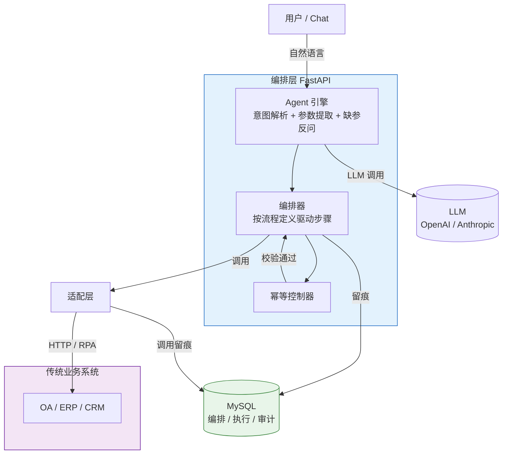
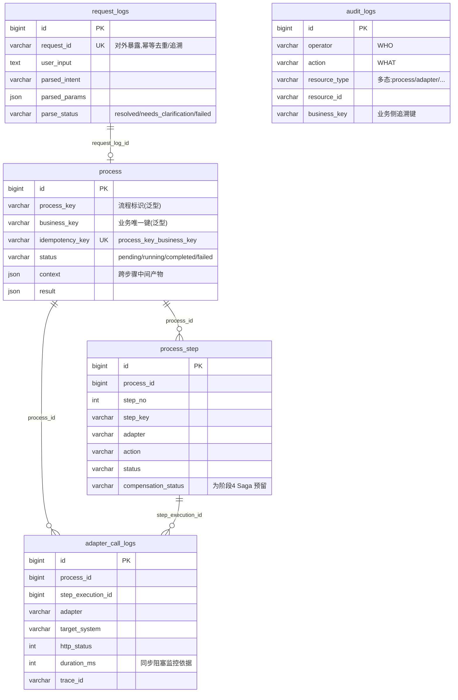

<div align="center">

# smart_talkflow

**让成熟的传统业务系统,具备自然语言驱动的 Agent 能力**

一个面向 OA / ERP / CRM 等传统系统的**通用 Agent 编排平台**——把模糊的自然语言请求,转化为对确定工作流的精确调用,并逐步从「同步单点执行」演进为「长程可靠执行」。

[](./LICENSE)
[](https://www.python.org/)
[](https://fastapi.tiangolo.com/)
[](#项目路线图)

</div>

---

## 目录

- [这是什么](#这是什么)
- [为什么需要它](#为什么需要它)
- [核心特性](#核心特性)
- [架构总览](#架构总览)
- [项目路线图](#项目路线图)
- [技术栈](#技术栈)
- [项目结构](#项目结构)
- [核心设计理念](#核心设计理念)
- [配置项说明](#配置项说明)
- [数据库设计](#数据库设计)
- [开发指南](#开发指南)
- [贡献](#贡献)
- [协议](#协议)

---

## 这是什么

`smart_talkflow` 是一个**业务无关的 Agent 编排底座**。它不复制任何业务数据,只负责把"用户的一句话"翻译成一串对已有业务系统的精确调用,并在每一步留下可追溯的执行痕迹。

举一个贯穿全项目的例子——**员工入职**:

> 用户:「给市场部张三办入职」
>
> 平台:① 用 LLM 提取出意图 `onboarding` 与参数 `{name: 张三, dept: 市场部}`
> ② 按姓名 + 部门回查 HR 主数据,补全身份证号(业务唯一键);重名则反问用户
> ③ 做幂等校验,确认没有重复办过
> ④ 顺序执行:建档 → 开域账号 → 授权 OA 权限 → 开通关联业务系统 → 开通邮箱
> ⑤ 每一步的输入、输出、耗时、外部 HTTP 调用全部落库留痕

最终,用户在 30 秒内得到「员工号 9527、域账号 zhangsan、邮箱 zhangsan@corp.com」的完整结果;而管理员随时能在数据库里按操作人或业务键还原整个执行现场。

> **一句话定位**:传统业务系统负责"业务数据",`smart_talkflow` 负责"编排、执行、审计"。

## 为什么需要它

绝大多数企业里,真正运转业务的是一批**成熟但陈旧**的 OA / ERP / CRM。它们接口零散、文档缺失、流程割裂,员工要完成一件事(如办入职),往往要在五六个系统间来回点按。直接给它们套一个聊天机器人会立刻撞上三堵墙:

1. **LLM 会"幻觉参数"**——编造一个不存在的部门名,然后透传给下游系统,酿成脏数据。
2. **传统系统接口慢且不稳**——一个同步调用卡住 30 秒,整个服务就被拖垮。
3. **多步操作没有补偿**——建了档却开邮箱失败,留下半成品,只能人工收拾。

`smart_talkflow` 用一套**分层的、可演进的**架构正面回应这三个问题,并通过四个阶段逐步把"能用"做成"可靠"。它不试图一次到位,而是遵循一条务实的工程主线:

> **先跑通,再解耦;先同步,再异步;先人工,再自动。**

## 核心特性

- 🔌 **业务无关的泛型模型**——平台不建任何业务主数据表,`process_key` / `business_key` / `adapter` / `action` 全部是运行时赋值的泛型字符串,同一套底座能编排入职、离职、请假、审批……任意流程。
- 🛡️ **Pydantic 强校验,挡住 LLM 幻觉**——LLM 输出的每一个参数都过 Schema 校验,越界值(如不存在的部门枚举)绝不透传给下游。
- 🔁 **业务键级幂等**——以 `UNIQUE(process_key, business_key)` 兜底,同一句话重复说不会重复建账号。
- 🧩 **LLM 抽象层,屏蔽厂商差异**——一套 `SupportsInvokeMessages` 协议统一 OpenAI / Anthropic,Function Calling / Tool Use 归一为 `workflow_calls`。
- 📝 **提示词三级降级**——远程 git 仓库 > 自定义 > 内置默认,任一来源失败自动降级,支持提示词热更新与版本化。
- 🧭 **全链路 Trace ID**——每条请求生成唯一 `trace_id`,贯穿日志、数据库记录、对外 HTTP 调用头,出问题可像"查案"一样还原现场。
- 🏗️ **为未来阶段预留**——单步执行表已内置 `compensation_status` 字段,为阶段四的 Saga 补偿提前铺路,避免日后改表。
- 🐳 **一键基础设施**——`docker compose up` 即起 MySQL 8,容器首次启动自动建表,本地零配置。

## 架构总览

`smart_talkflow` 采用**分层 + 渐进解耦**的架构。随着阶段推进,适配层会从"同进程内联函数"逐步演化为"独立微服务"再升级为"标准化 REST 工具服务"。



**核心数据流**(以入职为例,详见[数据库设计](#数据库设计)):

```
用户输入 → request_logs(记录意图解析)
         → process(幂等校验 + 创建执行实例)
            ├─ process_step × N(建档 / 开户 / 授权 / 邮箱……)
            │    └─ adapter_call_logs × N(每次外部 HTTP 调用留痕)
            └─ 收尾:status = completed + result
         → audit_logs(谁、在何时、对什么、做了什么)
```

## 项目路线图

项目的最大价值在于一条**经过深思的四阶段演进路线**——每一阶段都有明确的验收标准,前一阶段为后一阶段铺路。当前处于**阶段一**。

| 阶段 | 主题 | 核心交付 | 状态 |
|:---:|---|---|:---:|
| **1** | **MVP——同步单流程硬跑通** | 同进程内跑通"一句话办入职":LLM 解析 + 幂等 + 硬编码编排(建档→开户→授权→邮箱) | 🚧 开发中 |
| **2** | **配置化与解耦** | YAML 驱动流程定义(watchdog 热加载)+ 适配层拆为独立 FastAPI 微服务 + 通用 WorkflowEngine | 📋 规划中 |
| **3** | **工具标准化** | 适配层暴露标准 `GET /tools` + `POST /invoke`,编排层经 `ToolRegistry` 工具注册中心统一发现与调用 | 📋 规划中 |
| **4** | **长程任务可靠性** | 异步调度 + 事件驱动恢复 + 人工审批节点 + Saga 补偿引擎 + 超时扫描 | 📋 规划中 |

**各阶段验收标准**(摘要):

- **阶段 1**:一句"给张三办入职"30 秒内成功回复;重复请求不重复建账号。
- **阶段 2**:新增"离职流程"只需加一个 YAML 文件,零 Python 改动;热加载 < 5 秒。
- **阶段 3**:适配层暴露标准 `GET /tools` 与 `POST /invoke`,可用 curl/Postman 直接调试;`ToolRegistry` 启动扫描并缓存工具目录,加载期即可校验 YAML 引用一致性。
- **阶段 4**:长程任务"提交即返回",编排层重启后能从 WAITING 状态恢复;失败自动补偿或告警。

> 完整的设计文档(含每阶段的架构图、时序图、埋坑点、挑战点)见 [`SSD/传统业务系统接入 Agent 落地计划.md`](./SSD/传统业务系统接入%20Agent%20落地计划.md)。

## 技术栈

| 层级 | 选型 | 说明 |
|---|---|---|
| 语言 | **Python 3.12+** | 全栈统一 |
| API 框架 | **FastAPI** | 异步原生、自动 OpenAPI 文档、与 Pydantic 深度集成 |
| 数据校验 | **Pydantic v2** | LLM 输出强校验,防止幻觉参数污染下游 |
| 配置管理 | **pydantic-settings** | 环境变量 → 类型化配置,必填项缺失"启动即失败" |
| ORM | **SQLAlchemy 2.0(async)** | 流程实例持久化、审计留痕 |
| 数据库 | **MySQL 8.0**(asyncmy 驱动) | utf8mb4,连接池 + `pool_pre_ping` |
| HTTP 客户端 | **httpx(async)** | 进程级单例连接池,自动注入 trace_id |
| LLM 接入 | **OpenAI / Anthropic SDK** | 统一抽象层,屏蔽厂商与协议差异 |
| 包管理 | **uv** | 极速依赖解析与虚拟环境管理 |
| 编排 | **Docker Compose** | 一键拉起 MySQL 并自动初始化建表 |

## 项目结构

```
smart_talkflow/
├── main.py                       # FastAPI 应用入口(阶段一收尾装配)
├── db/
│   ├── smart_talkflow_init.sql   # 5 张平台表建表脚本(容器首次启动自动执行)
│   └── schema_diagram.md         # 数据库 ER 关系图与设计说明
├── docker-compose.yml            # MySQL 8 一键编排
├── pyproject.toml                # uv 项目定义与依赖
├── .env.example                  # 环境变量模板
├── SSD/                          # 系统设计文档(含完整落地计划)
└── src/                          # 源码根目录(运行时包路径根)
    ├── conf/
    │   └── config.py             # ✅ Pydantic Settings 配置(启动即校验)
    ├── engine/                   # LLM 引擎
    │   ├── client/
    │   │   ├── base_client.py    # ✅ 统一请求/响应模型 + 客户端协议
    │   │   └── llm_client.py     # ✅ OpenAI / Anthropic 客户端(屏蔽 SDK 差异)
    │   ├── messages.py           # ✅ 会话消息模型
    │   ├── prompts/
    │   │   ├── system_prompt.py  # ✅ 主控提示词(远程/自定义/默认三级降级)
    │   │   └── envirement.py     # ✅ 运行环境信息
    │   └── parser.py             # 🚧 意图解析 + 参数提取 + 缺参反问
    ├── orchestrator/             # 编排层
    │   ├── dispatcher.py         # 🚧 intent → 编排器路由分发
    │   ├── resolver.py           # 🚧 身份补全(查 HR 主数据,重名反问)
    │   └── actions/
    │       └── onboarding.py     # 🚧 硬编码入职流程(建档→开户→授权→邮箱)
    ├── adapters/                 # 适配层(封装传统系统调用)
    │   ├── base.py               # 🚧 适配器基类
    │   ├── oa_client.py          # 🚧 OA REST 客户端
    │   └── oa_adapter/           # 🚧 OA 域:员工 / 身份认证 / 权限授权
    ├── runtime/                  # 请求级执行上下文(每请求构建,用完即弃)
    │   ├── context.py            # 🚧 RequestContext
    │   └── RequestRunner.py      # 🚧 串联 parse → resolve → 幂等 → orchestrate
    ├── infra/                    # 基础设施(✅ 已完成)
    │   ├── database.py           # ✅ SQLAlchemy 异步引擎 + 连接池 + 会话管理
    │   ├── models.py             # ✅ 5 张业务无关 ORM 模型
    │   ├── http.py               # ✅ httpx 异步封装(trace_id 自动注入)
    │   ├── logger.py             # ✅ 分级日志
    │   ├── exceptions.py         # ✅ HTTP 业务异常体系
    │   └── idempotency.py        # 🚧 幂等校验(依赖 UNIQUE 索引)
    ├── api/                      # FastAPI 路由层
    │   ├── router.py             # 🚧 /chat 与 /execute 路由
    │   ├── schema.py             # 🚧 请求/响应 DTO
    │   └── deps.py               # 🚧 依赖注入(DB Session、操作人等)
    ├── services/                 # 业务服务(🚧 邮箱、流式、记忆等)
    ├── works/                    # 工作流实现(🚧)
    └── utils/
        └── trace_id_util.py      # ✅ 全链路 Trace ID(ContextVar)
```

> 图例:✅ 已实现 · 🚧 开发中 / 占位 · 📋 规划中

## 核心设计理念

### 1. 业务无关:平台只存"编排、执行、审计"

平台**绝不复制业务数据**——员工、部门、身份证号、邮箱账号统统归各传统业务系统所有,平台只"调用"不"持有"。因此全部 5 张表都是**泛型**的:`process_key`、`business_key`、`adapter`、`action` 都是字符串,其"具体含义"由运行时的流程定义决定,而非由表结构绑定。这意味着同一套底座可以编排任意业务流程。

### 2. 逻辑关联而非物理外键

日志类表(`adapter_call_logs`、`audit_logs`)**刻意不加外键约束**:它们只存 ID 不建 FK。这样"删除一条测试流程实例"不会波及审计日志,满足**审计独立性与不可篡改**要求。ORM 层用 `relationship` + `foreign()` 在"无物理外键"的前提下建立导航,仅服务于代码层,不影响数据库约束。

### 3. 用业务唯一键做幂等,且必须先补全

幂等键不能用 `name`(会重名),必须用身份证号等业务唯一键。但用户说"给市场部张三办入职"通常**不含身份证号**——所以执行前要先按"姓名 + 部门"回查 HR 主数据补全(命中多条则反问用户选择),再以补全后的键做幂等校验。数据库用 `UNIQUE(process_key, business_key)` 做最终兜底。

### 4. LLM 输出强校验,把幻觉挡在编排层

LLM 可能编造不存在的部门名。所有 LLM 输出都经 Pydantic `validator` / 枚举强校验,**不合法参数绝不透传给下游**。这是"用 Agent 操作真实生产系统"时最关键的一道安全闸。

### 5. 统一的 LLM 抽象层

通过 `SupportsInvokeMessages` Protocol 定义统一的客户端接口,`OpenAIClient` 与 `AnthropicApiClient` 各自实现。无论底层是 OpenAI 的 `tool_calls` 还是 Anthropic 的 `tool_use` 块,对外都归一为 `workflow_calls`。切换模型或厂商只需改环境变量。

### 6. 提示词可热更新、可版本化

系统提示词按**远程 git 仓库 > 自定义入参 > 内置默认**三级降级获取。远程失败自动降级,永不阻断启动。这让提示词可以作为独立资产进行版本管理与 A/B 实验,而不必改动代码。

## 配置项说明

全部配置通过环境变量注入(见 `.env.example`),由 `pydantic-settings` 类型化加载。**必填项缺失会在导入配置模块时直接抛出,做到"启动即失败"**。

### MySQL

| 变量 | 说明 | 默认 |
|---|---|---|
| `MYSQL_HOST` | 数据库主机 | `127.0.0.1` |
| `MYSQL_PORT` | 宿主机暴露端口(容器内固定 3306) | `3306` |
| `MYSQL_DATABASE` | 业务库名 | `smart_talkflow` |
| `MYSQL_USER` / `MYSQL_PASSWORD` | 应用连接账号 | `talkflow` / `talkflow` |
| `MYSQL_ROOT_PASSWORD` | root 密码(仅 Docker 初始化用) | `root` |
| `POOL_SIZE` / `MAX_SIZE` | 连接池初始 / 最大大小 | `10` / `20` |
| `KEEP_ALIVE` | 连接最长存活秒数(主动回收防 `wait_timeout` 断开) | `3600` |
| `SQL_LOG` | 是否打印 SQL(本地调试置 `True`,生产关闭) | `False` |
| `TZ` | 时区 | `Asia/Shanghai` |

### LLM

| 变量 | 说明 | 默认 |
|---|---|---|
| `LLM_PROVIDER` | 提供商:`openai` / `anthropic` | — (必填) |
| `LLM_API_KEY` | API Key | — (必填) |
| `LLM_MODEL` | 模型名(如 `gpt-4o-mini`) | — (必填) |
| `LLM_BASE_URL` | API Base URL(兼容 OpenAI 协议的第三方均可) | — (必填) |
| `LLM_TIMEOUT` | 请求超时(秒) | `60` |
| `LLM_TEMPERATURE` | 采样温度 | `0.2` |

## 数据库设计

平台共 **5 张业务无关表**,完整 ER 图与设计说明见 [`db/schema_diagram.md`](./db/schema_diagram.md)。



**关联层次**:强外键关系(请求→流程、流程→步骤)**故意不加物理外键**;日志表(适配调用、审计)为"逻辑关联",保证日志独立于业务记录存活,满足审计不可篡改要求。

## 开发指南

### 运行环境约定

源码以 `src/` 为运行时包路径根。代码内的导入形如 `from conf.config import settings`、`from infra.database import db_session`,因此**执行脚本时工作目录应为 `src/`**:

```bash
cd src
python -m infra.database        # 示例:以模块方式运行
```

### 日志与追踪

平台采用分级日志(`logs/info`、`logs/error`、`logs/debug`),每条请求由 `utils/trace_id_util` 生成唯一 `trace_id`,并通过 `ContextVar` 在请求生命周期内传播,自动注入到:

- 数据库记录(`process.trace_id`、`adapter_call_logs.trace_id`、`audit_logs.trace_id`)
- 对外 HTTP 请求头(`X-Trace-Id`)

排查问题时,凭一个 `trace_id` 即可串联整条调用链。

### 数据库会话用法

```python
from infra.database import db_session
from infra.models import Process

async with db_session() as session:
    session.add(Process(process_key="onboarding", business_key="...", ...))
# 正常退出自动 commit;异常自动 rollback 并重新抛出
```

### 重置数据库

```bash
docker compose down -v   # 删除数据卷
docker compose up -d     # 重新初始化,重新执行建表脚本
```

## 贡献

本项目正处于**阶段一(MVP)积极开发中**,欢迎各种形式的贡献:

- 🐛 报告问题或提出建议 → [Issues](../../issues)
- 💡 讨论架构与路线图 → 阅读 [`SSD/`](./SSD/) 下的设计文档后发表意见
- 🔧 提交代码 → Fork → 分支开发 → PR(请确保不破坏现有基础设施层自测)

**特别欢迎的方向**:意图解析器、编排器、各传统系统适配器(OA / AD / 邮箱 / CRM)的实现,以及阶段二的 YAML 流程引擎设计。

## 协议

[MIT License](./LICENSE) · Copyright © 2026 Haruki

---

<div align="center">

**先跑通,再解耦 · 先同步,再异步 · 先人工,再自动**

⭐ 如果这个项目对你有启发,欢迎 Star 关注阶段演进。

</div>
