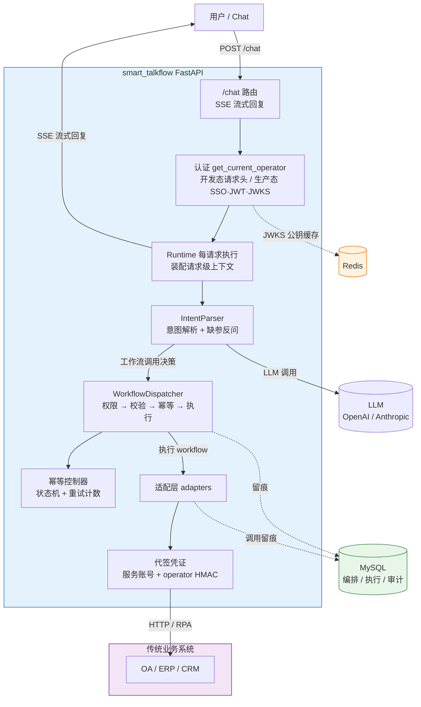
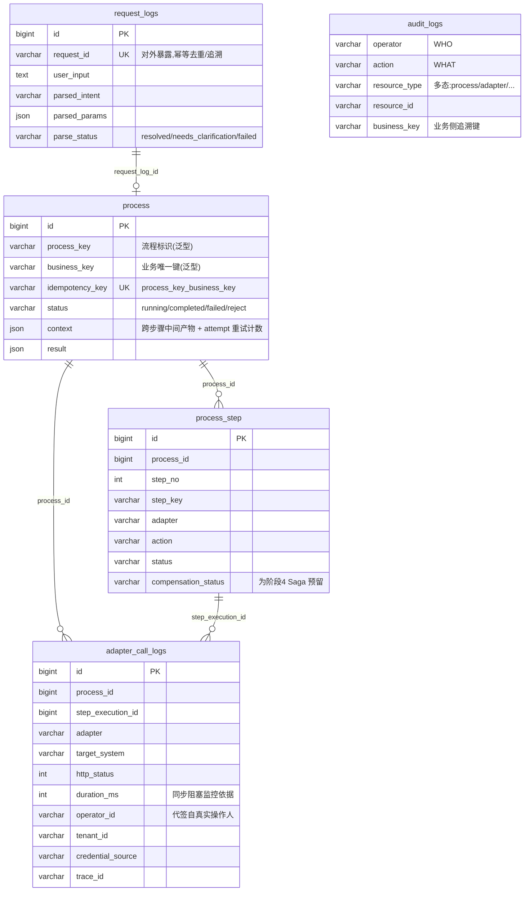

<div align="center">

# smart_talkflow

**让成熟的传统业务系统,具备自然语言驱动的 Agent 能力**

一个面向 OA / ERP / CRM 等传统系统的**通用 Agent 编排平台**——把模糊的自然语言请求,转化为对确定工作流的精确调用,并逐步从「同步单点执行」演进为「长程可靠执行」。

[](./LICENSE)
[](https://www.python.org/)
[](https://fastapi.tiangolo.com/)
[](#项目路线图)

</div>

---

## 目录

- [这是什么](#这是什么)
- [为什么需要它](#为什么需要它)
- [核心特性](#核心特性)
- [架构总览](#架构总览)
- [项目路线图](#项目路线图)
- [技术栈](#技术栈)
- [项目结构](#项目结构)
- [核心设计理念](#核心设计理念)
- [配置项说明](#配置项说明)
- [数据库设计](#数据库设计)
- [开发指南](#开发指南)
- [贡献](#贡献)
- [协议](#协议)

---

## 这是什么

`smart_talkflow` 是一个**业务无关的 Agent 编排底座**。它不复制任何业务数据,只负责把"用户的一句话"翻译成一串对已有业务系统的精确调用,并在每一步留下可追溯的执行痕迹。

当前 MVP 已落地的示例流程是**会议室预订**:

> 用户:「帮我把 A 会议室订给下午的产品评审会」
>
> 平台:① 认证层确认操作人(开发态信任请求头,生产态走 SSO/JWT)
> ② LLM 解析出意图 `meeting_room_booking` 与结构化参数(room_id / 起止时间 / 主持人 …),缺参则反问
> ③ 编排器做**角色权限校验 → Pydantic 参数校验 → 幂等校验**(同一人+同一会议室+同一时段不重复预订)
> ④ 顺序执行下游 OA:`提交预订 → 审批 → 更新使用状态`,每步以**服务账号 + 真实操作人代签**调用
> ⑤ 每一步的输入、输出、耗时、外部 HTTP 调用、操作人身份全部落库留痕
> ⑥ 全程以 **SSE 流式**把「思考 / 工具开始 / 工具完成」实时推回前端

> 设计蓝本是更复杂的**员工入职**(LLM 解析 → 按 姓名+部门 回查 HR 主数据补全身份证号 → 幂等 → 建档→开户→授权→邮箱),它更完整地体现了「身份补全 + 业务键幂等 + 多步补偿」的演进方向,详见 [`SSD/`](./SSD/)。

> **一句话定位**:传统业务系统负责"业务数据",`smart_talkflow` 负责"编排、执行、审计"。

## 为什么需要它

绝大多数企业里,真正运转业务的是一批**成熟但陈旧**的 OA / ERP / CRM。它们接口零散、文档缺失、流程割裂,员工要完成一件事,往往要在五六个系统间来回点按。直接给它们套一个聊天机器人会立刻撞上三堵墙:

1. **LLM 会"幻觉参数"**——编造一个不存在的部门名,然后透传给下游系统,酿成脏数据。
2. **传统系统接口慢且不稳**——一个同步调用卡住 30 秒,整个服务就被拖垮。
3. **多步操作没有补偿**——建了档却开邮箱失败,留下半成品,只能人工收拾。
4. **操作人身份丢失**——用一个服务账号统一调用,审计和权限判定全失真,出事无法追溯。

`smart_talkflow` 用一套**分层的、可演进的**架构正面回应这些问题,并通过四个阶段逐步把"能用"做成"可靠"。它不试图一次到位,而是遵循一条务实的工程主线:

> **先跑通,再解耦;先同步,再异步;先人工,再自动。**

## 核心特性

- 🔌 **业务无关的泛型模型**——平台不建任何业务主数据表,`process_key` / `business_key` / `adapter` / `action` 全部是运行时赋值的泛型字符串,同一套底座能编排入职、离职、会议室预订……任意流程。
- 🛡️ **Pydantic 强校验,挡住 LLM 幻觉**——LLM 输出的每一个参数都过 Schema 校验,越界值绝不透传给下游。
- 🔁 **业务键级幂等 + 状态机**——以 `UNIQUE(process_key, business_key)` 兜底,命中记录按 `running / completed / failed / reject` 分流:已完成的直接短路,失败的按重试计数放行或永久拒绝。
- 🔐 **两层认证 + 代签**——开发态信任请求头、生产态走 SSO/JWT(JWKS 公钥经 Redis 缓存验签);真实操作人经 HMAC 代签给下游,服务账号只做技术认证,审计与权限始终归属真实用户。
- 🧭 **角色权限网关**——每个工作流声明 `allowed_roles`,编排器在执行前判定操作人是否有权触发,把越权请求挡在编排层。
- 🧩 **LLM 抽象层,屏蔽厂商差异**——一套 `SupportsInvokeMessages` 协议统一 OpenAI / Anthropic,Function Calling / Tool Use 归一为 `ToolUseBlock`,切换厂商只改环境变量。
- 📡 **SSE 流式反馈**——意图解析与工具执行的过程实时以 `text / tool_started / tool_completed` 事件推回前端,长流程不阻塞。
- 📝 **提示词三级降级**——远程 git 仓库 > 自定义 > 内置默认,任一来源失败自动降级,支持提示词热更新与版本化。
- 🔍 **全链路 Trace ID**——每条请求生成唯一 `trace_id`,贯穿日志、数据库记录、对外 HTTP 调用头,出问题可像"查案"一样还原现场。
- 🧱 **一次调用一条留痕**——适配器把下游真实 HTTP 状态码归一为业务异常,但**不向上抛**,而是结构化为 `AdapterResponse` 落库,保证审计完整性。
- 🏗️ **为未来阶段预留**——单步执行表已内置 `compensation_status` 字段,为阶段四的 Saga 补偿提前铺路,避免日后改表。
- 🐳 **一键基础设施**——`docker compose up` 即起 MySQL 8 + Redis 7,容器首次启动自动建表,本地零配置。

## 架构总览

`smart_talkflow` 采用**分层 + 渐进解耦**的架构。请求级对象每请求构建、用完即弃;基础设施(DB/Redis/LLM Client)是进程级单例。随着阶段推进,适配层会从"同进程内联函数"逐步演化为"独立微服务"再升级为"标准化 REST 工具服务"。



**核心数据流**(以会议室预订为例,详见[数据库设计](#数据库设计)):

```
用户输入 → request_logs(记录意图解析 / 缺参反问)
         → process(幂等状态机:running → completed / failed / reject)
            └─ process_step × N(submit_booking / approve_booking / update_use_status)
                 └─ adapter_call_logs × N(每次外部 HTTP 调用 + 代签操作人留痕)
         → audit_logs(谁、在何时、对什么、做了什么)
回复全程以 SSE 流式输出(text / tool_started / tool_completed)
```

## 项目路线图

项目的最大价值在于一条**经过深思的四阶段演进路线**——每一阶段都有明确的验收标准,前一阶段为后一阶段铺路。当前处于**阶段一**。

| 阶段 | 主题 | 核心交付 | 状态 |
|:---:|---|---|:---:|
| **1** | **MVP——同步单流程硬跑通** | 同进程内跑通"一句话预订会议室":认证 + LLM 解析 + 幂等 + 硬编码编排(提交→审批→更新状态)+ SSE 流式 | 🚧 开发中 |
| **2** | **配置化与解耦** | YAML 驱动流程定义(watchdog 热加载)+ 适配层拆为独立 FastAPI 微服务 + 通用 WorkflowEngine | 📋 规划中 |
| **3** | **工具标准化** | 适配层暴露标准 `GET /tools` + `POST /invoke`,编排层经 `ToolRegistry` 工具注册中心统一发现与调用 | 📋 规划中 |
| **4** | **长程任务可靠性** | 异步调度 + 事件驱动恢复 + 人工审批节点 + Saga 补偿引擎 + 超时扫描 | 📋 规划中 |

**阶段一当前进度**:基础设施层(DB/HTTP/日志/异常/幂等/Redis)、认证层(JWKS/SSO)、编排层(注册器 + 调度器 + 权限网关 + 幂等状态机)、OA 适配器(含代签)、会议室预订流程、SSE 流式管线均已落地。**当前缺口**是意图解析核心 `IntentParser.run()`(尚为骨架)——它补齐后,端到端「自然语言 → 自动执行」才算闭环;`WorkflowDispatcher` 已就绪但尚未接入主链路。

**各阶段验收标准**(摘要):

- **阶段 1**:一句"帮我订会议室"30 秒内成功回复;重复请求不重复预订;全程可凭 trace_id 还原。
- **阶段 2**:新增"离职流程"只需加一个 YAML 文件,零 Python 改动;热加载 < 5 秒。
- **阶段 3**:适配层暴露标准 `GET /tools` 与 `POST /invoke`,可用 curl/Postman 直接调试;`ToolRegistry` 启动扫描并缓存工具目录,加载期即可校验 YAML 引用一致性。
- **阶段 4**:长程任务"提交即返回",编排层重启后能从 WAITING 状态恢复;失败自动补偿或告警。

> 完整设计文档见 [`SSD/传统业务系统接入 Agent 落地计划.md`](./SSD/) 与 [`SSD/用户认证与操作权限控制落地计划.md`](./SSD/)。

## 技术栈

| 层级 | 选型 | 说明 |
|---|---|---|
| 语言 | **Python 3.12+** | 全栈统一 |
| API 框架 | **FastAPI** + **Uvicorn** | 异步原生、自动 OpenAPI 文档、SSE 流式 |
| 数据校验 | **Pydantic v2** | LLM 输出强校验,防止幻觉参数污染下游 |
| 配置管理 | **pydantic-settings** | 环境变量 → 类型化配置,必填项缺失"启动即失败" |
| ORM | **SQLAlchemy 2.0(async)** | 流程实例持久化、审计留痕 |
| 数据库 | **MySQL 8.0**(asyncmy 驱动) | utf8mb4,连接池 + `pool_pre_ping` |
| 缓存 | **Redis 7**(redis-py async) | JWKS 公钥缓存等 KV 场景 |
| HTTP 客户端 | **httpx(async)** | 进程级单例连接池,自动注入 trace_id |
| 认证 | **PyJWT** + **cryptography** | RS256 JWT 验签 + JWKS 公钥解析 |
| LLM 接入 | **OpenAI / Anthropic SDK** | 统一抽象层,屏蔽厂商与协议差异 |
| 包管理 | **uv** | 极速依赖解析与虚拟环境管理 |
| 编排 | **Docker Compose** | 一键拉起 MySQL + Redis 并自动初始化建表 |

## 项目结构

```
smart_talkflow/
├── src/                          # 源码根目录(运行时包路径根,import 无 src. 前缀)
│   ├── main.py                   # ✅ FastAPI 入口:lifespan 装配 runtime + 停机释放 DB/Redis
│   ├── conf/
│   │   └── config.py             # ✅ pydantic-settings 单例(启动即校验)
│   ├── engine/                   # LLM 引擎层(厂商无关抽象)
│   │   ├── client/
│   │   │   ├── base_client.py    # ✅ 统一请求/响应模型 + SupportsInvokeMessages 协议
│   │   │   ├── llm_client.py     # ✅ OpenAI / Anthropic 客户端(屏蔽 SDK 差异)
│   │   │   └── messages.py       # ✅ 会话消息模型(tool_calls/tool_use 归一为 ToolUseBlock)
│   │   ├── prompts/
│   │   │   ├── system_prompt.py  # ✅ 主控提示词(远程/自定义/默认三级降级)
│   │   │   └── envirement.py     # ✅ 运行环境信息
│   │   ├── stream_event.py       # ✅ 编排层流式事件(AssistantTextDelta / ToolExecution*)
│   │   └── parser.py             # 🚧 IntentParser 意图解析(当前骨架)
│   ├── security/                 # 认证层
│   │   └── jwks_client.py        # ✅ JWKS 公钥解析 + Redis 缓存(JWT RS256 验签)
│   ├── api/                      # FastAPI 路由层
│   │   ├── router.py             # ✅ /chat 路由(SSE 流式)
│   │   ├── deps.py               # ✅ 认证依赖(开发态请求头 / 生产态 SSO)
│   │   └── schema.py             # ✅ 请求/响应 DTO(ChatRequest)
│   ├── orchestrator/             # 编排层
│   │   ├── base.py               # ✅ BaseWorkflow + WorkflowRegistry(含角色权限)
│   │   ├── dispatcher.py         # ✅ WorkflowDispatcher(权限→校验→幂等→执行→状态机)
│   │   ├── resolver.py           # 🚧 身份补全(查 HR 主数据、重名反问)
│   │   └── workflow/
│   │       └── meeting_room.py   # ✅ 会议室预订流程(提交→审批→更新状态)
│   ├── runtime/                  # 请求级执行上下文
│   │   ├── context.py            # ✅ OperatorContext / RequestContext(ContextVar)
│   │   └── runner.py             # ✅ 启动装配工厂 + 每请求 Runtime.run(SSE)
│   ├── adapters/                 # 适配层(封装传统系统 HTTP 调用 + 代签)
│   │   ├── base.py               # ✅ BaseAdapter(错误码归一 + 结构化留痕)
│   │   ├── oa_adapter/           # ✅ OA 域(oa_client 聚合 + 会议室预订 adapter)
│   │   ├── crm_adapter/          # 🚧 CRM 客户端骨架
│   │   ├── ecs_adapter/          # 🚧 ECS 客户端骨架
│   │   └── erp_adapter/          # 🚧 ERP 客户端骨架
│   ├── services/                 # 业务服务
│   │   ├── credential.py         # ✅ 代签凭证(服务账号 + operator HMAC)
│   │   ├── email.py              # 🚧 邮箱服务骨架
│   │   └── memory.py             # 🚧 记忆服务骨架
│   ├── infra/                    # 基础设施(✅ 已完成)
│   │   ├── database.py           # ✅ SQLAlchemy 异步引擎 + 连接池 + 会话管理
│   │   ├── models.py             # ✅ 5 张业务无关 ORM 模型
│   │   ├── http.py               # ✅ httpx 异步封装(trace_id 自动注入)
│   │   ├── logger.py             # ✅ 分级日志(TraceIdFilter)
│   │   ├── exceptions.py         # ✅ HTTP 业务异常体系(11 个状态码子类)
│   │   ├── idempotency.py        # ✅ 流程级幂等(状态机 + 重试计数)
│   │   └── redis_client.py       # ✅ Redis 异步单例
│   └── utils/
│       └── trace_id_util.py      # ✅ 全链路 Trace ID(ContextVar)
├── tests/                        # 标准库 unittest(test_llm_client 为真实 LLM 冒烟)
├── db/
│   ├── smart_talkflow_init.sql   # 5 张平台表建表脚本(容器首次启动自动执行)
│   └── schema_diagram.md         # 数据库 ER 关系图与设计说明
├── SSD/                          # 系统设计文档(落地计划 + 认证权限设计)
├── docker-compose.yml            # MySQL 8 + Redis 7 一键编排
├── pyproject.toml                # uv 项目定义与依赖
└── .env.example                  # 环境变量模板
```

> 图例:✅ 已实现 · 🚧 开发中 / 占位 · 📋 规划中

## 核心设计理念

### 1. 业务无关:平台只存"编排、执行、审计"

平台**绝不复制业务数据**——员工、部门、会议室、邮箱账号统统归各传统业务系统所有,平台只"调用"不"持有"。因此全部 5 张表都是**泛型**的:`process_key`、`business_key`、`adapter`、`action` 都是字符串,其"具体含义"由运行时的流程定义决定。同一套底座可以编排任意业务流程。

### 2. 逻辑关联而非物理外键

日志类表(`adapter_call_logs`、`audit_logs`)**刻意不加外键约束**:它们只存 ID 不建 FK。这样"删除一条测试流程实例"不会波及审计日志,满足**审计独立性与不可篡改**要求。ORM 层用 `relationship` + `foreign()` 在"无物理外键"的前提下建立导航,仅服务于代码层,不影响数据库约束。

### 3. 用业务唯一键做幂等,带状态机

幂等键不能用易重名字段,必须用业务唯一键(会议室预订 = 操作人 + 会议室 + 起止时间;入职 = 身份证号)。执行前若用户输入不含该键,要先回查主数据补全(命中多条则反问)。幂等判定是一个**状态机**:按命中记录的 `status` 分流——

- **已完成**(completed):直接短路返回历史结果。
- **进行中**(running):拒绝并发重入。
- **失败**(failed):按 `attempt` 重试计数放行重跑;超 `max_retry` 则转为 `reject` 永久拒绝。
- **首次**(未命中):插入 `running` 占位,放行执行。

数据库用 `UNIQUE(process_key, business_key)` 做最终兜底,并发冲突靠唯一索引拦截后回查。

### 4. LLM 输出强校验,把幻觉挡在编排层

LLM 可能编造不存在的部门名或会议室号。所有 LLM 输出都经 Pydantic 强校验,**不合法参数绝不透传给下游**。这是"用 Agent 操作真实生产系统"时最关键的一道安全闸。

### 5. 统一的 LLM 抽象层

通过 `SupportsInvokeMessages` Protocol 定义统一的客户端接口,`OpenAIClient` 与 `AnthropicApiClient` 各自实现。无论底层是 OpenAI 的 `tool_calls` 还是 Anthropic 的 `tool_use` 块,对外都归一为 `ToolUseBlock`。切换模型或厂商只需改环境变量。

### 6. 两层认证 + 操作人代签

身份**只来自可信的认证来源,绝不来自请求体或 LLM 参数**(可伪造)。开发态直接信任 `X-Operator-*` 请求头便于联调;生产态走企业 SSO——平台不持有公钥,而是按需从 JWKS 端点拉取、经 Redis 缓存、按 token 的 `kid` 定位 RS256 公钥验签。

对下游业务系统的调用用**服务账号**做技术认证(`X-API-Key`),同时把**真实操作人**经 HMAC 签名「代签」(`X-Operator-Userid` + `X-Agent-Signature`)。下游验签后改写当前用户为真实操作人,使 `@PreAuthorize` 按真实权限判定、审计归属真实用户。

### 7. 启动装配一次,每请求轻量执行

进程级组件(`WorkflowRegistry` / `WorkflowDispatcher` / `IntentParser`)在应用 `lifespan` 启动时**装配一次**,存入 `app.state`;每个请求只做轻量执行——构建请求级上下文、跑意图解析、产出 SSE 事件流。SSE 序列化归 runtime,路由层不做请求内装配。

### 8. 一次调用一条结构化留痕

适配器把下游真实 HTTP 状态码归一为业务异常(400/401/403/404/409/422/429/5xx 各有对应异常),但**捕获后不向上抛**,而是连同请求/响应/耗时/操作人打包成 `AdapterResponse`。一次外部调用必产生一条可落库的完整留痕,故障可追溯、不可丢。

### 9. 提示词可热更新、可版本化

系统提示词按**远程 git 仓库 > 自定义入参 > 内置默认**三级降级获取,末尾追加「当前可用工作流」清单供主控 LLM 选择。远程失败自动降级,永不阻断启动。这让提示词可以作为独立资产进行版本管理与 A/B 实验,而不必改动代码。

## 配置项说明

全部配置通过环境变量注入(见 `.env.example`),由 `pydantic-settings` 类型化加载。**必填项缺失会在导入配置模块时直接抛出,做到"启动即失败"**。

### MySQL

| 变量 | 说明 | 默认 |
|---|---|---|
| `MYSQL_HOST` | 数据库主机 | `127.0.0.1` |
| `MYSQL_PORT` | 宿主机暴露端口(容器内固定 3306) | `3306` |
| `MYSQL_DATABASE` | 业务库名 | `smart_talkflow`(必填) |
| `MYSQL_USER` / `MYSQL_PASSWORD` | 应用连接账号 | 必填 |
| `MYSQL_ROOT_PASSWORD` | root 密码(仅 Docker 初始化用) | `root` |
| `POOL_SIZE` / `MAX_SIZE` | 连接池初始 / 最大大小 | `10` / `20` |
| `KEEP_ALIVE` | 连接最长存活秒数(主动回收防 `wait_timeout` 断开) | `3600` |
| `SQL_LOG` | 是否打印 SQL(本地调试置 `True`,生产关闭) | `False` |
| `TZ` | 时区 | `Asia/Shanghai` |

### LLM

| 变量 | 说明 | 默认 |
|---|---|---|
| `LLM_PROVIDER` | 提供商:`openai` / `anthropic` | — (必填) |
| `LLM_API_KEY` | API Key | — (必填) |
| `LLM_MODEL` | 模型名(如 `gpt-4o-mini`) | — (必填) |
| `LLM_BASE_URL` | API Base URL(兼容 OpenAI 协议的第三方均可) | — (必填) |
| `LLM_TIMEOUT` | 请求超时(秒) | `60` |
| `LLM_TEMPERATURE` | 采样温度 | `0.3` |

### 下游业务系统(OA)

| 变量 | 说明 | 默认 |
|---|---|---|
| `OA_BASE_URL` | 下游业务系统基地址 | 必填 |
| `OA_API_KEY` | 服务账号标识(下游 `AgentDelegationFilter` 白名单内) | 必填 |
| `OA_DELEGATION_SECRET` | 与下游共享的 HMAC 签名密钥(防伪造 operator) | 必填 |

### 认证与 SSO

| 变量 | 说明 | 默认 |
|---|---|---|
| `AUTH_DEV_MODE` | `True`=开发态信任 `X-Operator-*` 请求头;`False`=生产走 SSO | `True` |
| `SSO_ISSUER` | JWT issuer(生产态必填) | — |
| `SSO_JWKS_URI` | JWKS 公钥端点(生产态必填) | — |
| `SSO_AUDIENCE` | JWT audience(留空不校验) | — |
| `SSO_JWKS_CACHE_TTL` | JWKS Redis 缓存秒数 | `3600` |

### Redis 与提示词仓库

| 变量 | 说明 | 默认 |
|---|---|---|
| `REDIS_URL` | Redis 连接串(JWKS 缓存等;生产态必填) | `redis://127.0.0.1:6379/0` |
| `IS_GIT_REPO` | 是否启用远程提示词仓库拉取 | `False` |
| `GIT_REPO_URL` | 远程提示词仓库地址(启用时必填) | — |
| `GIT_BRANCH` / `GIT_RELATIVE_PATH` | 分支 / 仓库内提示词文件相对路径 | 留空用默认 |

## 数据库设计

平台共 **5 张业务无关表**,完整 ER 图与设计说明见 [`db/schema_diagram.md`](./db/schema_diagram.md)。



**关联层次**:强外键关系(请求→流程、流程→步骤)**故意不加物理外键**;日志表(适配调用、审计)为"逻辑关联",保证日志独立于业务记录存活,满足审计不可篡改要求。

## 开发指南

### 运行环境约定

源码以 `src/` 为运行时包路径根,代码内 import 形如 `from conf.config import settings`、`from infra.database import db_session`(**无 `src.` 前缀**)。因此 `src/` 必须在 `sys.path` 上。**推荐始终在项目根目录运行并设 `PYTHONPATH=src`**:

```bash
# 启动服务(入口为 src/main.py)
PYTHONPATH=src uv run uvicorn main:app --port 8000 --reload

# 以模块方式运行任意代码 / 跑测试(也需 PYTHONPATH=src,从项目根)
PYTHONPATH=src python -m infra.database
PYTHONPATH=src python -m unittest discover -s tests
PYTHONPATH=src python -m unittest tests.test_idempotency   # 单个模块
```

### 日志与追踪

平台采用分级日志,每条请求由 `utils/trace_id_util` 生成唯一 `trace_id`,并通过 `ContextVar` 在请求生命周期内传播,自动注入到:

- 数据库记录(`process.trace_id`、`adapter_call_logs.trace_id`、`audit_logs.trace_id`)
- 对外 HTTP 请求头(`X-Trace-Id`)

排查问题时,凭一个 `trace_id` 即可串联整条调用链。

### 数据库会话用法

```python
from infra.database import db_session
from infra.models import Process

async with db_session() as session:
    session.add(Process(process_key="meeting_room_booking", business_key="...", ...))
    await session.flush()   # ⚠️ autoflush=False,写库必须显式 flush
# 正常退出自动 commit;异常自动 rollback 并重新抛出
```

### 重置数据库

```bash
docker compose down -v   # 删除数据卷
docker compose up -d     # 重新初始化,重新执行建表脚本
```

> 想深入了解分层职责、认证代签机制、幂等状态机细节,以及当前的实现缺口,请参阅 [`CLAUDE.md`](./CLAUDE.md)。

## 贡献

本项目正处于**阶段一(MVP)积极开发中**,欢迎各种形式的贡献:

- 🐛 报告问题或提出建议 → [Issues](../../issues)
- 💡 讨论架构与路线图 → 阅读 [`SSD/`](./SSD/) 下的设计文档后发表意见
- 🔧 提交代码 → Fork → 分支开发 → PR(请确保不破坏现有基础设施层自测)

**特别欢迎的方向**:`IntentParser` 意图解析器的落地实现、身份补全 `resolver`、各传统系统适配器(邮箱 / CRM / ERP)的实现,以及阶段二的 YAML 流程引擎设计。

## 协议

[MIT License](./LICENSE) · Copyright © 2026 Haruki

---

<div align="center">

**先跑通,再解耦 · 先同步,再异步 · 先人工,再自动**

⭐ 如果这个项目对你有启发,欢迎 Star 关注阶段演进。

</div>
