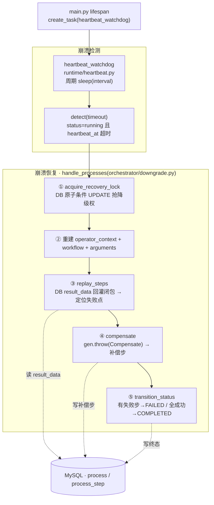
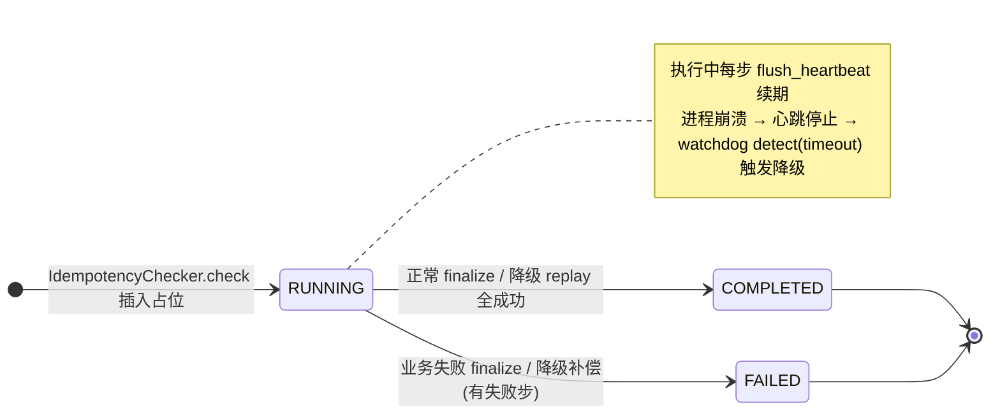
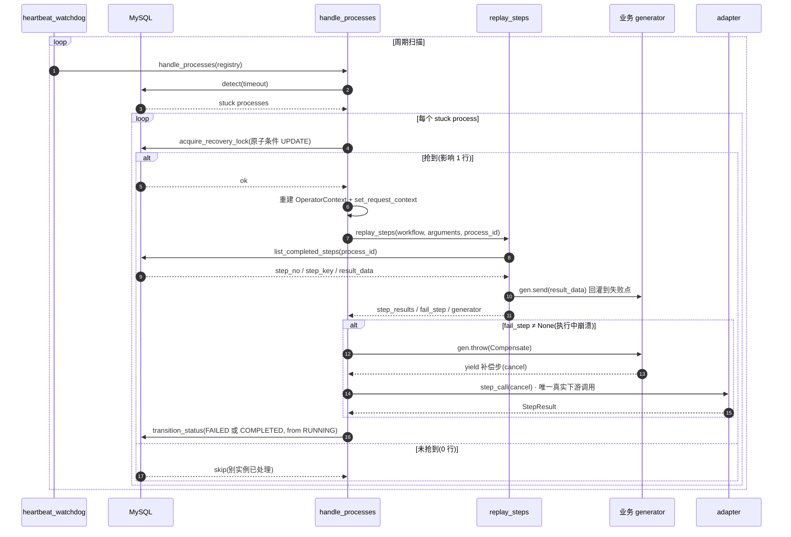

> **目标**:让平台在「编排执行中崩溃」后,**自动检测存活、自动降级补偿**,使流程不因进程崩溃而永久卡死——同时保证多实例并发安全、零下游副作用。
>
> **定位**:本文是《传统业务系统接入 Agent 落地计划》在**可靠性 / 自恢复维度**的专项补充。原计划与已落地的「Saga 补偿 + 幂等状态机」解决了「业务失败」的一致性,但未覆盖「**平台进程崩溃**」(OOM / 重启 / kill)导致的 `process` 永久卡 `running` 这一**基础设施级**留洞。
>
> **核心原则**:判崩溃靠**信号(心跳)**而非**时间(started_at)**;恢复靠**replay 闭包变量 + throw 补偿**(**不重跑**,零下游副作用);多实例安全靠**数据库原子条件更新**。

> **状态**:已落地。当前代码在 `orchestrator/downgrade.py`(`handle_processes`)+ `orchestrator/workflow_engine.py`(`replay_steps`/`compensate`)+ `runtime/heartbeat.py`(`heartbeat_watchdog`)。

---

## 1. 问题背景

### 1.1 崩溃留洞:`process` 卡 `running` 锁死幂等

平台侧 DB **没有贯穿执行的大事务**(每个 `db_session` 独立 commit,因执行中要发 HTTP、不能裹在 DB 事务里)。`IdempotencyChecker.check()` 插入 `status=running` 占位后 `commit`,之后才执行 workflow。若执行中进程崩溃:

| 崩溃点 | 后果 |
|---|---|
| `check` commit 之后、`execute` 之前 | `process` 永远 `running`,无 `finalize` |
| `execute` 中途(某步 adapter 调用后) | `process` 永远 `running`,`process_step` 半截 |
| `finalize` 之前 | `process` 永远 `running` |

**锁死幂等**:同一 `business_key` 再次请求 → 命中 `running` → `_check_process` 返回拒绝并发 → **用户无法重试、流程永久卡死**。

### 1.2 为什么不能「纯 `started_at` + N 分钟超时判崩溃」

若用 `started_at` 超时判崩溃,会**误杀长任务**。判据应靠**心跳**(`heartbeat_at`):执行中每步续,崩溃则停。

### 1.3 agent 自恢复是基本能力

编排 agent 不能因一次崩溃就永久锁死。「崩了自己爬起来」是基本要求——但本方案选择**降级补偿(不重跑)**而非重跑(原因见 §4)。

---

## 2. 设计目标与原则

| 目标 | 手段 |
|---|---|
| 检测存活 | **心跳**:`heartbeat_at`,执行中持续续(`flush_heartbeat`),崩溃则停;判崩溃依据「**无心跳超时**」 |
| 自动恢复 | 崩溃 → **replay 恢复闭包变量 + throw Compensate 补偿**(不重跑,零下游副作用) |
| 多实例并发安全 | **数据库原子条件 UPDATE** 防重复降级,无需 redis 锁 |
| 精简 | 不引入 redis 锁 / fencing token / 对账;**不重跑**(不依赖下游幂等,无 attempt 计数) |

---

## 3. 总体方案

> 总体方案 mermaid:检测 → 恢复(抢锁 → replay → 补偿 → 标终态)。



> `process` 状态机(mermaid):崩溃不是新状态,而是 `running` + 心跳超时。



### 3.1 崩溃检测:心跳

`process.heartbeat_at`,执行中(`_exec_step` 每步)调 `flush_heartbeat` 续期;进程崩溃则停止续期。

```
存活 = heartbeat_at 持续更新(执行中每步续)
崩溃 = heartbeat_at 长期无更新(进程没了)
判据 = status='running' AND heartbeat_at < now - timeout   ← 无心跳超时
```

### 3.2 崩溃恢复:replay + 补偿(不重跑)

```
watchdog 周期扫描
   │
   ▼
detect(timeout) ──> 命中「running 且无心跳超时」的 process
   │
   ▼
对每个 stuck process:
   ① acquire_recovery_lock 抢降级权(DB 原子条件 UPDATE,刷新心跳防并发)
   ② 重建 operator(operator_context 快照)+ workflow + arguments
   ③ replay_steps:重建 generator,replay 已成功步 result_data 回灌闭包变量,定位失败点
   ④ compensate:gen.throw(Compensate) 触发业务 except 分支,yield 补偿步(cancel)
   ⑤ 标终态:有失败步 → failed;全成功(replay 跑完)→ completed
```

**关键:不重跑 adapter**。replay 用 DB 已持久化的 `result_data` 回灌 generator 闭包变量,不重新调下游。只有补偿步(补偿已成功步的副作用)才真正调 adapter(cancel)。

> 崩溃恢复时序(mermaid):detect → 抢锁 → replay → throw Compensate → 标终态。



---

## 4. 为什么「不重跑」

### 4.1 yudao 非幂等 → 重跑会撞冲突

yudao `submit` 每次新建,`validateTimeConflict` 拒同时段重复预订。崩溃前 submit 已成功 → 重跑 submit 撞冲突。

### 4.2 replay + 补偿绕开下游副作用

replay 不重调 adapter,只从 DB `result_data` 回灌闭包变量(恢复 generator 到崩溃时的状态)。然后 throw Compensate 触发补偿(cancel 已成功步的副作用)。**零下游副作用,零幂等依赖**。

---

## 5. 多实例防重

多实例水平扩展时,每个实例的 watchdog 都会扫到同一批 stuck process。防重复降级靠 **DB 原子条件 UPDATE**:

```sql
-- acquire_recovery_lock
UPDATE process SET heartbeat_at = NOW()
WHERE id = ? AND status = 'running' AND (heartbeat_at < <阈值> OR heartbeat_at IS NULL)
```

- **原子性**:条件 UPDATE 只有一个实例能影响 1 行(抢到降级权);其它实例 `heartbeat_at` 已刷新 → 0 行 → 跳过。
- **无 attempt 计数**:不像旧方案 `attempt+1`(因为不重跑,无需计数)。
- **可重复执行幂等**:`WHERE status='running'`,重复执行对已终态 0 行影响。

---

## 6. 工程落地(已实现)

### 6.1 心跳(检测存活)

| 文件 | 实现 |
|---|---|
| `db/smart_talkflow_init.sql` | `process` 有 `heartbeat_at DATETIME NULL` |
| `src/repository/models.py` | `Process.heartbeat_at` |
| `src/repository/process_tracker.py` | `flush_heartbeat(process_id)`:每步续;`detect(timeout)`:扫描超时 |
| `src/orchestrator/workflow_engine.py` | `_exec_step` 每步 `await flush_heartbeat(process_id)` |

### 6.2 result_data 持久化(replay 前提)

| 文件 | 实现 |
|---|---|
| `src/orchestrator/workflow_engine.py` | `_exec_step` 每步 `finish_step(result_data=result.data)`(每步都存,供 replay 恢复所有闭包变量) |
| `src/repository/step_tracker.py` | `finish_step(result_data=...)` + `list_completed_steps(process_id) → [(step_no, step_key, result_data)]` |

### 6.3 operator 快照(降级代签)

| 文件 | 实现 |
|---|---|
| `db/smart_talkflow_init.sql` + `src/repository/models.py` | `process.operator_context JSON`(user_id / roles / tenant / name) |
| `src/orchestrator/idempotency.py` | `IdempotencyCheckRequest.operator_context`;`check()` 存入 process |
| `src/orchestrator/dispatcher.py` | `_check_idempotency` 把入口 operator 序列化传入 |
| `src/orchestrator/downgrade.py` | `OperatorContext.from_operator_context(process.operator_context)` 重建 |

### 6.4 降级处理(`src/orchestrator/downgrade.py`)

`async def handle_processes(registry)`:
1. `process_list = await detect(settings.process_heartbeat_timeout)`。
2. 对每个 process:
   - **抢降级权**:`acquire_recovery_lock`(DB 原子条件 UPDATE);失败 = 别实例已处理 → 跳过。
   - **重建上下文**:`OperatorContext.from_operator_context` + `set_request_context` + `trace_id_context.set`。
   - **重建 workflow + arguments**:`registry.get_workflow(process.process_key)` + `input_model.model_validate(process.input_params)`。
   - **replay**:`replay_steps(workflow, arguments, process.id)` → `(step_results, fail_step, generator)`。
   - **补偿**:`if fail_step is not None: await compensate(generator, step_results, StepResult(error="心跳超时中断"), on_step=None)`。
   - **标终态**:`fail_step is not None` → `transition_status(FAILED, RUNNING)`;`fail_step is None`(全成功)→ `transition_status(COMPLETED, RUNNING)`。

### 6.5 后台 watchdog

| 文件 | 实现 |
|---|---|
| `src/runtime/heartbeat.py` | `heartbeat_watchdog(registry)`:`while True: await sleep(interval); await handle_processes(registry)`;异常 `except Exception` 不退出 |
| `src/main.py` | `lifespan` 启动 `asyncio.create_task(heartbeat_watchdog(runtime.registry))`,停机 `task.cancel()` |

### 6.6 配置(`src/conf/config.py`)

```python
process_heartbeat_timeout: int = 60    # 无心跳超时秒(判崩溃阈值)
process_recovery_interval: int = 20    # watchdog 扫描间隔秒
```

> `process_max_attempts` 已废弃(不重跑,无 attempt 计数)。

---

## 7. 不重试、不计数(与旧方案的关键差异)

旧方案(recovery + 重跑)用 `attempt` 计数 + `max_retry` 上限决定「放弃交人工」。新方案(降级 + 不重跑)**没有重跑**——降级只做一次:replay + 补偿 + 标终态。不重跑就不需要计数,也不会对同一 process 无限重试。

- 降级成功(补偿完成)→ 标 failed(交人工/对账决策后续)或 completed(replay 全成功)。
- 降级失败(补偿步失败)→ 补偿步 `finish_step(FAILED)`,流程标 failed。补偿失败可见(留痕),交人工/对账。

---

## 8. 验证

### 8.1 单测

- `tests/test_heartbeat.py`:`flush_heartbeat`、`detect`、`acquire_recovery_lock`(mock)。
- `tests/test_downgrade.py`:`handle_processes` 各分支(抢权/replay/compensate/标终态,mock)。
- `tests/test_step_tracker.py`:`finish_step` 落 `result_data`、`list_completed_steps`。
- `tests/test_dispatcher_e2e.py`:端到端全链路(dispatcher.execute → engine drive → adapter mock OA → MySQL),含全成功/补偿/幂等短路三场景。

### 8.2 手动

```bash
docker compose down -v && docker compose up -d   # 确保表结构
PYTHONPATH=src python -m unittest tests.test_dispatcher_e2e -v
```

- 造一条 `running` 且 `heartbeat_at` 旧的 process → `handle_processes` → replay + 补偿 + 标 failed/completed。
- 两实例并发降级同一 process → DB UPDATE 只一成功。

---

## 9. 边界与未覆盖(后续阶段)

| 项 | 说明 | 后续 |
|---|---|---|
| 对账(查 yudao 真实状态) | 补偿失败 / 留痕不一致时,以 yudao 为真相源对齐 | 独立最终防线 |
| redis 分布式锁 | DB UPDATE 已防多实例重复降级;锁仅作补偿期间双保险 | 多实例 + 补偿并发高时再加 |
| BPM 长审批 | 长等待应拆成 `waiting_external` 状态(回调驱动),不占 `running` | 接真实 BPM 时 |

---

## 10. 演进路线

1. **本计划(已落地)**:心跳检测 + 降级补偿(replay + throw Compensate,不重跑)+ DB UPDATE 多实例防重。
2. **后续**:对账任务(查 yudao 对齐平台真实状态,补偿失败的最终兜底)。
3. **再后续**:`waiting_external` 状态 + 回调驱动(支撑 BPM 长审批等真正长任务)。

---

> **与已落地能力的关系**:降级的「补偿」复用 generator 引擎的 `compensate`(gen.throw(Compensate) 触发业务 except 补偿步);「replay」复用 `replay_steps`(重建 generator + DB result_data 回灌闭包);「幂等防重」复用 `process` 的 `UNIQUE(process_key, business_key)`;「终态转换」用 `transition_status(FAILED/COMPLETED, RUNNING)`。新增的核心是**心跳存活检测**(`flush_heartbeat`/`detect`)与**降级调度**(`handle_processes`/`heartbeat_watchdog`),以及为支撑 replay 而恢复的 `result_data` 每步持久化与 `operator_context` 快照。
