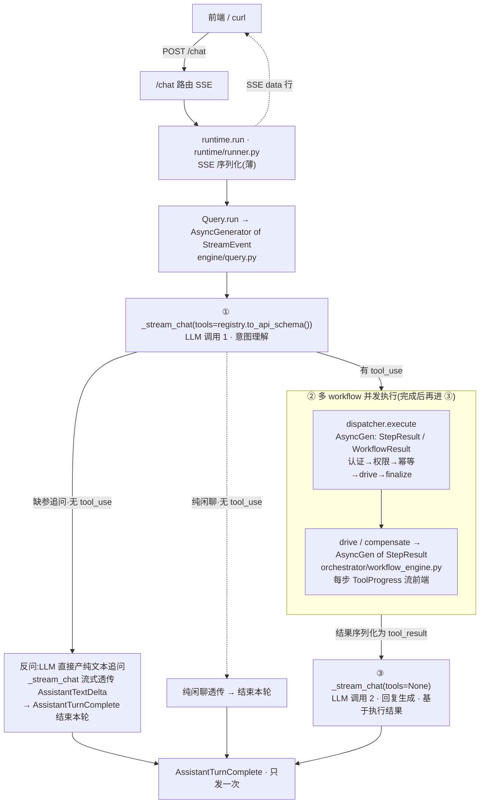
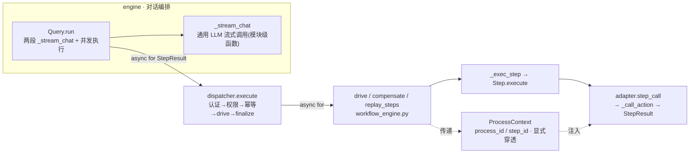
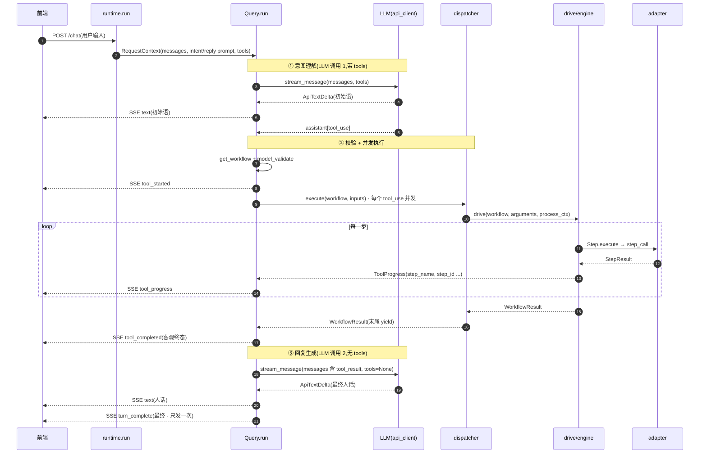

# 对话编排链路重构计划书 v3.4

> 版本:v3.4 | 日期:2026-06-29 | 状态:ProcessContext 已落地;_stream_chat 合并 / generator 化待实施
> 范围:请求主线编排层重构(`_stream_chat` 合并 + `dispatcher.execute` generator 化 + 多 workflow 并发)
> 关联文档:`工作流引擎设计方案.md`、`流程崩溃自动恢复落地计划.md`
>
> **演进记录**:
> - v1.0:agentic loop(校验失败回 LLM 重生成)——论证不适合本系统,作废。
> - v2.0:砍 loop,但回复硬编码、删 `intent_parser`、忽略 `reply_generation`——丢掉回复生成,作废。
> - v3.0:补回回复生成,三职责分离(`intent_parser`/执行/`reply_generation`)+ `Query` 编排。
> - v3.1:定稿开放问题(AssistantTurnComplete 只发最终 / ToolExecutionCompleted 流前端 / 类名 /
>   一律走 reply_generation / 多 workflow 并发);标注并发隔离前置难点 + 分阶段。
> - v3.2:定并发隔离方案 = 每 task 独立 `RequestContext` 对象(路 1)。
> - v3.3:`ProcessContext` 面向对象方案落地(替代路 1)——process_id/step_id 封装在 `ProcessContext` 实例,
>   显式传递,每执行独立实例天然并发隔离。已落地 + 验证(import / 单测 / e2e 全过)。
> - v3.4(本版):**IntentParser/ReplyGenerator 合并为 `_stream_chat`**(两者逻辑同:stream_message 消费 +
>   yield AssistantTextDelta + 累积 message + yield TurnComplete,只差 request 的 tools/messages)。
>   model 等从 context;"意图理解/回复生成"是两次 `_stream_chat`(不同 request),非独立类。

---

## 一、背景与动机

### 1.1 现状两个硬伤

1. **回复是硬编码 dump,不是对话**:`intent_parser.py:153-163` 把结果糊成
   `[workflow 输出结构化]\n...` 当回复,从没人生成「已为您预订「周会」,预订号 123」。
2. **职责搅成一团**:`IntentParser.run` 揉了意图理解/路由/校验/执行/(伪)回复 5 件事;
   `reply_generation.py` 空文件,从未接入。

### 1.2 根因:把「完整对话的两次 LLM 调用」当一次

- **LLM 调用 1 — 意图理解**(`intent_parser`):用户输入 → `tool_use` 决策。
- **LLM 调用 2 — 回复生成**(`reply_generation`):执行结果 → 自然语言回复。
- 现状只做了调用 1 + 执行,把调用 2 用硬编码糊弄。

### 1.3 重构目标

1. **职责分离**:通用 LLM 调用(`_stream_chat`)+ 执行层 + `Query` 编排;
   "意图理解/回复生成"是两次 `_stream_chat`(不同 request),非独立类。
2. **`dispatcher.execute` 改 `AsyncGenerator[StepResult]`**:步骤进度原生 yield,删 `on_step`/queue hack。
3. **单轮、不重试**:校验失败不回 LLM 重生成 `tool_call`(继承 v2.0)。
4. **多 workflow 并发(workflow 级)**:多个 `tool_use` 的 workflow 并发执行;单 workflow 内步骤仍顺序。

---

## 二、核心模型:完整对话的两次 LLM 调用

```
用户:"帮我订个会议室"
   │
   ▼ ① 意图理解 — LLM 调用 1            [_stream_chat(tools)]
   stream_message(user_input + tools) → assistant[tool_use]
     → AssistantTextDelta(初始语)
   │   无 tool_use → 纯聊天,Query 发 AssistantTurnComplete,结束
   ▼ ② 执行(多 workflow 并发)           [校验内联 + dispatcher]
   │   校验(get_workflow + model_validate) → 失败: error tool_result(不重试)
   │   yield ToolExecutionStarted
   │   async for sr in dispatcher.execute: yield ToolProgress
   │   WorkflowResult → 序列化 tool_result
   ▼ ③ 回复生成 — LLM 调用 2            [_stream_chat(无 tools)]
   stream_message(历史: assistant[tool_use] + user[tool_result])
     → AssistantTextDelta(最终人话)
   │
   ▼  Query 发 AssistantTurnComplete(最终)   ★ 只发一次
用户看到自然语言结果
```

### 2.1 与「不做重试 loop」的关系

| | 是什么 | 做不做 |
|---|---|---|
| 重试 loop | 校验失败 → 回 LLM 重决定 tool_call | ❌ 不做 |
| 回复生成 | 执行完成 → 回 LLM 基于结果生成人话 | ✅ 必须做(闭环必需) |

---

## 三、架构图

> 下图为整体架构 mermaid;逐步细节见 §3.1 的 ASCII。



### 3.1 重构后(两次 LLM `_stream_chat` + 执行 + 并发)

```
HTTP /chat (SSE)
  │
  ▼
runtime.run [runner.py]                                  (SSE 序列化,薄)
  │
  ▼
Query.run(context) -> AsyncGenerator[StreamEvent]   [engine/query.py]  编排器
  │
  ├─① _stream_chat(context.messages, tools=registry.to_api_schema())  ── LLM 调用 1(意图理解)
  │     yield AssistantTextDelta(初始语) + AssistantTurnComplete(含 tool_uses)
  │     无 tool_use → 纯聊天,Query 透传 TurnComplete → return
  │
  ├─② 执行(多 workflow 并发,workflow 级)
  │     校验内联(get_workflow + model_validate) → 通过进 _run_workflows / 失败 error tool_result
  │     yield ToolExecutionStarted(每个)
  │     并发:asyncio fan-in 消费多个 dispatcher.execute → ToolProgress(tool_name=...)
  │     各 WorkflowResult → ToolExecutionCompleted + tool_result
  │     messages += user[tool_results]
  │
  ├─③ _stream_chat(messages, tools=None)  ── LLM 调用 2(回复生成,messages 含 tool_result)
  │     yield AssistantTextDelta(最终人话) + AssistantTurnComplete(最终)
  │
  └─ yield AssistantTurnComplete(reply_message)   ★ 只发最终一次

dispatcher.execute -> AsyncGenerator[StepResult | WorkflowResult]  (最后 yield WorkflowResult)
drive/compensate  -> AsyncGenerator[StepResult]
```

---

## 四、模块设计图

> 模块依赖与文件归属(mermaid);各模块伪代码见 §4.1–§4.6。



### 4.1 `_stream_chat` —— 通用 LLM 流式调用(意图理解 + 回复生成共用)

```
_stream_chat(messages, tools=None) -> AsyncGenerator[StreamEvent]
  # model/system_prompt/max_tokens 从 context;messages/tools 参数化:
  #   调用 1(意图理解): messages=context.messages(用户消息), tools=registry.to_api_schema()
  #   调用 2(回复生成): messages=含 tool_result 历史, tools=None(避免再发起 tool_use)
  final_message = None
  
  async for event in context.api_client.stream_message(
      request=ApiMessageRequest(
          model=context.model.model, 
          messages=messages,
          system_prompt=context.system_prompt, 
          max_tokens=context.model.max_tokens, 
          tools=tools,
      )
  ):
      if isinstance(event, ApiTextDeltaEvent):
          yield AssistantTextDelta(text=event.text)       # LLM 文本流(调用 1=初始语/纯聊天;调用 2=最终人话)
          continue
          
      if isinstance(event, ApiMessageCompleteEvent):
          final_message = event.message
  
  if final_message is None:
      raise RuntimeError("模型流式输出完成, 但是没有最终消息")
  
  yield AssistantTurnComplete(message=final_message)     # 本次调用完成;Query 按阶段决策
```

**意图理解(调用 1)与回复生成(调用 2)是同一动作**(stream_message 消费 + yield AssistantTextDelta + 累积 message + yield TurnComplete),只差 request 的 `tools`(传/不传)与 `messages`(用户消息 / 含 tool_result),故合并为 `_stream_chat`,Query 调两次。`model` 等通过 context 传递。

### 4.2 执行层 —— 无 LLM

```
dispatcher.execute(workflow, inputs) -> AsyncGenerator[StepResult | WorkflowResult]
    短路(认证/权限/幂等) → yield WorkflowResult(不 yield StepResult)
    正常 → async for sr in workflow.execute: yield sr
            _finalize; yield WorkflowResult(整体结果,最后产出)

校验(get_workflow + model_validate)在 Query 内联,不单独 resolve 函数、不封装 Resolved:
  通过 → (tool_use, workflow, inputs) 进 _run_workflows
  失败 → error tool_result(不执行)
```

### 4.3 调用 2(回复生成)的约定

调用 2 = `_stream_chat(messages, tools=None)`,messages 含 `assistant[tool_use]` + `user[tool_result]`。

**一律走调用 2**(用户定):有 `tool_use` 必过调用 2,不做模板直出优化——LLM 做**润色/安抚/建议/结论综合**(把 workflow 通用结论转成贴合语境的回复,失败时共情 + 给建议,多工具时综合成一段)。

**tool_result 序列化(`WorkflowResult` → `tool_result.content`,已定稿)**:给 LLM「结论 + 状态 + 过程概览」,**剥离原始数据**:

- 给:`output`(结论,已人话)、`is_error`、`compensated`、步骤名+成败、失败 `error`。
- 不给:`steps[].data`、`step_id`、`input_params`、`response_payload`(大 / 敏感 / 对回复无价值)。

格式用简洁文本(`key: value` 行式,省 token):

    [meeting_room_booking] success
    已为您预订会议室:周会(预订号 123)
    steps: 提交预订 ✓, 审批通过 ✓, 更新使用状态 ✓

完整 `metadata` 保留在 `ToolResultBlock.result_metadata`(供审计 + 前端工具卡片展开),LLM 只看精简 `content`。

### 4.4 `Query`(编排器)—— 两次 `_stream_chat` + 执行

```
Query.run(context) -> AsyncGenerator[StreamEvent]
  messages = list(context.messages) # 用户查询消息

  # ① 意图理解(调用 1:_stream_chat 传 tools;按事件类型分流)
  async for event in self._stream_chat(context.messages, tools=registry.to_api_schema()):
      if isinstance(event, AssistantTextDelta):
          yield event                         # 文本流式透传
          continue
      
      # AssistantTurnComplete(llm调用完成)
      final_message = event.message
      if not final_message.tool_uses:
          yield event                         # 纯聊天:调用 1 完成=最终,透传
          return
      
      messages.append(final_message)          # ai回复的工具调用决策追加到消息
      
      break
      
  tool_uses = final_message.tool_uses

  # ② 校验 + 并发执行
  validated_workflows, error_results = [], []
  
  for tool_use in tool_uses:
      workflow = registry.get_workflow(tool_use.name)
      if workflow is None:
          error_results.append(ToolResultBlock(tool_use_id=tool_use.id, content=f"未知工具: {tool_use.name}", is_error=True))
          continue
      
      try:
          inputs = workflow.input_model.model_validate(tool_use.input)
      except Exception as exc:
          error_results.append(ToolResultBlock(tool_use_id=tool_use.id, content=f"无效参数: {exc}", is_error=True))
          continue
      
      validated_workflows.append((tool_use, workflow, inputs))
  
  # 流式输出开始执行工具消息
  for tool_use in tool_uses: 
      yield ToolExecutionStarted(tool_use.name, tool_use.input)
  
  results = await self._run_workflows(validated_workflows)  # 只跑通过的(并发,见 4.6)
  
  # 遍历 results:一次序列化,同时 yield 工具卡片(前端) + 收集 tool_result(喂 LLM 调用 2)
  tool_results = []
  for (tool_use, workflow_result) in results:
      output = _serialize_result(workflow_result)  # 序列化见 §4.3(结论+状态+步骤概览)
      # sse推给前端展示工具执行的过程
      yield ToolExecutionCompleted(
          tool_name=tool_use.name,
          output=output,
          is_error=workflow_result.is_error,
          metadata=workflow_result.metadata,
      )   # 流前端(工具卡片)
      # 追加到历史消息, 喂 LLM 生成最终对话回复
      tool_results.append(ToolResultBlock(
          tool_use_id=tool_use.id,
          content=output,
          is_error=workflow_result.is_error,
          result_metadata=workflow_result.metadata,
      ))
  
  # Anthropic 协议风格的消息
  messages.append(ConversationMessage(role="user", content=tool_results + error_results))

  # ③ 回复生成(调用 2:_stream_chat 不传 tools,messages 含 tool_result;全透传)
  async for event in self._stream_chat(messages, tools=None):
      yield event                             # AssistantTextDelta(人话) + AssistantTurnComplete(最终)
```

**`AssistantTurnComplete` 语义**:每次 `_stream_chat` 完成 yield 一个(调用 1 / 调用 2)。
Query **透传最终一次**:纯聊天透传调用 1 的;有工具拿调用 1 的 tool_uses(不透传)、透传调用 2 的。
`_stream_chat` 产 `AssistantTextDelta` + `AssistantTurnComplete`,Query 按类型分流。

### 4.5 数据契约

```
StepResult(frozen dataclass):
    ok / data / error / name / step_id
    is_compensation: bool = False      # ★ 新增(默认 False,补偿步置 True)

ToolProgress(frozen dataclass):
    tool_name: str          # ★ 新增(并发时区分进度归属哪个 workflow)
    step_name: str
    is_error: bool
    step_id: int | None = None
    is_compensation: bool = False
    error: str | None = None

ToolExecutionCompleted:客观终态(成功/失败 + 结构化 metadata)
    → 流前端(工具卡片) + 喂 `_stream_chat` 调用 2。不是人话。
给用户的人话:`_stream_chat` 调用 2 的 AssistantTextDelta。
AssistantTurnComplete:由 Query 只发一次(最终)。
```

### 4.6 多 workflow 并发(workflow 级)★ 本版新增

```
_run_workflows(validated_workflows):   # validated_workflows: list[(tool_use, workflow, inputs)](校验通过的)
  # queue fan-in = 并发汇集多个 generator(dispatcher.execute 各 yield StepResult): 多生产者(run task)→ 单消费者(Query yield)
  queue: asyncio.Queue[ToolProgress | WorkflowCompleted]
  
  async def run(tool_use, workflow, inputs):     # 直接传,不封装 Resolved
      # 调度分发器执行工作流
      async for result in dispatcher.execute(workflow, inputs):   # StepResult | WorkflowResult
          if isinstance(result, WorkflowResult):
              await queue.put(WorkflowCompleted(tool_use, result))     # 整体结果(完成标记)
          else:
              await queue.put(ToolProgress(tool_name=tool_use.name, step_name=result.name, ...))
              
  tasks = [
               asyncio.create_task(run(tool_use, workflow, inputs)) 
               for (tool_use, workflow, inputs) in validated_workflows
          ]
          
  # 消费 queue:ToolProgress 直接 yield;WorkflowCompleted 收集,收齐 N 个结束
```

**粒度(用户定):workflow 级并发,step 不并发**。单 workflow 内步骤仍顺序(generator)。
并发使多 workflow 的 `ToolProgress` 交错,故 `ToolProgress` 必须带 `tool_name`。

**并发隔离(已由 `ProcessContext` 解决,落地)**:dispatcher 每个 workflow 内部 `new` 独立
`ProcessContext`(process_id/step_id 实例隔离);`RequestContext`(operator/trace_id)只读,
并发 task 共享读无竞态。**无需 clone RequestContext**(v3.2 路 1 已弃)。

---

## 五、数据流向图

> 完整对话时序(mermaid);场景化数据流见 §5.1–§5.4。



### 5.1 完整对话(单 workflow,成功)

```
① _stream_chat 调用 1(传 tools): AssistantTextDelta("好的") + final_message(tool_use)
② 执行: ToolExecutionStarted → ToolProgress×3(提交/审批/更新) → ToolExecutionCompleted(客观)
   messages += assistant[tool_use] + user[tool_result]
③ _stream_chat 调用 2(不传 tools): AssistantTextDelta("已为您预订「周会」,预订号 123")
④ Query: AssistantTurnComplete(reply)
→ SSE: text(初始) / tool_started / tool_progress×3 / tool_completed / text(人话) / turn_complete
```

### 5.2 多 workflow 并发

```
① _stream_chat 调用 1 → 2 个 tool_use(如订会议室 + 发通知)
② ToolExecutionStarted×2(并发发出)
③ 并发执行:
     wf-A: ToolProgress(A.提交) → ToolProgress(A.审批) ...
     wf-B: ToolProgress(B.发送) ...           # 交错,各自带 tool_name 区分
   ToolExecutionCompleted×2
④ _stream_chat 调用 2:基于 2 个 tool_result 生成综合回复
⑤ AssistantTurnComplete
```

### 5.3 纯聊天 / 校验失败

- 纯聊天:① AssistantTextDelta(纯文本) → Query 发 AssistantTurnComplete → 结束(无执行、无调用 2)。
- 校验失败:② 校验(get_workflow/model_validate)失败 → error tool_result(不重试)→ ③ _stream_chat 调用 2 生成失败人话 → AssistantTurnComplete。

### 5.4 崩溃降级(downgrade)

```
handle_processes → replay_steps → fail_step 分支:
  async for _ in compensate(...): pass      # 只消费副作用
  transition_status(process.id, FAILED, ...)
```

---

## 六、关键设计决策

| # | 决策 | 说明 |
|---|------|------|
| 1 | **职责分离** | 通用 LLM 调用(`_stream_chat`)+ 执行层;`Query` 编排(两次 `_stream_chat`)。 |
| 2 | **补回回复生成(一律走)** | 有 tool_use 必过 LLM 调用 2,不跳过,保证回复一致性(用户定)。纯聊天不走(调用 1 即最终)。 |
| 3 | **`AssistantTurnComplete` 只发最终** | 由 Query 在对话结束透传一次;`_stream_chat` 产 AssistantTextDelta + TurnComplete(用户定)。 |
| 4 | **`ToolExecutionCompleted` 流前端** | 客观终态作「工具卡片」展示,过程可见;同时喂 `_stream_chat` 调用 2(用户定)。 |
| 5 | **类名 `Query`** | 文件 query.py;`_stream_chat` 为 Query 方法(用户定)。 |
| 6 | **多 workflow 并发(workflow 级)** | 多 tool_use 并发执行;单 workflow 内 step 顺序。`ToolProgress` 加 `tool_name`(用户定)。 |
| 7 | **`dispatcher.execute` generator 化** | yield StepResult,删 on_step/queue;整体结果走 StopAsyncIteration.value;StepResult 加 is_compensation。 |
| 8 | **单轮、不重试** | 校验失败不回 LLM;error tool_result 走 `_stream_chat` 调用 2 生成失败人话(继承 v2.0)。 |

---

## 七、分阶段实施(★ 因并发的前置难点)

**阶段一(主链路闭环,必做)**:
- `_stream_chat`(通用 LLM 调用)+ `Query` 编排(两次调用)。
- `dispatcher.execute` generator 化、删 on_step、StepResult 加 is_compensation。
- **单 workflow 串行执行**(多 tool_use 暂串行),先跑通「意图理解→执行→回复生成」全链路。
- `AssistantTurnComplete` 只发最终、`ToolExecutionCompleted` 流前端。
- `downgrade` 适配 + 测试基建(asyncSetUp)修复。

**阶段二(多 workflow 并发,依赖阶段一)**:
- workflow 级并发(fan-in)+ `ToolProgress` 加 `tool_name`。
- **并发隔离:已由 `ProcessContext` 解决**(见 §4.6/§9)——dispatcher 每 workflow 独立实例,无需 clone。
- 单 workflow 内 step 仍顺序。

> 分阶段理由:并发隔离已由 `ProcessContext` 解决(无风险);阶段二只剩 fan-in + `tool_name`。
> 先把单 workflow 对话闭环(含回复生成)跑通,价值最大。阶段二在阶段一稳定后推进。

---

## 八、文件改动清单(阶段一为主)

| 文件 | 动作 | 阶段 |
|------|------|------|
| `src/engine/query.py` | **新建** `Query` 编排器(含 `_stream_chat` 通用 LLM 调用) | 一 |
| `src/orchestrator/workflow_engine.py` | drive/compensate 改 generator;删 on_step;StepResult 加 is_compensation | 一 |
| `src/orchestrator/base.py` | execute 改 generator | 一 |
| `src/orchestrator/dispatcher.py` | execute 改 generator(短路 return / async for / _finalize) | 一 |
| `src/orchestrator/downgrade.py` | `async for _ in compensate` | 一 |
| `src/runtime/runner.py` | Query 装配;SSE 映射 AssistantTurnComplete/ToolProgress | 一 |
| `src/engine/stream_event.py` | ToolProgress 加 tool_name | 二 |
| `src/runtime/context.py` | RequestContext 回归只读不变量(process_id/step_id 移除) | ✅ 已落地 |
| `src/orchestrator/workflow_engine.py`(ProcessContext 部分) | **新增 `ProcessContext`**;Step.execute/drive/compensate/_exec_step 显式贯穿 process_ctx | ✅ 已落地 |
| `tests/*` | 适配 generator + asyncSetUp 修复;并发用例 | 一/二 |

---

## 九、边界与风险

1. **✅ `process_id`/`step_id` 竞态 —— 已由 `ProcessContext` 解决(落地)**:旧设计把它们作为
   `RequestContext` 可变属性(`set_process_id`/`set_step_id` 写共享对象),并发竞态。**v3.3 解法**:
   封装为 `ProcessContext`(process_id + step_id),dispatcher 创建后**显式传递**,每执行独立实例 →
   天然隔离(不靠 ContextVar/clone)。`RequestContext` 回归只读不变量。已落地 + import/单测/e2e 验证通过。
2. **两次 LLM 成本/延迟**:有工具必过调用 2,延迟翻倍(用户接受,换回复质量)。
3. **✅ dispatcher.execute 产出 union(已定 B)**:yield `StepResult`(步骤)+ 最后 yield `WorkflowResult`(整体)。消费方 `async for` + `isinstance` 分流,避开 async generator return value 取不到的坑。
4. **并发进度交错**:多 workflow 的 ToolProgress 交错,靠 `tool_name` 区分;前端按 tool_name 归类展示。
5. **tool_result 序列化格式**:WorkflowResult → LLM 文本的具体格式,影响回复质量,需定清晰格式。
6. **幂等短路 + 回复**:dispatcher 短路返回无 StepResult,Query 仍把短路结果序列化喂 `_stream_chat` 调用 2。
7. **✅ 测试基建**:RequestContext asyncSetUp 字段问题已修(字段可选 + 测试简化),单测/e2e 验证通过。

---

## 十、已定决策(原开放问题,均已拍板)

1. ✅ **`AssistantTurnComplete` 只发最终**(Query 在对话结束发一次)。
2. ✅ **`ToolExecutionCompleted` 流前端**(工具卡片,过程可见)。
3. ✅ **类名 `Query`**(`_stream_chat` 为 Query 方法)。
4. ✅ **一律走 `_stream_chat` 调用 2**(保证回复一致性)。
5. ✅ **多 workflow 并发(workflow 级,非 step 级)** → 分阶段,阶段二做。
6. ✅ **`process_id`/`step_id` 管理 = `ProcessContext` 面向对象(已落地)**:封装为 `ProcessContext` 实例,
   显式传递(dispatcher→drive→_exec_step→Step.execute→adapter),每执行独立实例天然并发隔离。
   替代 v3.2 的路 1(clone RequestContext)——更根本(实例隔离)。`RequestContext` 回归只读不变量。

### 仍需实现时定的细节(非方向性)
- (tool_result 序列化方案已定稿,见 §4.3;阶段二 fan-in 的进度交错顺序、多工具回复的 token 上限等,实现时再定)

---

## 十一、验证方法

1. **import 链**:`PYTHONPATH=src python -c "import engine.query, orchestrator.dispatcher, runtime.runner"`。
2. **完整对话专项脚本**:mock LLM 1(tool_use)+ dispatcher(WorkflowResult)+ LLM 2(人话);断言产出
   `AssistantTextDelta(初始) → ToolProgress×N → ToolExecutionCompleted → AssistantTextDelta(人话) → AssistantTurnComplete`。
3. **纯聊天脚本**:mock LLM 1 纯文本;断言不调 dispatcher、只一个 AssistantTurnComplete。
4. **校验失败脚本**:mock 工具名错;断言不重试、`_stream_chat` 调用 2 生成失败人话。
5. **多 workflow 并发脚本(阶段二)**:2 个 tool_use;断言并发执行、ToolProgress 带 tool_name 交错、综合回复。
6. **单测/e2e**:`tests.test_meeting_room_workflow`、`tests.test_dispatcher_e2e`(修 asyncSetUp 后)。
7. **手动 SSE**:起服务 `curl /chat`,观察 text/tool_started/tool_progress/tool_completed/turn_complete 序列。
