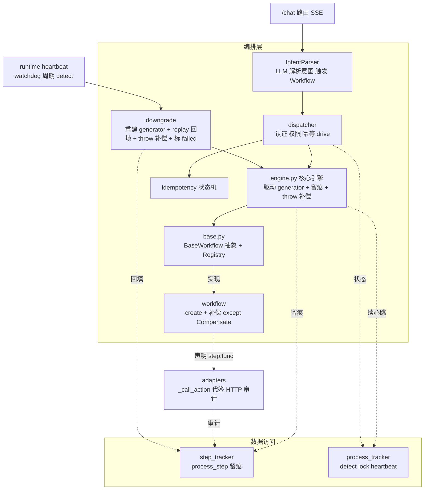
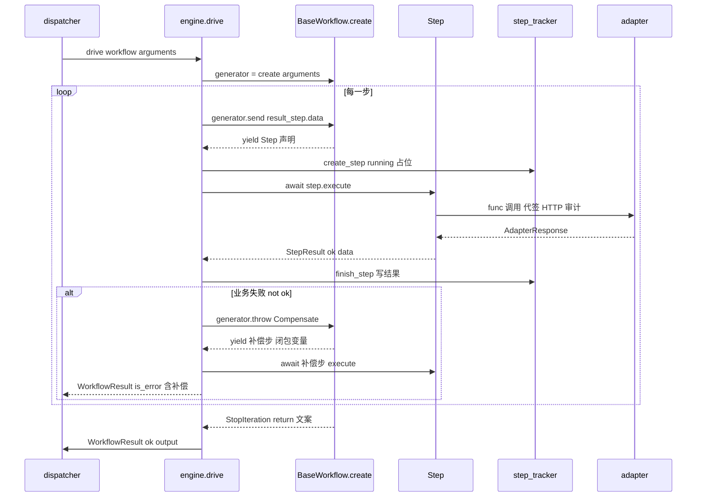
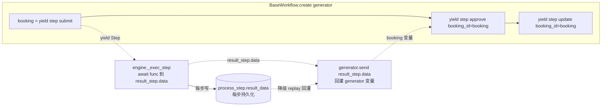

# 工作流引擎设计方案(Generator 声明式)

> 状态:现行设计底稿(取代第二代 `WorkflowStep + StepContext` 与第三代 `Step/StepSlot/sequence.compensate` 草稿)。
> 定位:编排引擎子设计,与 `用户认证与操作权限控制落地计划.md` / `流程崩溃自动恢复落地计划.md` 并列。

## 1. 背景与目标

`smart_talkflow` 是业务无关的 Agent 编排平台:把一句自然语言翻译成对传统业务系统(OA/ERP/CRM)的确定工作流调用,并在每步留下可追溯的执行痕迹。LLM 单轮(非 ReAct),`/chat` 同步 SSE 流式,当前处于 MVP 阶段。

引擎已经历三代、反复重构,暴露出 6 个痛点,新方案必须根治:

| 痛点 | 旧表现 | 根因 |
|---|---|---|
| 数据传递牵强 | `StepContext.results[step_key]` / `Ref` / `StepSlot` / `FieldSlot` | 数据流依赖命名容器 + 字段访问手动拆,耦合 step_key |
| 补偿特殊化 | 每步自带 `compensate(ctx)`,会议室 3 步各写 cancel | 整笔回滚语义被切碎到 step |
| 为留痕写复杂逻辑 | `_exec_step` 手工编排 6 步留痕 | 留痕与业务执行搅在一起 |
| recovery 太重 | 补偿旧残留 + 从头重跑 + attempt 计数 + 抢权 | 依赖下游幂等、与同步 `/chat` 冲突 |
| 命名爆炸 | Step/StepSlot/FieldSlot/StepResult/StepMeta/StepSequence/StepStatus/WorkflowStep/StepContext | Step* 概念过多,三代三个名 |
| 异常归一分散 | create / compensate 各自 try/except 白名单 | 归一逻辑散落,易漏 |

**目标**:借鉴 Temporal「workflow as code」+ Python generator 的优雅表达,设计一个**声明式、数据流自然、引擎自动留痕、统一补偿、失联只降级**的引擎,治上述 6 痛点,且不破坏 8 个外部契约(每步留痕 / trace_id / 代签 / 幂等 / 层A权限 / 心跳 / SSE / 审计)。

## 2. 设计哲学

**模块结构总览**(★ 为本次新建的引擎核心):



读图:`/chat` → IntentParser(LLM 解析意图)→ dispatcher(四道 guardrail 闸门:认证/权限/幂等/参数)→ **engine.drive**(驱动 BaseWorkflow.create generator,每步自动留痕,失败 throw Compensate 补偿);watchdog 周期 detect 失联 → orchestrator/downgrade(重建 generator + replay 回填 + throw 补偿 + 标 failed)。★ engine.py 是唯一新建核心,其余模块复用现有、零接口改动。

### 2.1 流程即 generator(借鉴 workflow as code)

`BaseWorkflow.create(arguments)` 是一个**同步 generator**:`yield step(...)` 声明一个步骤,`value = yield step(...)` 接收上一步的产出。引擎驱动 generator:对每个 yield 出来的 `Step` 执行真实 adapter 调用,再把 `result_step.data` 用 `generator.send(data)` 回灌。

```python
# 业务写法(左)≈ 引擎做的事(右):
booking_id = yield step(submit, ...)    #  ≈  booking_id = await submit(...)
yield step(approve, booking_id)         #  ≈  await approve(booking_id)
```

数据流走 generator **局部变量**——业务侧无任何 `Ref`/`Slot`/`results[step_key]`,痛点 1 根除。

### 2.2 副作用隔离(借鉴 Temporal activity)

`create` 是**纯描述的步骤声明**(声明 `Step` 对象,不真正调 adapter、无 I/O);真正的 async I/O 封装在 `Step.func`(adapter action)里,由引擎 `await` 执行。这是 Temporal「activity 隔离」的轻量版——`create` 只编排,`Step.func` 承载副作用。

### 2.3 为何不像 Temporal 那样重

| Temporal 特性 | 采纳? | 理由 |
|---|---|---|
| replay(确定性重放) | 是(轻量) | 仅降级时重建 generator + 回填已持久化的 result_data 恢复闭包变量(不重执行 adapter、不做 event sourcing/集群);同步 `/chat` 无需完整 durable execution |
| 独立集群 + worker | 否 | 单进程 FastAPI,watchdog 同进程协程;MVP 不引入集群运维 |
| 确定性约束(禁随机/时间/IO) | 部分 | `create` 本就纯描述无 IO(约束只针对 generator,不针对 Step.func) |
| activity 隔离 | 是(轻量) | `Step.func` 即 activity |
| saga 内建 | 是 | generator 内 `except Compensate` 闭包补偿(终态/逆序统一) |
| 事件溯源完整历史 | 否 | `process_step` 表已是简化执行日志,够审计 |

### 2.4 借鉴 Rasa Pro CALM 的适配

Rasa Pro 的 CALM(Conversational AI with Language Models)用声明式 flow 描述「完成一个任务的逻辑步骤」,有几个设计值得借鉴。但 Rasa 是**多轮对话引擎**(LLM 每轮驱动),smart_talkflow 是**单轮后端编排**(`/chat` 一次性执行工作流),所以借鉴要适配、要取舍。

**可借鉴并已适配的点**:

1. **flow 即任务逻辑单元**:Rasa 一个 flow = 一个任务的全部步骤;smart_talkflow 的 `BaseWorkflow.create`(generator 描述步骤序列)同理。`BaseWorkflow` 对应 Rasa 的 flow,是业务逻辑的一等单元。
2. **step 类型化**:Rasa step 有 `action`(执行副作用)/ `collect`(收集信息)/ `link`(子流程)/ `set_slots`(设数据)/ `noop`。smart_talkflow 适配:
   - **`action`** → `Step`(调 adapter,当前核心 step 类型)。
   - **`set_slots`** → **generator 变量**(数据流走 `var = yield step(...)`,天然覆盖「设数据」,无需额外 step 类型)。
   - **`collect`** → **不采纳**(Rasa 用它向用户多轮收集信息;smart_talkflow LLM 单轮,参数不全由 parser 在 `/chat` 内消化,不向用户反问)。若未来支持多轮补全参数,再引入。
3. **guardrails(执行前闸门)**:Rasa 用 flow guards / LLM 推理护栏做条件激活与安全。smart_talkflow 的 `dispatcher.execute` **本身就是 guardrail gate**,在 `workflow.create` 前过四道闸门:① 认证(operator 注入)→ ② 权限(`workflow_role` 白名单)→ ③ 幂等(状态机判重)→ ④ 参数(parser 已校验入参)。这四道闸门是引擎的安全边界,流程内不再重复校验。
4. **LLM → flow 触发**:Rasa `FlowPolicy` 用 LLM 生成内部命令驱动 flow;smart_talkflow 的 `IntentParser` 同理(LLM 解析意图 → 触发对应 `BaseWorkflow`)。差异:smart_talkflow **单轮**(parser 一次解析 → workflow 一次执行),非 Rasa 的逐步 LLM 命令(internal monologue)。parser 在内部消化幻觉(重试/反问在 parser 层),workflow 执行不被 LLM 逐步打断。

**不盲抄的部分(单轮后端编排 vs 多轮对话)**:

| Rasa 特性 | 采纳? | 理由 |
|---|---|---|
| `collect`(多轮收集 slot) | 否 | smart_talkflow 单轮,参数不全在 parser 内消化,不向用户反问 |
| internal monologue(逐步 LLM 命令驱动) | 否 | 单轮:parser 一次解析即触发 workflow,执行中无 LLM 介入 |
| deviations(对话偏离修正/澄清 pattern) | 否 | 多轮对话才需要;单轮后端编排无对话偏离 |
| YAML 声明 flow | 否 | 选 Python generator(code 优于 YAML:类型安全/IDE/可调试/无热加载复杂度) |

**一句话**:借鉴 Rasa 的**flow 任务单元 + step 类型化思想 + guardrails 闸门 + LLM→flow 触发**,但不抄它的**多轮对话内核**(collect / 逐步命令 / 偏离修正),因为 smart_talkflow 是单轮后端编排,不是对话引擎。

## 3. 核心抽象(API)

### 3.1 类型清单(收敛后业务可见仅 6 个)

```python
# orchestrator/engine.py


class Compensate(Exception):
    """引擎↔业务的补偿协议信号。

    一步失败时,引擎向 generator `generator.throw(Compensate)`;业务的 create 用
    `except Compensate` 捕获进入补偿分支(`yield` 补偿步,直接用闭包变量)。
    这是引擎与业务之间唯一的补偿触发契约,必须显式定义(被业务 `except` 消费)。
    """


@dataclass(frozen=True)
class Step:
    """一步对外调用(声明式)。引擎据此推断留痕字段 + 执行。

    解耦约定:`func` 直接返回 `StepResult`(成败 + data + 错误)——这是引擎与副作用之间
    唯一的契约。`AdapterResponse` 属于 adapter 层,由 adapter action 在内部把它转成
    `StepResult` 返回;引擎从不 import `AdapterResponse`。数据流走 workflow generator 的
    局部变量(闭包),Step 不持有命名产出——借鉴 Temporal「workflow as code」。
    """
    func: Callable[..., Awaitable[StepResult]]              # async,直接返回引擎契约类型
    args: tuple = ()
    kwargs: dict = field(default_factory=dict)
    name: str | None = None        # 步骤中文名(留痕 step_name;不填取 func.__name__)

    async def execute(self) -> StepResult:
        """执行本步:调 func,返回 StepResult。

        引擎只调本方法(await step.execute());func 抛出的异常不在此捕获,由引擎
        `_exec_step` 统一归一(见 §4.4)。
        """
        return await self.func(*self.args, **self.kwargs)


@dataclass(frozen=True)
class StepResult:
    """单步结果(引擎内部 + 降级 replay 用)。

    前 3 个字段(成败语义)在 func 返回时由 adapter 层填好 / 异常时由 `_exec_step` 的 except 内联归一填充;
    后 2 个(留痕元信息)由引擎 `_exec_step` 用 `dataclasses.replace` 补齐。
    """
    ok: bool                        # 本步是否成功
    data: Any = None                # 成功产出(供 generator.send 回灌 generator 变量 + 落 result_data 供降级 replay);失败时 None
    error: str | None = None        # 失败文案(「可重试」由 adapter 在文案里体现,引擎不判 http_status)
    # 以下由引擎组装,func 返回时不填:
    name: str | None = None
    step_id: int | None = None      # 留痕主键
```

`step(...)` 是 `Step` 的工厂函数(便于 `yield step(...)` 顺写);adapter action 直接返回 `StepResult`(adapter 层把 `AdapterResponse` 转好),业务侧写 `yield step(submit, ...)` 无需任何解读样板。**全程只有 `Step` 一个步骤概念**——痛点 5(Step/StepSlot/FieldSlot/StepResult/StepMeta/StepSequence/StepStatus/WorkflowStep/StepContext)收敛为:`Step` + `StepResult`(引擎内部);补偿走 generator 内闭包(见 §6),不引入额外类型。

### 3.2 BaseWorkflow 基类(create 演进)

```python
class BaseWorkflow(ABC):
    name: str
    description: str
    input_model: type[BaseModel]

    @abstractmethod
    def create(self, arguments: BaseModel) -> Generator[Step, Any, str]:
        """声明流程:yield step(...),return 最终给用户的文案。
        引擎 send 每步 result_step.data 回来;业务用 var = yield step(...) 接收(闭包变量)。

        这是声明式的同步 generator——只编排步骤序列、不做 I/O;真正副作用封在
        Step.func 里由引擎 await。补偿也写在这里:`except Compensate` 分支 yield 补偿步,
        直接用上面的闭包变量(见 §6)。方法名用 `create`:调用即**创建 generator**(不执行),区别于 `step.execute`(执行单步)。
        """

    @abstractmethod
    def business_key(self, arguments: BaseModel) -> str | None: ...

    # to_api_schema 由基类提供;create 是子类实现的抽象 generator(含补偿分支),
    # 由 engine.drive 直接驱动(dispatcher 调 engine.drive,不经基类 wrapper)。
```

`create` 返回 `Generator[Step, Any, str]`:yield 出 `Step`、send 进 `Any`(result_step.data)、return 出最终文案。引擎 `engine.drive` 直接驱动这个 generator(不再有基类 create wrapper 这层)。

### 3.3 同步 generator vs async generator

adapter action 是 `async def`,但 **create 选同步 generator**:
- `create` 是纯描述(声明 `Step`,无 I/O),同步函数更自然、更易测;
- 真正的 async I/O 在 `Step.func` 里,引擎 `await func(...)` 后 `generator.send(data)` 回灌;
- 失联降级「重建 generator、send 回填数据」用同步 `generator.send` 语义最清晰。

代价:`create` 内不能直接 `await`(它不是 async)——但 `create` 本就不该做 I/O,所有副作用封进 `Step.func` 由引擎执行。这正是副作用隔离的体现(`create` 沿用既有入口命名,语义是「声明步骤序列」而非「直接执行副作用」,真正执行在 `Step.func`)。

## 4. 执行模型

**核心执行流程**(引擎驱动 generator,正常路径 + 失败补偿):



读图:引擎 `generator.send` 拉 `Step` 声明 → `create_step` 留痕 → **`await step.execute()`(Step 调 func,func 内部把 `AdapterResponse` 转成 `StepResult` 返回;代签+HTTP+审计在 adapter 层)** → `finish_step` 写结果 → `generator.send(result_step.data)` 回灌 generator 变量,循环。引擎只驱动 + 留痕 + 异常归一,**不直接碰 adapter、也不认识 `AdapterResponse`**(分层:`engine` 驱动/留痕、`Step` 调 func+解读、`adapter` 做外部调用)。任一步 `not ok` 立即 `generator.throw(Compensate)` 触发 execute 的补偿分支,引擎继续驱动补偿步(用闭包变量)直到 StopIteration。**全程不向上抛异常**(drive 永远返回结构化结果)。

### 4.1 引擎驱动循环 `engine.drive(workflow, arguments) -> WorkflowResult`

```python
async def drive(workflow, arguments, *, on_step=None) -> WorkflowResult:
    generator = workflow.create(arguments)
    step_results: list[StepResult] = []
    send_value = None                          # 首次 send(None) 启动

    try:
        while True:
            try:
                step = generator.send(send_value)
            except StopIteration as stop:
                return WorkflowResult(output=stop.value or "完成",
                                      metadata={"steps": [asdict(result_step) for result_step in step_results]})
            if not isinstance(step, Step):
                raise TypeError(f"create 必须 yield Step,得到 {type(step)}")

            result_step = await _exec_step(step, len(step_results) + 1)
            step_results.append(result_step)
            if on_step:
                await on_step(result_step)          # SSE 钩子(可选)
            send_value = result_step.data

            if not result_step.ok:
                # 失败:throw Compensate 触发 create 补偿分支,驱动补偿步直到 StopIteration(见 §6)
                logger.info("drive:步 %d 失败(%s),转补偿", len(step_results), result_step.error)
                return await _compensate(generator, step_results, on_step)
    except Exception as exc:
        logger.exception("drive 异常:workflow=%s", workflow.name)
        return WorkflowResult(output=f"流程异常: {exc!r}", is_error=True,
                              metadata={"steps": [asdict(result_step) for result_step in step_results]})
```

### 4.2 单步执行 `_exec_step`(引擎自动留痕,业务零感知)

每步引擎做 6 件事——**全在引擎内,业务 create 里没有任何留痕代码**(痛点 3 根除):

```python
async def _exec_step(step: Step, step_no: int) -> StepResult:
    process_id = get_process_id()

    await flush_heartbeat(process_id)                         # ① 续心跳

    adapter, action, input_params = _step_meta(step.func, step.args, step.kwargs)  # ② 推断元信息
    step_id = await create_step(                              # ③ 留痕占位
        process_id, step_no,
        step_key=step.name or step.func.__name__,
        step_name=step.name or step.func.__name__,
        adapter=adapter, action=action, input_params=input_params,
    )
    set_step_id(step_id)                                      # ④ 回填,供 adapter_call_logs 关联

    started = perf_counter()
    logger.info("步 %d 开始:%s.%s", step_no, adapter, action)
    try:
        result_step = await step.execute()                           # ⑤ 执行本步(Step 调 func 返回 StepResult;adapter 内部落 AdapterCallLog)
    except Exception as exc:                                  # ⑥ 异常归一:兜底 adapter bug / generator 异常,统一产失败 StepResult(见 §4.4)
        logger.warning("步 %d 异常归一:%s", step_no, exc)
        result_step = StepResult(ok=False, error=str(exc) or f"引擎未捕获异常: {exc!r}")
    finally:
        set_step_id(None)

    duration_ms = int((perf_counter() - started) * 1000)
    await finish_step(
        step_id,
        status=StepStatus.COMPLETED if result_step.ok else StepStatus.FAILED,
        result_data=result_step.data if result_step.ok else None,  # 每步都存(降级 replay 据此恢复所有 generator 变量)
        error_message=result_step.error,                          # 失败文案;原始响应体由 adapter_call_logs 承载,不在此重复
        duration_ms=duration_ms,
    )
    logger.info("步 %d 完成:ok=%s, %dms", step_no, result_step.ok, duration_ms)
    return replace(result_step, name=step.name, step_id=step_id)
```

### 4.3 推断步骤元信息 `_step_meta`(治痛点 3)

```python
def _step_meta(func, args, kwargs) -> tuple[str, str, dict]:
    """从 adapter action callable 推断 (adapter, action, input_params)。
    func 形如 room_booking_adapter.submit_booking —— 通过 __self__/__name__ 取。"""
    instance = getattr(func, "__self__", None)
    adapter = getattr(instance, "adapter_name", None) or getattr(instance, "target_system", "") or "unknown"
    action = getattr(func, "__name__", "call")
    input_params = {**dict(zip(_arg_names(func), args)), **kwargs}   # kwargs + 位置参按形参名归位
    return adapter, action, input_params
```

业务侧 `step(...)` 的 `args/kwargs` 直接成为留痕的 `input_params`,无需业务再写一遍。`step_no` 由引擎计数器给(不再依赖业务声明的顺序常量)。

### 4.4 异常归一(治痛点 6)

归一直接**内联在 `_exec_step` 的 `except` 里**(见 §4.2 ⑥),不单独建函数——所有异常都走这一处,create/compensate 不再各自处理。

**归一策略**:adapter.`_call_action` 已把 HTTP/网络层归一为结构化响应(不抛),这里只兜底 adapter 自身 bug 与 generator 层异常;引擎**不判 http_status、不构造 AdapterResponse**——「可重试」是 adapter/编排层对错误的解释,不是步骤结果的客观属性,只产失败 `StepResult`。`StepResult` 不带「可重试」字段,这个属性由 adapter 在 `error` 文案里体现(它知道 503 是临时错误),编排层/LLM 据文案转述给用户即可。引擎的步级结果只表达客观的成败/data/错误。

### 4.5 正常 vs 失败路径

```
正常:generator.send → Step → _exec_step(心跳/留痕/调用/留痕)→ send(result_step.data) → 下一 Step → … → StopIteration(return 文案)→ WorkflowResult(ok)
失败:某步 not ok → finish_step(FAILED)→ generator.throw(Compensate) → create 补偿分支 yield 补偿步 → 驱动补偿步 → StopIteration → WorkflowResult(is_error 已补偿)
```

引擎全程不向上抛异常(drive 永远返回结构化结果),契合「LLM 单轮、/chat 同步 SSE」。

## 5. 数据流

**数据流转**(generator 变量是主数据流;每步 result_data 持久化供降级 replay):



读图:主数据流走 **generator 变量**(`booking` 经 `generator.send` 回灌,后续步直接引用,无 step_key/容器);**每步** `result_data` 都持久化,供失联降级 replay 回灌所有闭包变量。补偿用 generator 内闭包变量(见 §6),不依赖命名产出——业务侧数据流纯粹走变量,无任何声明。

### 5.1 generator 变量(主数据流)

`booking_id = yield step(submit, ...)` —— 引擎 `generator.send(result_step.data)` 把 `StepResult.data`(yudao bookingId)回灌,generator 局部变量直接拿到,**无中间容器、无 step_key 索引**。后续步 `step(approve, booking_id=booking_id)` 直接用变量。痛点 1 彻底消失。

### 5.2 每步持久化 `result_data`——供降级 replay

`_exec_step` 对**每一步**都把 `result_step.data` 写进 `result_data`(不再挑命名步)。失联降级时重建 generator generator,按步序把 DB 里的 `result_data` 用 `generator.send` 回灌,generator 的闭包变量逐一恢复到失败点——这正是 Temporal 式 replay 的轻量版(见 §7)。补偿直接用这些闭包变量(见 §6),无需命名产出。

### 5.3 与现有持久化的关系(零改动)

- `process_step.step_key/step_name`:引擎从 `Step.name` 取(业务给中文名,留痕可读)。
- `process_step.adapter/action`:引擎推断。
- `process_step.input_params`:`step(...)` 的 `args/kwargs`。
- `process_step.result_data`:每步写(供降级 replay)。
- `adapter_call_logs.step_execution_id`:`set_step_id(step_id)` 在 `_exec_step` 内回填,adapter `_call_action` 自动取(现有契约,不改)。

## 6. 补偿模型

补偿写在 **generator 内**(闭包式,借鉴 Temporal saga):`try` 包正常步,`except Compensate` 分支 `yield` 补偿步,直接用上面的闭包变量。引擎负责检测失败、`generator.throw(Compensate)` 触发、驱动补偿步——业务只写「失败时做什么」,不写检测/分流控制流。

### 6.1 补偿驱动 `_compensate`

drive 检测到某步 `not ok` 后调用:`generator.throw(Compensate)` 让 create 进入 `except Compensate` 分支,随后照常 `generator.send` 驱动补偿步(补偿步也经 `_exec_step` 留痕、执行),直到 StopIteration 拿到补偿文案。

```python
async def _compensate(generator, step_results, on_step) -> WorkflowResult:
    """throw Compensate 触发 create 补偿分支,驱动补偿步直到 StopIteration。"""
    fail = step_results[-1] if step_results else None

    try:
        logger.info("补偿:throw Compensate(失败步=%s)", fail.name if fail else "?")
        step = generator.throw(Compensate)            # 失败 yield 处抛 → create 进 except → 返回首个补偿步
    except StopIteration as stop:                    # except 内无 yield,直接 return
        return WorkflowResult(output=stop.value or (fail and fail.error) or "执行失败", is_error=True,
                              metadata={"steps": [asdict(result_step) for result_step in step_results], "compensated": True})
    except Compensate:                               # create 没 except Compensate(无补偿)→ 直接失败
        return WorkflowResult(output=(fail and fail.error) or "执行失败", is_error=True,
                              metadata={"steps": [asdict(result_step) for result_step in step_results]})

    while True:                                      # 驱动补偿步(逆序/终态都由 create 的 except 体决定)
        result_step = await _exec_step(step, len(step_results) + 1)
        logger.info("补偿步执行:%s ok=%s", result_step.name, result_step.ok)
        step_results.append(result_step)
        if on_step:
            await on_step(result_step)
        try:
            step = generator.send(None)               # 补偿步产出不回灌(create 闭包已有所需变量)
        except StopIteration as stop:
            return WorkflowResult(output=stop.value or "执行失败,已补偿", is_error=True,
                                  metadata={"steps": [asdict(result_step) for result_step in step_results], "compensated": True})
```

### 6.2 两种形态,同一套机制(都写在 create 的 except 里)

| 形态 | create 写法 | 引擎行为 |
|---|---|---|
| 终态覆盖(会议室) | `except Compensate: yield step(cancel, booking_id=...)` | throw 后驱动这唯一的补偿步 |
| 严格可逆(入职) | `except Compensate:` 内逆序 `yield step(逆操作, ...)` | throw 后按 except 体顺序驱动多个补偿步 |

业务无需写「这是哪种 saga」——补偿步序列就是 `except` 体里的 yield 序列,引擎照驱动即可。无逆操作的步(如开通邮箱)在 except 里不 yield,自然跳过。

### 6.3 补偿失败

补偿步也是普通 `Step`,经 `_exec_step` 执行;其 `StepResult.not ok` 时 `finish_step` 标 FAILED、`compensation_status=failed`(沿用现有 `CompensationStatus`)。补偿失败不吞错——残留可见,交人工/对账;引擎不因某个补偿步失败而中断,`except` 体继续 yield 后续补偿步。

## 7. 失联降级(不重跑)

### 7.1 方向:只降级,不重跑(已定调)

旧 recovery(补偿旧残留 + 从头重跑 + attempt + 抢权重跑)与同步 `/chat` 冲突,且依赖下游幂等(yudao 非幂等会撞时段冲突)。新方案:**watchdog 检测失联 → 重建 generator generator → replay 已成功步的 result_data 回灌闭包变量 → throw Compensate 跑补偿 → 标 failed**,绝不重跑。

### 7.2 重建 generator generator 的可行性(关键论证)

`create` 是**纯描述的同步 generator**(不调 adapter、无 I/O),重建它**没有副作用风险**:再调一次 `workflow.create(arguments)` 得到新 generator,yield 序列与首次完全一致(确定性,只依赖 `arguments`)。

```
首次执行:generator = create(arguments); step1 成功(落 result_data=123)→ send(123); step2 执行中崩溃
降级重建:gen2 = create(arguments); step1 声明 → 从 DB result_data 取 123 → send(123)(闭包变量恢复);
         step2 声明 → DB 无此步(当初没成功)= 失败点 → generator.throw(Compensate) → 进入补偿
```

**这就是 Temporal 式 replay 的轻量版**:重建 generator + 从 DB 回填已持久化的 `result_data`,把闭包变量恢复到失败点。与完整 Temporal replay 的区别:我们**不做 event sourcing、不引入集群**,只在降级时 replay 已成功步拿结构——send 的是 DB 已持久化的 `result_data`,**不重新调下游 adapter**。零下游副作用,零幂等依赖。

> 约束:`create` 内禁止用 `datetime.now()`/随机数决定分支(同 Temporal 确定性约束,但只约束 generator,不约束 Step.func)。

### 7.3 回填算法 `_replay_steps`

```python
async def _replay_steps(workflow, arguments) -> tuple[list[StepResult], Step | None, Generator]:
    """重建 generator,replay 已成功步的 result_data 回灌闭包变量,定位失败步;返回 generator 供补偿续跑。"""

    # ① 从 DB 取已成功步的 result_data,按 step_no 索引(供按步号查)
    completed = await list_completed_steps(get_process_id())   # [(step_no, step_key, result_data)]
    logger.info("replay:开始恢复闭包变量(已成功 %d 步)", len(completed))
    result_data_by_step = {step_no: result_data for step_no, _, result_data in completed}

    # ② 重建 generator(未启动、无副作用;create 只依赖 arguments,确定性)
    generator = workflow.create(arguments)

    # ③ replay 循环:send 推进 generator,用 DB 的 result_data 回灌闭包变量,直到失败点
    step_results, send_value, step_no = [], None, 0
    fail_step = None
    while True:
        try:
            step = generator.send(send_value)                  # 推进到下一个 yield,拿到 step 声明
        except StopIteration:
            break
        step_no += 1
        if step_no not in result_data_by_step:                 # DB 无此步 = 当初没成功 = 失败点
            fail_step = step
            logger.info("replay:定位失败步=%s", step.name)
            break
        result_data = result_data_by_step[step_no]
        step_results.append(StepResult(ok=True, data=result_data, name=step.name, step_id=None))
        send_value = result_data                               # 下一轮回灌,闭包变量逐一恢复
    return step_results, fail_step, generator
```

### 7.4 降级主流程(填 `orchestrator/downgrade.py` 骨架)

```python
async def handle_processes(registry) -> None:
    process_list = await detect(settings.process_heartbeat_timeout)
    if process_list:
        logger.info("降级:检测到 %d 个失联流程", len(process_list))
    for process in process_list:
        # ① 抢锁(多实例防重:DB 原子条件 UPDATE,0 行=被别的实例抢走)
        if not await acquire_recovery_lock(process.id, settings.process_heartbeat_timeout):
            logger.info("降级:process=%s 被别的实例抢占,跳过", process.id)
            continue

        # ② 重建该 process 的请求上下文(操作人 / trace_id,供代签 + 审计关联)
        operator = OperatorContext.from_operator_context(process.operator_context)
        set_request_context(RequestContext(operator=operator, process_id=process.id, trace_id=process.trace_id))
        trace_id_context.set(process.trace_id)

        # ③ 重建 workflow + 业务入参 arguments(operator 经 ContextVar)
        workflow = registry.get_workflow(process.process_key)
        arguments = workflow.input_model.model_validate(process.input_params or {})

        # ④ replay 已成功步的 result_data,定位失败点(不重跑 adapter,零下游副作用)
        step_results, fail_step, generator = await _replay_steps(workflow, arguments)

        # ⑤ 在失败点 throw 补偿(与正常失败同路径;fail_step 为 None 表示流程已跑完,跳过)
        if fail_step is not None:
            await _compensate(generator, step_results, on_step=None)

        # ⑥ 标终态 failed(经 process_tracker.transition_status 状态迁移;降级只善后,不走幂等状态机)
        await transition_status(
            process.id, target_status="failed", from_status="running",
            extra={"error_message": f"失联降级,失败步: {fail_step.name if fail_step else '未知'}"},
        )
        logger.info("降级:process=%s 已善后(失败步=%s)", process.id, fail_step.name if fail_step else "无")
```

**降级路径不再** `reset_process` / 从头重跑 `run_steps`。`acquire_recovery_lock` 只刷新心跳防并发,处理完经 `transition_status` 直接转 `failed`(不走 `IdempotencyChecker` 状态机)。

### 7.5 与 watchdog 的边界

- `runtime/heartbeat.py` 的 `heartbeat_watchdog` 不变(周期 `detect` + 调 `handle_processes`)。
- `process_tracker.detect` / `acquire_recovery_lock` / `flush_heartbeat` / `list_completed_steps` / `transition_status` 全部复用现有,不改。
- 降级配置只剩 `process_heartbeat_timeout` / `process_recovery_interval`(无 attempt 计数)。

## 8. 外部契约衔接(零接口改动)

| 契约 | 现有实现 | 引擎如何挂(不改其接口) |
|---|---|---|
| 每步留痕 | `step_tracker.create_step/finish_step/update_compensation/list_completed_steps` | `_exec_step` 调 create/finish(正常步+补偿步统一走);`_compensate` 对失败补偿步调 update_compensation 标 failed;降级调 list_completed_steps。**不改 step_tracker** |
| trace_id | `utils/trace_id_util` ContextVar + logger filter + `infra/http` 注入 `X-Trace-Id` | 引擎不碰 trace_id(全程在请求 ContextVar 内);降级 `trace_id_context.set(process.trace_id)` 恢复 |
| 代签凭证 | `services/credential` + `adapters/base._call_action` 自动注入 + 落 AdapterCallLog | 引擎只经 `Step.execute` 调 `func`(adapter action),代签在 adapter 内自动完成;降级重建 OperatorContext 后代签头随之正确 |
| 幂等状态机 | `orchestrator/idempotency` NEW/COMPLETED/FAILED | dispatcher 负责 check + finalize;引擎只产 `WorkflowResult`,dispatcher 据其 `is_error` 调 `checker.completed/failed`。failed 终态不重执行(降级只补偿不重跑,与「failed 不重执行」一致) |
| 权限(层A) | `permission/permission.WorkflowRoleChecker` | dispatcher 在 `workflow.create` 前调 `is_allowed`,引擎不感知(权限是 workflow 级,非 step 级) |
| 心跳 | `process_tracker.flush_heartbeat` + `runtime/heartbeat` watchdog | `_exec_step` 每步 `flush_heartbeat`;watchdog 调降级。**不改** |
| SSE 流 | `engine/stream_event` + `runtime/runner._serialize_event` | `engine.drive` 接 `on_step` 回调,parser 用它把 `StepResult` 转 `ToolExecutionStarted/Completed` 流式产出。引擎本身不依赖 SSE 类型,保持纯净 |

### 8.1 SSE 钩子(最小侵入)

`engine.drive(workflow, arguments, *, on_step=None)` 接受可选回调,dispatcher/parser 传入一个把 `StepResult` 转成 SSE 事件的 async 回调。引擎本身不耦合 SSE 类型。

## 9. 命名收敛(治痛点 5)

| 旧(Step* 爆炸) | 新 |
|---|---|
| Step / WorkflowStep | **`Step`**(唯一步骤概念) |
| StepSlot / FieldSlot / Ref / FieldRef | **删除** —— 数据流走 generator 变量 |
| StepResult / StepMeta | **`StepResult`**(引擎内部) |
| StepSequence / StepStatus | **删除** —— generator 即序列,状态在 process_step 表 |
| StepContext / WorkflowExecutionContext | **废弃**(create 不再要 context 参数,operator 经 ContextVar) |
| call / ref / yields / as_ | **`step()`**(工厂) |

**业务侧可见仅 5 个**:`BaseWorkflow` / `Step` / `step()` / `Compensate` / `WorkflowResult`,语义各自独立无重叠。

## 10. 取舍

### 10.1 优雅体现在哪(治 6 痛点对照)

1. 数据传递牵强 → generator 变量(`var = yield step(...)`),零容器、零 step_key。
2. 补偿特殊化 → generator 内 `except Compensate` 闭包补偿(终态/逆序统一),业务只写「失败时做什么」。
3. 为留痕写复杂逻辑 → 引擎 `_exec_step` 推断元信息 + 自动 create/finish,业务 create 零留痕代码。
4. recovery 太重 → 失联只降级(重建 generator + replay result_data 回灌 + throw 补偿 + 标 failed),不重跑、不 attempt、不依赖下游幂等。
5. 命名爆炸 → Step* 收敛为 `Step` + `StepResult`(内部)。
6. 异常归一分散 → `_exec_step` 的 except 内联统一归一,create/compensate 不再各自 try/except。

### 10.2 generator 方案的代价与边界

- **generator 内不能直接 await**:副作用必须封进 `Step.func`。这是约束也是隔离(防 create 里混 I/O,破坏「纯描述」)。需发非 adapter 副作用(如发邮件)时,包成 async 函数传给 `step()`。
- **数据驱动的条件分支**:`var = yield step(...)` 后,后续 `yield` 可依 `var` 决定(**支持条件分支**)——覆盖会议室/入职这类顺序编排。复杂并行留后续阶段。
- **generator 不可序列化**:`create` 不能像 YAML 存盘重放。但不需要(降级靠重建 + DB 回填,不存 generator 本身)。

## 11. 日志/留痕简洁原则

### 11.1 引擎自动留痕,业务零感知

业务的 `create` 里**没有任何日志/留痕代码**。所有 `process_step`(create/finish/compensation)、`adapter_call_logs`、心跳、trace_id 都在引擎 `_exec_step` 与 adapter `_call_action` 内自动完成。业务写 `yield step(submit, ...)` 这一行,引擎自动产出:一条 running 占位、一次 HTTP 调用审计、一条 completed 结果、一次心跳续期。

### 11.2 不为日志写复杂逻辑

引擎日志只记三类(结构性、无业务分支):步骤边界(`_exec_step` 开始/结束,adapter/action/step_no/duration)、失败归一(except 兜底 warn,error_message)、补偿(`_compensate` 补偿步 done/failed)。

业务侧**禁止**在 `create` 里写 `logger.info` 编排逻辑(若需业务日志,放 adapter action 内,与副作用同处)。

### 11.3 留痕丢失不阻断主流程

`step_tracker` / `adapter_call_logs` 落库失败只 `logger.exception` 不抛(沿用现有 `except SQLAlchemyError`)。引擎沿用:留痕是审计附属,不应让业务调用因留痕失败而失败。

## 12. 落地步骤

1. **`orchestrator/engine.py`(新)**:`Step`/`step()`/`StepResult`/`Compensate` + `drive`/`_exec_step`/`_compensate`/`_step_meta`;adapter action 返回 `StepResult`(adapter 层把 `AdapterResponse` 转好),引擎与 `AdapterResponse` 解耦。单测:mock adapter + step_tracker,验证正常路径、推断元信息、异常归一、闭包补偿(except Compensate 终态/逆序两形态)。
2. **`orchestrator/base.py`(改)**:`BaseWorkflow` 抽象 `steps()` → `create()` generator(声明式,只编排,含 `except Compensate` 补偿分支);`create` 由 `engine.drive` 直接驱动(不经基类 wrapper);`WorkflowExecutionContext` 废弃(create 不要 context 参数,operator 经 ContextVar)。
3. **`orchestrator/workflow/meeting_room.py`(改)**:`steps()` → `create()`(generator,`except Compensate` 内 `yield step(cancel)` 终态覆盖)。
4. **新增 `orchestrator/workflow/onboarding.py`**(示例,可选):`except Compensate` 内逆序补偿,作蓝本验证。
5. **`orchestrator/dispatcher.py`(微改)**:`create` 第 5 步调 `engine.drive(workflow, arguments)`(直接驱动 `workflow.create` generator,不经 wrapper)。
6. **`orchestrator/downgrade.py`(填骨架)**:`handle_processes`/`_replay_steps`。
7. **`runtime/heartbeat.py`(不动)**:watchdog 已调 `handle_processes`,接口不变。
8. **`conf/config.py`**:保留 `process_heartbeat_timeout`/`process_recovery_interval`(降级配置)。
9. **测试**:`test_engine`(drive 各路径)、`test_downgrade`(重建+回填+补偿+标 failed)、改 `test_meeting_room_workflow`(切 generator)。

## 附录 A:示例——会议室预订(终态覆盖补偿)

```python
class MeetingRoomBookingWorkflow(BaseWorkflow):
    name = "meeting_room_booking"
    description = "调用OA系统执行会议室预订:提交→审批→更新使用状态"
    input_model = MeetingRoomBookingInput

    def business_key(self, arguments):
        op = get_operator()
        return f"{op.user_id}_{arguments.room_id}_{arguments.meeting_start_time}_{arguments.meeting_end_time}"

    def create(self, arguments):
        op = get_operator()                  # operator 在 ContextVar
        booking_id = None
        try:
            booking_id = yield step(
                room_booking_adapter.submit_booking,
                room_id=arguments.room_id, meeting_title=arguments.meeting_title,
                meeting_start_time=arguments.meeting_start_time, meeting_end_time=arguments.meeting_end_time,
                creator=op.user_id, moderator_id=arguments.moderator_id,
                name="提交预订",
            )

            yield step(room_booking_adapter.approve_booking, booking_id=booking_id, name="审批通过")
            yield step(room_booking_adapter.update_use_status, booking_id=booking_id,
                       use_status=arguments.use_status, name="更新使用状态")
            return f"已为您预订会议室:{arguments.meeting_title}(预订号 {booking_id})"
        except Compensate:                                  # 闭包变量 booking_id 直接用,无需声明
            if booking_id:
                yield step(room_booking_adapter.cancel_booking, booking_id=booking_id, name="取消预订")
            return "预订失败,已取消"
```

对比旧方案(3 步各写 cancel):**一个 `except Compensate` 内的 cancel 覆盖整笔**,因为 yudao `cancel` 是终态覆盖。

## 附录 B:示例——员工入职(严格可逆,闭包逆序补偿)

```python
class EmployeeOnboardingWorkflow(BaseWorkflow):
    name = "employee_onboarding"
    input_model = OnboardingInput

    def create(self, arguments):
        emp = account = None
        try:
            emp = yield step(
                hr_adapter.create_profile, arguments.name, dept=arguments.dept, id_no=arguments.id_no,
                name="HR 建档",
            )
            emp_id = emp["id"]

            account = yield step(
                ad_adapter.open_account, employee_id=emp_id,
                name="开通域账号",
            )

            yield step(crm_adapter.grant_access, employee_id=emp_id, name="授权 CRM")
            yield step(mail_adapter.create_mailbox, account_id=account, name="开通邮箱")  # 无逆操作:except 里不 yield,人工兜底
            return f"入职完成:{arguments.name}"
        except Compensate:                                  # 逆序:后开的先撤;闭包变量直接用
            if account:
                yield step(ad_adapter.disable_account, employee_id=emp_id, name="禁用域账号")

            if emp:
                yield step(hr_adapter.delete_profile, employee_id=emp_id, name="删除 HR 档案")
            return "入职失败,已回滚"
```

- 开通域账号有逆操作 → `except` 里 yield 禁用;
- 开通邮箱无逆操作 → `except` 里不 yield(留 `compensation_status=none`,人工兜底)。

**两种补偿形态用同一套机制**:终态(会议室:一个 cancel)和逆序(入职:多个逆操作)都写在 `except Compensate` 里,引擎 throw 后照驱动。

## 关键文件清单

- `src/orchestrator/engine.py`(新建,引擎核心)
- `src/orchestrator/base.py`(改:`BaseWorkflow` 抽象 `create`(含 `except Compensate`),`steps`→`create` generator)
- `src/orchestrator/workflow/meeting_room.py`(改:`steps`→`create` generator,`except Compensate` 终态 cancel)
- `src/orchestrator/downgrade.py`(填骨架:降级重建+回填+补偿)
- `src/orchestrator/dispatcher.py`(微改:execute 委托 engine.drive)

辅助参考(不改但引擎依赖):`repository/step_tracker.py`、`repository/process_tracker.py`、`adapters/base.py`、`runtime/context.py`。

## 参考来源

- [Temporal — Durable Execution](https://temporal.io/blog/what-is-durable-execution)
- [Temporal — Saga Pattern Made Easy](https://temporal.io/blog/saga-pattern-made-easy)
- [AWS Prescriptive Guidance — Saga Orchestration Pattern](https://docs.aws.amazon.com/prescriptive-guidance/latest/cloud-design-patterns/saga-orchestration.html)
- [DBOS — Database-Oriented Durable Workflow](https://docs.dbos.dev/)
- [CIDR 2026 — Consistency and Correctness in Data-Oriented Workflow Systems](https://www.cidrdb.org/)