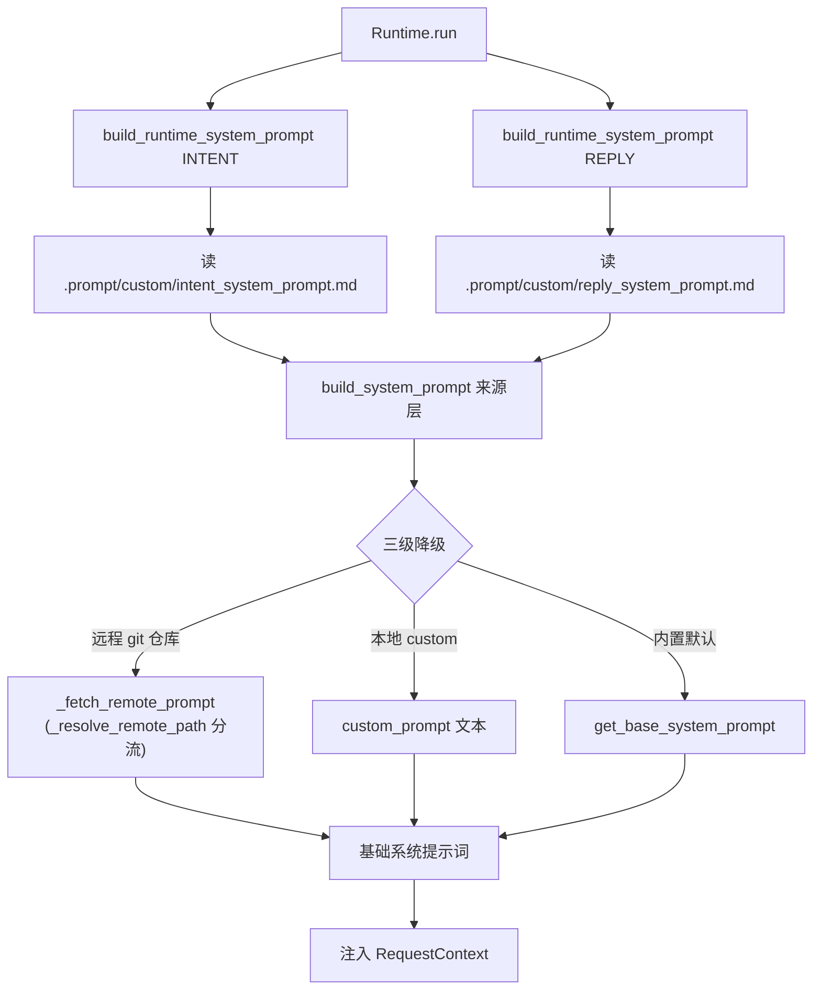

# 提示词加载架构设计与落地说明

> 日期: 2026-06-30(已落地)
> 状态: **已落地**,本文对齐 `src/prompts/` + `runtime/runner.py` 的真实实现
> 范围:`smart_talkflow` 的系统提示词加载与运行时拼装链路
> 关联:本文是「提示词加载」子系统的现行总纲;对话编排全链路见 `对话编排链路计划书.md`

---

## 一、一句话定位

提示词加载分两层,用「来源层 + 运行时入口」的薄分层:

- **来源层**(`system_prompt.py`):只负责**拿到原始提示词文本**——在「远程 git 仓库 / 本地自定义 / 内置默认」之间做三级降级。
- **运行时入口**(`context.py`):**内联加载本地自定义文件**,再委托来源层,产出最终送给模型的系统提示词。

贯穿全链路的一条铁律:

> **系统提示词业务无关,不枚举 workflow。** workflow 清单由 `engine/query.py` 意图理解阶段的 function-calling `tools` 承担(`tools=self._registry.to_api_schema()`,`engine/query.py:155`),不写进 system prompt。

这条铁律也是本子系统与早期「设计稿」之间**最大的分歧**(见第九章)。

---

## 二、目录与文件职责(现状)

```text
src/prompts/
├── __init__.py        # 公共出口:统一导出 PromptType / build_* / EnvironmentInfo
├── context.py         # 运行时入口:内联加载 .prompt/custom/ + 委托来源层
├── environment.py     # settings → EnvironmentInfo(远程仓库环境信息)
└── system_prompt.py   # 来源层:PromptType 枚举 + 默认模板 + 远程拉取 + 三级降级
```

四个文件都已就位、各司其职,不再有「空壳」或「未接线」状态:

| 文件 | 职责 | 关键符号 |
|---|---|---|
| `system_prompt.py` | 来源选择:默认模板、远程仓库拉取、custom 降级,按 `PromptType` 分流 | `PromptType` / `get_base_system_prompt` / `build_system_prompt` / `_fetch_remote_prompt` / `_resolve_remote_path` |
| `context.py` | 运行时入口:读 `.prompt/custom/<type>_system_prompt.md` 作 custom,委托 `build_system_prompt` | `build_runtime_system_prompt` |
| `environment.py` | 从 `settings` 构造 `EnvironmentInfo`(含 intent/reply 两条远程路径) | `EnvironmentInfo` |
| `__init__.py` | 统一导出对外 API,调用方只从 `prompts` 顶层导入 | `__all__` |

---

## 三、运行时调用链

提示词加载发生在 `runtime/runner.py` 的 `Runtime.run()` 中,**每请求执行一次**,分别为意图理解和回复生成构建两份系统提示词。

实际调用(`runtime/runner.py:165-168`):

```python
env = EnvironmentInfo.get_environment()
intent_system_prompt = await build_runtime_system_prompt(PromptType.INTENT, env=env)
reply_system_prompt = await build_runtime_system_prompt(PromptType.REPLY, env=env)
```

随后两份提示词注入 `RequestContext`(`runtime/runner.py:179-180`),供 `engine/query.py` 两段式 LLM 编排使用:意图理解带 `tools`、回复生成不带 `tools`。

调用链:

```text
Runtime.run
  ├─ EnvironmentInfo.get_environment()              # 启动/请求时读 settings
  ├─ build_runtime_system_prompt(INTENT, env=env)   # 运行时入口(context 层)
  │     ├─ 读 .prompt/custom/intent_system_prompt.md  → custom(缺失/空白则 None)
  │     └─ build_system_prompt(INTENT, env, custom_prompt=custom)   # 来源层
  │           └─ 三级降级:远程 git > custom > 默认模板
  └─ build_runtime_system_prompt(REPLY, env=env)    # 同上,读 reply 阶段文件
        └─ ... → reply_system_prompt
```



注意链路里**没有**「拼 workflow 清单」这一步——这是与早期设计稿的关键差异(第九章详述)。

---

## 四、分层职责:来源层 vs 运行时入口

### 4.1 `system_prompt.py`:只负责「拿到原始文本」

它做且只做三件事:

1. 返回对应阶段的**内置默认模板**(`get_base_system_prompt(prompt_type)`)。
2. 从**远程 git 仓库**拉取提示词文本(`_fetch_remote_prompt`)。
3. 在「远程 / custom / 默认」三层之间**按优先级选择**(`build_system_prompt`)。

它**不做**:workflow 清单拼接、运行时 section 拼接、registry 注入。这些都不是「加载来源」的职责。

### 4.2 `context.py`:负责「运行时拼装」

它的实际职责比早期设计稿设想的更轻——**只做一件事:把本地 `.prompt/custom/` 的自定义提示词内联加载进来,再交给来源层**。

它接收到的只有 `prompt_type` 和 `env`,**不接收** `custom_prompt`(自己读本地文件),**也不接收** `workflow_registry`(workflow 清单改由 tools 承担,见第九章)。

### 4.3 为什么这样分

- `system_prompt.py` 是「纯来源选择」,与运行时对象无关,可独立测试三级降级。
- `context.py` 是「运行时入口」,把「本地可编辑的自定义提示词」这一运行期行为收敛在一处,调用方(`runner.py`)无需感知 `.prompt/custom/` 的存在与文件命名约定。
- 二者解耦后,`.prompt/custom/` 的加载策略变化只动 `context.py`,不影响来源层降级逻辑。

---

## 五、三级降级详解

降级发生在 `build_system_prompt`(`system_prompt.py:222-260`)内部,严格按优先级短路:

```python
prompt: str | None = None

# 1. 远程仓库拉取(仅 is_git_repo 且配置了 git_repo_url 时尝试)
if env.is_git_repo and env.git_repo_url:
    prompt = await _fetch_remote_prompt(
        env.git_repo_url,
        _resolve_remote_path(prompt_type, env),   # 按 prompt_type 分流远程仓库内路径
        env.git_branch,
    )

# 2. 降级到自定义提示词(context 层传入的本地 custom 文本)
if not prompt and custom_prompt:
    prompt = custom_prompt

# 3. 兜底:按 prompt_type 取内置默认模板
if not prompt:
    prompt = get_base_system_prompt(prompt_type)

return prompt
```

关键点:

- **任一层为空或失败,自动落到下一层**——远程 git 抛错返回 `None`、custom 为空、都走默认。
- **默认层按 `prompt_type` 分流**:intent 取 `_BASE_INTENT_SYSTEM_PROMPT`,reply 取 `_BASE_REPLY_SYSTEM_PROMPT`。
- `custom_prompt` 由 `context.py` 传入,**来源就是 `.prompt/custom/<type>_system_prompt.md`**(见第八章)。

---

## 六、`PromptType` 枚举(贯穿所有接口)

```python
class PromptType(StrEnum):
    """提示词类型:intent 意图理解 / reply 回复生成。"""
    INTENT = "intent"
    REPLY = "reply"
```

**所有提示词接口的第一参数都是 `PromptType`,不是裸字符串**。这是项目约定(见 `CLAUDE.md`):避免 `"intent"` / `"reply"` 这类魔法字符串散落各处。

`PromptType` 同时驱动两件事:

1. **默认模板分流**:`get_base_system_prompt(prompt_type)` 选 intent / reply 模板。
2. **远程路径分流**:`_resolve_remote_path(prompt_type, env)` 选远程仓库内的文件路径。

---

## 七、远程仓库处理

### 7.1 拉取:`_fetch_remote_prompt`(`system_prompt.py:162`)

采用 **clone-or-reset** 策略:

- 本地缓存目录 `.prompt/remote/` 不存在 → 浅克隆(`--depth 1`,省时省流量,提示词仓库只需最新文件)。
- 已存在 → 用远程版本**强制覆盖本地**(`fetch` + `reset --hard`,直接覆盖不合并,提示词仓库始终以远程为准)。
- `branch` 指定分支,为空时用仓库默认分支。
- 任何 git 或读取失败 → 返回 `None`,交上层降级。

### 7.2 远程路径按阶段分流:`_resolve_remote_path`(`system_prompt.py:206`)

```python
def _resolve_remote_path(prompt_type: PromptType, env: EnvironmentInfo) -> str:
    if prompt_type == PromptType.INTENT:
        return env.git_intent_relative_path or "intent_system_prompt.md"
    if prompt_type == PromptType.REPLY:
        return env.git_reply_relative_path or "reply_system_prompt.md"
    raise ValueError(f"不支持的提示词类型:{prompt_type!r}")
```

回退规则:**`git_intent_relative_path` / `git_reply_relative_path` 留空 → 回退阶段默认文件名**(`intent_system_prompt.md` / `reply_system_prompt.md`)。

> ⚠️ **没有通用的 `git_relative_path`**。早期设计稿曾建议保留一个通用 `git_relative_path` 作兼容回退,**落地时未采用**——intent / reply 直接各自一条字段,职责更清晰,不存在「通用兜底」的歧义路径。

### 7.3 远程优化本轮不做

远程 git 拉取当前**在请求链路同步执行**(每请求触发,但首次后走 `reset --hard` 较快)。考虑到:

1. 远程仓库是**可选**能力(`is_git_repo=False` 时完全不触发);
2. 当前主要矛盾早已不在 prompt 结构;
3. 进程内缓存 / 后台刷新会放大复杂度与测试成本。

本轮明确**不做**缓存与后台刷新。后续若线上频繁启用远程仓库、且拉取明显影响响应时间,再单独优化(进程内最近成功结果缓存 + 失败保底回退)。

---

## 八、本地自定义提示词(`.prompt/custom/`)

### 8.1 目录与文件

```text
.prompt/
├── custom/                          # 本地自定义提示词(运行时可编辑、每请求加载)
│   ├── intent_system_prompt.md      # intent 阶段自定义(缺失/空白 → 走默认)
│   └── reply_system_prompt.md       # reply 阶段自定义(缺失/空白 → 走默认)
└── remote/                          # 远程仓库克隆缓存(is_git_repo=True 时填充)
```

`custom/` 与 `remote/` **解耦、互不覆盖**:`custom/` 是用户本地可编辑的覆盖源,`remote/` 是远程仓库的只读克隆。

### 8.2 加载逻辑(`context.py:28-35`)

```python
custom_prompt = None
path = _CUSTOM_PROMPT_DIR / f"{prompt_type}_system_prompt.md"
if path.is_file():
    text = path.read_text(encoding="utf-8")
    if text.strip():           # 仅空白也视为缺失
        custom_prompt = text

return await build_system_prompt(prompt_type, env, custom_prompt=custom_prompt)
```

要点:

- **路径**:`.prompt/custom/{prompt_type}_system_prompt.md`(即 `intent_system_prompt.md` / `reply_system_prompt.md`),位于 `custom/` 子目录下。
- **缺失或仅空白** → `custom_prompt=None` → 交来源层走默认模板(`build_system_prompt` 第三级)。
- **不回退到 `.prompt/system_prompt.md`**:不存在这个通用兜底文件;intent / reply 各自一份,各自降级到各自的内置默认模板。

### 8.3 与远程的优先级

本地 `custom/` 是**第二级**,低于远程 git 仓库。即:启用远程仓库且拉取成功时,远程覆盖本地 custom;远程失败/未启用时,才用本地 custom;两者都没有时,用内置默认。

---

## 九、关键修正:workflow 清单改由 tools 承担(不进 system prompt)

这是本子系统落地过程中**与早期设计稿最重要的分歧**,必须讲清楚。

### 9.1 早期设计稿的主张(已被推翻)

早期设计稿曾主张:

> 把当前可用 workflow 清单,在 `context.py` 的运行时拼装阶段追加到 intent 系统提示词尾部,并附「只能从以上 workflow 中选择」的约束。理由是:workflow 清单属于运行时对象(registry),应当由「运行时拼装器」(`context.py`)注入,而非写进静态模板。

对应地,设计稿曾为 `build_runtime_system_prompt` 设计过 `workflow_registry: WorkflowRegistry | None = None` 参数。

### 9.2 实际落地的做法

**没有这样做。** workflow 清单完全离开了 system prompt,改由 LLM 原生 function-calling 承担:

- `engine/query.py:155` —— 意图理解阶段调用 `_stream_chat(..., tools=self._registry.to_api_schema())`,把所有已注册 workflow 以结构化工具 schema 的形式声明给 LLM。
- `WorkflowRegistry.to_api_schema()`(`orchestrator/base.py:77`)—— 把每个 workflow 转成一个 function-calling tool 定义(含参数 schema)。
- 回复生成阶段 `tools=None`(`engine/query.py:230` 附近),不带工具,只基于 tool_result 生成最终回复。

### 9.3 为什么改

1. **结构化工具优于自由文本清单**。function-calling 的 tool schema 直接表达 workflow 的参数名/类型/必填,LLM 对结构化工具的遵循度高于「在 prompt 里列一段文字再让它选」。
2. **职责更纯粹**。system prompt 只承载「意图判断规则 + 回复规范」,与具体 workflow 解耦——workflow 增删时 system prompt 不变,只需要改 registry 注册。
3. **天然防幻觉**。LLM 只能调用声明的 tool,无法臆造不存在的 workflow——这比「在 prompt 里写一句『禁止臆造』」更可靠。

### 9.4 对 prompts 子系统的连带影响

- `build_runtime_system_prompt` **不需要** `workflow_registry` 参数,签名收敛为 `(prompt_type, *, env)`。
- `context.py` 只剩「加载本地 custom + 委托来源层」一件事,职责更轻、更易测。
- system prompt 的两份内置模板(`_BASE_INTENT_SYSTEM_PROMPT` / `_BASE_REPLY_SYSTEM_PROMPT`)刻意**不绑定任何具体业务**,只演示判断模式与回复规范。

---

## 十、reply 提示词怎么处理

### 10.1 独立默认模板已落地

`_BASE_REPLY_SYSTEM_PROMPT`(`system_prompt.py:82`)专职「基于 tool_result 生成最终回复」,与 intent 模板完全分离,通过 `get_base_system_prompt(PromptType.REPLY)` 返回。

### 10.2 reply 不追加 workflow 清单

reply 阶段不是让模型「选工具」,而是让模型「说结果」,因此:

- 不带 `tools`(`engine/query.py` reply 阶段 `tools=None`);
- system prompt 不含 workflow 列表;
- 回复规范(优先说结论、失败给下一步、不暴露堆栈等)直接写在 `_BASE_REPLY_SYSTEM_PROMPT` 模板里,**不是运行时追加的 section**。

---

## 十一、接口一览(实际签名)

```python
# system_prompt.py
class PromptType(StrEnum):
    INTENT = "intent"
    REPLY = "reply"

def get_base_system_prompt(prompt_type: PromptType = PromptType.INTENT) -> str
def _resolve_remote_path(prompt_type: PromptType, env: EnvironmentInfo) -> str
async def _fetch_remote_prompt(repo_url: str, prompt_path: str, branch: str | None = None) -> str | None
async def build_system_prompt(
    prompt_type: PromptType,
    env: EnvironmentInfo,
    *,
    custom_prompt: str | None = None,
) -> str

# context.py
async def build_runtime_system_prompt(
    prompt_type: PromptType,
    *,
    env: EnvironmentInfo,
) -> str

# environment.py
@dataclass
class EnvironmentInfo:
    is_git_repo: bool
    git_repo_url: str | None = None
    git_branch: str | None = None
    git_intent_relative_path: str | None = None
    git_reply_relative_path: str | None = None

    @classmethod
    def get_environment(cls) -> EnvironmentInfo
```

> `build_system_prompt` / `build_runtime_system_prompt` 均为 **async**——因为 `_fetch_remote_prompt` 走 git 子进程(`asyncio.create_subprocess_exec`),整个链路必须可 await。

---

## 十二、配置项(`src/conf/config.py`)

| 配置项 | 类型 | 默认 | 说明 |
|---|---|---|---|
| `IS_GIT_REPO` | `bool` | `False` | 是否启用远程提示词仓库 |
| `GIT_REPO_URL` | `str \| None` | `None` | 远程仓库地址(`is_git_repo=True` 时必填,启动即校验) |
| `GIT_BRANCH` | `str \| None` | `None` | 拉取分支,空用仓库默认分支 |
| `GIT_INTENT_RELATIVE_PATH` | `str \| None` | `None` | intent 远程文件相对路径,空回退 `intent_system_prompt.md` |
| `GIT_REPLY_RELATIVE_PATH` | `str \| None` | `None` | reply 远程文件相对路径,空回退 `reply_system_prompt.md` |

启动校验(`config.py:145`):`is_git_repo=True` 且 `GIT_REPO_URL` 空白 → 直接抛错(「启动即失败」)。

---

## 十三、测试覆盖(`tests/test_prompts_context.py`)

标准 `unittest` + `IsolatedAsyncioTestCase`,用临时目录 mock `.prompt/custom/`,**无 DB、无真实 LLM**。覆盖四个场景:

1. `test_loads_intent_and_reply_respectively` —— intent / reply 各读各自阶段专属文件。
2. `test_local_file_loaded_when_exists` —— 本地非空文件 → 加载为 custom。
3. `test_blank_local_file_falls_back_to_default` —— 本地文件仅空白 → 视同缺失 → 走内置默认。
4. `test_missing_local_file_falls_back_to_default` —— 本地无对应文件 → 走内置默认。

运行:

```bash
PYTHONPATH=src python -m unittest tests.test_prompts_context -v
```

---

## 十五、遗留与待办

- **远程拉取同步执行**:见第七章 7.3,后置优化项,本轮不做。

---

## 十六、一句话总结

提示词加载子系统已落地为两层薄分层:

> **`system_prompt.py` 负责「远程 / 本地 custom / 默认」三级来源选择,按 `PromptType` 分流;`context.py` 作为运行时入口,内联加载 `.prompt/custom/` 自定义文件后委托来源层。系统提示词保持业务无关——workflow 清单不进 prompt,改由 `engine/query.py` 的 function-calling `tools` 承担。**
