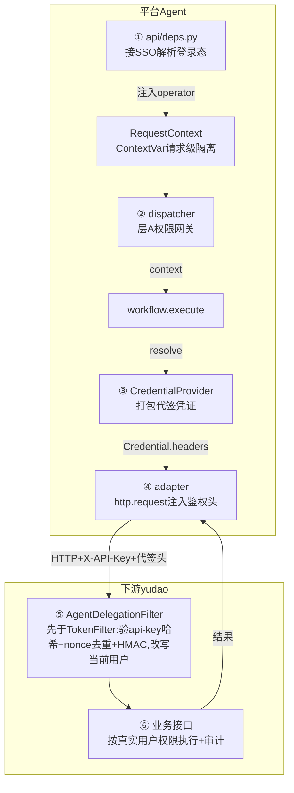
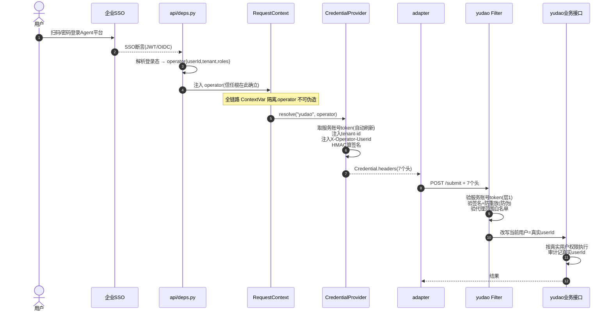

> **目标**:打通「Agent 平台 → 下游传统业务系统(OA / ERP / CRM)」的身份认证与操作权限,使平台能够**安全、可追溯**地代表不同真实用户调用下游 API,且**不复制任何业务系统的身份与权限数据**。
>
> **定位**:本文是《传统业务系统接入 Agent 落地计划》在**安全维度**的专项补充。原计划书的「安全与权限」一节只覆盖了平台自身的 RBAC,完全未设计「Agent 以什么身份、代表谁去调下游」这一贯穿四阶段却缺失的横切问题。
>
> **核心原则**:身份也是一种主数据——平台只**消费与流转**,不**生产与判定**。认证传递 ≠ 权限判定;权限判定交给权威源(SSO / 下游系统)。

------

## 文档导航

- [1. 问题背景](#1-问题背景)
- [2. 设计目标与原则](#2-设计目标与原则)
- [3. 总体架构](#3-总体架构)
- [4. 用户认证:三层信任链](#4-用户认证三层信任链)
- [5. 操作权限:三层权限判定](#5-操作权限三层权限判定)
- [6. 多用户与多租户](#6-多用户与多租户)
- [7. 端到端数据流走查](#7-端到端数据流走查)
- [8. 工程落地](#8-工程落地)
- [9. 安全红线与反模式](#9-安全红线与反模式)
- [10. 演进路线](#10-演进路线)
- [11. 边界与未覆盖场景](#11-边界与未覆盖场景)
- [12. 验收标准](#12-验收标准)

------

## 1. 问题背景

### 1.1 现状缺口(代码证据)

当前代码在整条「编排 → 适配 → 下游」调用链上,**「操作人 / 凭证」这个维度从头到尾不存在**:

| 文件 | 证据 | 缺什么 |
|---|---|---|
| `adapters/base.py` | `http.request(method, base_url+path, json=payload)` | 只发 `method/path/json`,**无任何鉴权头** |
| `adapters/base.py` | `AdapterRequest` 仅 `action/method/path/payload` | **无 credential / auth 字段** |
| `adapters/base.py` | `BaseAdapter.__init__(base_url)` | **不持有任何凭证** |
| `oa_adapter/oa_client.py` | `client = OAClient()` 模块级单例 | 进程级共享,无法按请求换身份 |
| `orchestrator/workflow/onboarding.py` | `from ... import client` 直接用单例 | **完全没传递「谁发起的」** |
| `runtime/context.py` | `QueryContext` 是空 dataclass | **无 operator / principal 字位** |
| `orchestrator/dispatcher.py` | `created_by=arguments.get("operator", "")` | operator **从业务参数 dict 取**(可伪造),且只用于幂等、未传给下游 |

下游时序图里 `OA->SYS: 调用 OA REST API` 默认凭据"天上掉下来",落到代码就是裸调——真接 OA/AD 必然 **401 / 403**。

### 1.2 问题本质:认证其实是两层,权限是多源

**层 1 · 调用可达性认证(Connect-time,M2M)**
平台↔下游的技术握手:服务账号 / API Key / mTLS / OAuth2 client_credentials。解决「能不能调通」。

**层 2 · 操作人语义认证(Principal / Delegation)**
下游系统的权限绑在**真实员工**身上。若平台用万能服务账号代替所有人:
1. **绕过下游权限模型**——服务账号要么被拒,要么被迫开超级权限,违反最小权限。
2. **审计归零**——下游审计全是「机器人/系统」,查不到真正操作人,而「可追溯」正是本项目核心卖点。
3. **跨域越权**——部门隔离失效。

> 「权限没打通」的根因 = 只做了层 1,丢了层 2。

除认证外,还横亘两个计划书**完全盲区**的维度:
- **租户隔离**:下游多租户(如 yudao 的 `tenant-id` 头),平台要正确传递。
- **凭证生命周期**:token 过期与刷新。

### 1.3 下游系统画像(以真实接入的 yudao 为例)

yudao(`/admin-api` 前缀 + `tenant-id` 头,ruoyi-vue-pro 体系)有**两条**调用路径:

**(a) 普通用户(前端直登)** —— `Authorization: Bearer <登录token>`(存 Redis 的会话令牌),经 `TokenAuthenticationFilter` 解出 `userId / userType / tenantId`,数据权限、菜单权限、操作日志都绑在该 userId。

**(b) Agent 平台代签(本方案)** —— 不走 Bearer,改走「服务账号 api-key + HMAC 代签」:

```
POST http://127.0.0.1:48080/admin-api/oa/meeting-room-booking/submit
  -H 'X-API-Key: <服务账号 api-key>'          # 层1·服务账号身份
  -H 'tenant-id: 1'
  -H 'X-Operator-Userid: 9527'                # 层2·真实操作人
  -H 'X-Agent-Signature: <HMAC>'              # 防伪造 operator
  -H 'X-Agent-Timestamp: <ts>'                # 防重放·时间戳窗口
  -H 'X-Agent-Nonce: <nonce>'                 # 防重放·一次性
  -d '{"roomId": 1, ...}'
```

由 `AgentDelegationFilter`(注册在全局链、**先于** `TokenAuthenticationFilter`)按 `X-API-Key` 头识别,验签 + nonce 去重后,把当前用户**改写**为 `X-Operator-Userid` 指定的真实员工 —— 此后 `@PreAuthorize` 按真实用户权限判定、审计记真实用户。

这意味着**不能**用「一个服务账号代替所有人、裸调业务接口」:那样 yudao 会认定操作人是服务账号,数据权限错位、审计全错。本方案围绕「如何让 yudao 以真实员工的身份正确执行」展开 —— 答案就是层2的 HMAC 代签 + 下游 Filter 改写。

------

## 2. 设计目标与原则

| 目标 | 说明 |
|---|---|
| **可信身份传递** | 平台代表真实用户调用下游,且下游能确信该身份不可伪造 |
| **不托管用户凭证** | 平台**永不持有**任何用户的下游会话 token,只持有 IT 管理的服务账号 |
| **权限交给权威源** | 业务/数据权限由下游判定,流程级权限由平台薄 RBAC 判定,**绝不在平台复制下游权限模型** |
| **可追溯** | 一个 `operator` 串联该用户的全链路日志与审计 |
| **最小身份足迹** | 平台碰身份最少,把「你是谁」留给 SSO,把「你能干什么」留给下游 |

**四条不可违背的原则:**

1. **身份与凭证解耦**——operator(身份)与服务账号 api-key / 代签凭证(技术认证)分别来自不同源,各自独立流转。
2. **身份只来自信任根**——operator 必须来自 SSO 登录态,**严禁**来自请求体或 LLM 参数。
3. **认证传递 ≠ 权限判定**——方案④只把可信身份送达权威源;判定逻辑归 SSO / 下游 / 平台薄 RBAC,各司其职。
4. **不复制业务主数据**——员工、部门、角色、权限模型一律归各系统所有,平台只存「映射关系」。

------

## 3. 总体架构

### 3.1 核心思路:代办员模式

方案④的本质可类比「政务大厅代办」:

- 代办员有他自己的**工作证**(= 服务账号 api-key)→ 能进大厅(= 能调通下游)。
- 他办的是**你的事**,得带上你签字的**委托书**(= HMAC 签名的 operator 头)→ 窗口把业务记在**你的名下、按你的权限办**。
- 代办员**不需要你的身份证原件**(= 平台不碰用户的下游 token)。

| 比喻 | 实体 | 解决 |
|---|---|---|
| 代办员工作证 | 服务账号 api-key | 层 1·能调通 |
| 你签字的委托书 | HMAC 签名的 operator 头 | 层 2·这事儿算你的 |
| 窗口见委托书后记你的名字 | yudao AgentDelegationFilter 改写当前用户 | 权限/审计按真实用户 |

### 3.2 架构全景



两处心脏:**平台侧 ③(打包身份)** 与 **下游侧 ⑥(拆包改写)**。

------

## 4. 用户认证:三层信任链

身份从用户登录到下游执行,经过三段可信传递:



### 4.1 信任根:SSO 登录态

平台**不建**自己的用户名/密码体系。身份来源是企业既有身份源(SSO / OIDC / 钉钉企微 / AD)。平台只是身份的**消费者**:
- 用户登录 Agent 平台时,SSO 断言确立「这是谁」。
- 平台信任 SSO 的判定,不自立身份。

### 4.2 operator 的确立与传递

`operator` 是贯穿全链的「真实操作人」对象,必须在**请求入口**确立并**请求级隔离**:

```python
# runtime/context.py —— 复刻 trace_id_context 的 ContextVar 隔离机制
import contextvars

@dataclass(frozen=True)
class OperatorContext:
    user_id: str              # 真实操作人(如 yudao userId "9527")
    name: str
    tenant_id: str            # 所属租户
    roles: list[str]          # 平台 RBAC 角色(从 SSO 映射),如 ["employee"] / ["hr_admin"]
    dept_scope: list[str]     # 数据权限范围(可操作的部门),从 SSO/HR 主数据同步

@dataclass(frozen=True)
class RequestContext:
    trace_id: str
    operator: OperatorContext

_operator_ctx: contextvars.ContextVar[OperatorContext] = contextvars.ContextVar("operator")

def set_operator(op: OperatorContext) -> None:
    _operator_ctx.set(op)

def get_operator() -> OperatorContext:
    return _operator_ctx.get()
```

> **请求级隔离是红线**:operator 绝不能是进程级共享变量,否则并发请求会串号(王五的身份串到李四的请求)。用 `ContextVar`,与现有 `trace_id_context` 完全同款。

### 4.3 凭证代签:CredentialProvider

`CredentialProvider` 是无状态进程级单例,**同一个 provider、不同 operator → 产出不同凭证**。其职责是把 operator 打包成下游可识别的「代签委托书」——**api-key(层1·服务账号身份)+ HMAC 签名(层2·防伪造 operator)**:

```python
# services/credential.py
@dataclass(frozen=True)
class Credential:
    scheme: str                 # "agent_delegation"
    headers: dict[str, str]     # ★ 已组装好的请求头,adapter 直接注入
    principal: str              # 真实操作人 userId(审计用)
    source: str                 # "service_account_delegated"

class CredentialProvider(Protocol):
    async def resolve(self, operator: OperatorContext | None) -> Credential: ...


class DefaultCredentialProvider(CredentialProvider):
    def __init__(self, api_key: str, delegation_secret: str):
        self._api_key = api_key                       # 服务账号标识(层1,与 yudao 共享,talkflow 明文存)
        self._delegation_secret = delegation_secret   # HMAC 签名密钥(层2,与 yudao 共享)

    async def resolve(self, operator: OperatorContext | None) -> Credential:
        # 无 operator:仅技术认证(只带 api-key)
        if operator is None:
            return Credential(scheme="agent_delegation",
                              headers={"X-API-Key": self._api_key},
                              source="service_account_only")

        # 防伪造:基于 operator + nonce + 时间戳算 HMAC 签名(每次请求都不同)
        nonce = uuid4().hex
        ts = now_unix()
        raw = f"{operator.user_id}|{operator.tenant_id}|{nonce}|{ts}"
        sig = hmac_sha256_hex(self._delegation_secret, raw)

        return Credential(
            scheme="agent_delegation",
            principal=operator.user_id,
            source="service_account_delegated",
            headers={
                "X-API-Key": self._api_key,                # 层1·服务账号身份(yudao 白名单/哈希校验)
                "tenant-id": operator.tenant_id,            # 租户隔离
                "X-Operator-Userid": operator.user_id,      # 层2·真实操作人
                "X-Agent-Signature": sig,                   # 防伪造 operator
                "X-Agent-Timestamp": str(ts),               # 防重放·时间戳窗口
                "X-Agent-Nonce": nonce,                     # 防重放·一次性
            },
        )
```

> **两个密钥各司其职、必须分离**:`api-key` 是服务账号**身份**(yudao 据此识别「Agent 平台来了」,存哈希);`delegation-secret` 是 HMAC**签名密钥**(代签 operator,明文存 yudao 用于重算)。两者**不同值**、分别生成、分别管理、分别轮换——单独泄露一个,攻击面都受限(详见 §9)。

### 4.4 下游身份改写:AgentDelegationFilter(yudao 已实现)

这是方案④在下游侧的核心——**一个 Filter**,注册在全局 `SecurityFilterChain`、**先于 `TokenAuthenticationFilter`**,按 `X-API-Key` 头识别 Agent 调用,校验通过后把当前用户改写为真实员工,复用 yudao 全部既有权限与审计:

```java
// yudao 侧:AgentDelegationFilter.java(先于 TokenAuthenticationFilter 执行)
public void doFilterInternal(request, response, chain) {
    String headerKey = request.getHeader("X-API-Key");
    if (StrUtil.isEmpty(headerKey)) { chain.doFilter(...); return; }  // 非 Agent 调用,走原生认证

    // 1. 校验 api-key:配置存 SHA-256 哈希,对请求明文 api-key 算哈希后恒定时间比对
    //    (防配置泄露 + 防时序攻击)
    if (!apiKeyHashMatch(headerKey, apiKeyHash)) return reject(401, "invalid api-key");

    // 2. 代签头齐全性:userId / tenantId / nonce / timestamp / signature
    // 3. 防重放·时间戳:±5 分钟窗口
    // 4. 防重放·nonce:Redis SETNX 去重(TTL = 窗口×2),窗口内不可重放
    if (redis.setIfAbsent(nonceKey, "", ttl) == false) return reject(401, "replay detected");

    // 5. 验签:用共享 delegation-secret 重算 HMAC(userId|tenant|nonce|ts),恒定时间比对
    if (!constantTimeEquals(hmac(secret, raw), signature)) return reject(401, "invalid signature");

    // 6. ★ 改写当前用户为真实操作人
    SecurityFrameworkUtils.setLoginUser(new LoginUser(userId, tenantId), request);
    chain.doFilter(...);   // 后续 @PreAuthorize 按真实 userId 判定、审计记真实用户
}
```

> **零侵入的关键**:改写当前用户后,yudao 原有的权限注解、数据权限拦截器、操作日志、业务校验**全部自动生效,业务接口一行都不用改**。Filter 对所有业务域(OA / ERP / CRM)通用,按 `X-API-Key` 头识别(不按路径)。
>
> **启用**:`@Bean` + `@ConditionalOnProperty(name = "yudao.agent.api-key-hash")`,未配置则不创建 Bean(向后兼容);经 `ObjectProvider<AgentDelegationFilter>` 加入 FilterChain,Bean 不存在时链路照常构建。

### 4.5 凭证生命周期:静态密钥 + 哈希存储 + 密钥治理

方案采用**静态共享密钥**(api-key + delegation-secret),没有 token 过期/刷新的复杂性。治理要点:

| 项 | api-key | delegation-secret |
|---|---|---|
| talkflow 存储 | `.env` 明文(`OA_API_KEY`) | `.env` 明文(`OA_DELEGATION_SECRET`) |
| yudao 存储 | **SHA-256 哈希**(`api-key-hash`,防配置泄露) | **明文**(`@Value`,HMAC 验签需原 secret 重算,不能哈希) |
| 有效期 | 静态(无过期) | 静态(无过期) |
| 生成 | `secrets.token_urlsafe(32)`(CSPRNG),见 `utils/api_key_util.py` | `secrets.token_urlsafe(32)`(独立生成,与 api-key 不同值) |
| 轮换 | 人工轮换(多 key 并存过渡) | 人工轮换 |

> **为什么不走 token 刷新**:实测 yudao 的 OAuth2 `client_credentials` grant 签发的 token 绑定 `userId=0`(空用户、无业务权限),调不通带 `@PreAuthorize` 的业务接口;而服务账号登录(password grant)又与「不托管人类密码」冲突。最终选 **api-key + HMAC** 这套**无状态、无刷新、无托管**的方案,用「哈希存储 + nonce 去重 + 恒定比对」补齐安全短板(见 §9),比 token 刷新更简单、泄露面更小。
>
> **红线**:密钥只进环境变量 / KMS(Vault),**绝不进日志、不进代码仓库、不进 Agent 上下文**;传输必须走 TLS(明文 api-key 在 `X-API-Key` 头)。

------

## 5. 操作权限:三层权限判定

权限判定分散在三层,由不同系统分别负责。**方案④覆盖层 B/C(大头),层 A 需平台配套。**

| 权限层 | 谁判定 | 在哪判定 | 判定依据 | 方案④的角色 |
|---|---|---|---|---|
| **层 A·流程级** | **平台**薄 RBAC | dispatcher 入口 | `operator.roles` vs 流程 `allowed_roles` | 提供可信 operator(地基) |
| **层 B·业务级** | **yudao** | 业务接口 | 改写后真实 userId 的角色权限 | ✅ 直接激活 |
| **层 C·数据级** | **yudao** | 数据权限拦截器 | 真实用户部门/租户 | ✅ 直接激活 |

### 5.1 层 A:平台流程级 RBAC(薄网关)

平台**唯一**需要自己做的权限判定,且只做**流程粒度**的粗控制:「哪个角色能用 Agent 触发哪个流程」。**不复制 yudao 的细粒度权限模型。**

```python
# orchestrator/base.py —— BaseWorkflow 增加权限声明
class BaseWorkflow(ABC):
    name: str
    description: str
    input_model: type[BaseModel]
    allowed_roles: set[str] = set()   # ★ 允许触发的角色;空集=全员可用

    def is_allowed(self, operator: OperatorContext) -> bool:
        """层 A:operator 是否有权触发本流程。"""
        if not self.allowed_roles:                      # 未声明=不限制
            return True
        return bool(set(operator.roles) & self.allowed_roles)
```

```python
# orchestrator/workflow/onboarding.py —— 入职流程只放行 HR
class OnboardingWorkflow(BaseWorkflow):
    name = "onboarding"
    allowed_roles = {"hr_admin"}
```

```python
# orchestrator/dispatcher.py —— 「查工作流」后、「参数校验」前插入层 A
async def dispatch(self, name, arguments, context, max_retry):
    workflow = self._registry.get_workflow(name)
    if workflow is None: ...

    # ★ 同时修正现存隐患:operator 不再从 arguments 取,改从 context(信任根)取
    if not workflow.is_allowed(context.operator):
        logger.warning("用户 %s 无权触发工作流 %s", context.operator.user_id, name)
        return WorkflowResult(output="您没有该操作的权限", is_error=True)

    # 2. 参数校验 ...(原逻辑不动)
```

> **同时修正现存安全隐患**:当前 `dispatcher.py` 的 `created_by=arguments.get("operator")` 从业务参数取 operator,等于身份可伪造。应统一改为从 `context.operator`(信任根)取。

### 5.2 层 B / 层 C:下游业务级与数据级(yudao 激活)

平台**不写任何业务权限代码**。方案④把当前用户改写为真实员工后,yudao 既有能力自动生效:
- **业务权限**:菜单权限、操作权限注解(`@PreAuthorize`)。
- **数据权限**:按部门/租户的行级过滤。

### 5.3 拒绝的反馈处理

| 拒绝来源 | 处理 |
|---|---|
| 层 A(平台拦) | dispatcher 直接返回「您没有该操作权限」,不消耗下游资源 |
| 层 B/C(yudao 返 403) | `adapters/base.py` 现有 `ForbiddenException` 归一捕获 → `is_error=True` → workflow 走 `_failure`,带 operator 语义提示 |

------

## 6. 多用户与多租户

### 6.1 多用户:服务账号不变,operator 变

这是「身份与凭证解耦」设计在多用户下的红利:

| 组件 | 多用户下 | 原因 |
|---|---|---|
| 服务账号 api-key | **不变**(共享 1 个) | 只是门禁卡,无状态,可并发复用 |
| delegation-secret | **不变**(共享 1 个) | HMAC 签名密钥,平台↔yudao 固定约定 |
| `CredentialProvider` | **不变**(进程级单例) | 无状态,按入参产出不同凭证 |
| `operator` | **每人不同** | 来自各自登录态 |
| `X-Operator-Userid` / 签名 | **每人每请求不同** | 随 operator+nonce+ts 变 |
| `tenant-id` | **随用户租户变** | 跨租户用户带各自租户 |
| yudao 当前用户 | **改写成各自** | 业务按各自权限执行 |

> 服务账号从头到尾不知道、也不关心是王五还是李四——它只是「全公司门禁卡」。区分用户的是 `X-Operator-Userid` 与 yudao 改写。并发请求完美隔离、互不串扰。

### 6.2 多租户:tenant 映射 + 交叉校验

- 平台维护 `operator → tenant_id` 映射(以及平台租户与下游租户的对齐),映射从 SSO/HR 主数据**同步**,不手维护。
- 调用下游时 `CredentialProvider` 据 operator 注入 `tenant-id`。
- yudao Filter 改写时**交叉校验** `X-Operator-Userid` 与 `tenant-id` 必须匹配——防止「租户 1 的代办冒充去动租户 2」。

### 6.3 并发隔离要点

| 风险 | 对策 |
|---|---|
| operator 串号 | `RequestContext` 用 `ContextVar` 请求级隔离(同 trace_id) |
| 凭证并发生成 | `CredentialProvider` 无状态,每次请求独立产出 api-key + 签名,无需加锁 |
| 跨租户越界 | yudao Filter 交叉校验 operator↔tenant |
| 服务账号滥用代理 | yudao Filter 代理范围白名单限定 |

------

## 7. 端到端数据流走查

### 7.1 场景一:多用户并发订会议室(认证 + 多租户)

王五(`9527`,市场部,租户1)与李四(`9528`,技术部,租户1)**同时**订会议室。两人都只登录了 Agent 平台(SSO),**从未登录 yudao**。

| 环节 | 王五的请求 | 李四的请求 |
|---|---|---|
| ① 入口解析 operator | `{9527, 租户1, 市场部}` | `{9528, 租户1, 技术部}` |
| ③ 服务账号 api-key | `<同一个 api-key>`(★共享) | `<同一个 api-key>`(★共享) |
| ③ tenant-id | `1` | `1` |
| ③ X-Operator-Userid | `9527` | `9528` |
| ③ X-Agent-Signature | `HMAC(secret,"9527\|1\|nonceA\|tsA")` | `HMAC(secret,"9528\|1\|nonceB\|tsB")` |
| ⑥ yudao 改写当前用户 | → 王五本人 | → 李四本人 |
| ⑦ 业务执行 | 按 9527 权限/部门,审计记 9527 | 按 9528 权限/部门,审计记 9528 |

服务账号不变,委托书不同,各自按真实身份执行,完美隔离。

### 7.2 场景二:入职流程(三层权限分层拦截)

| 场景 | 层 A(平台) | 层 B(业务) | 层 C(数据) | 结果 |
|---|---|---|---|---|
| 王五(员工)说"订会议室" | ✅ 流程不限角色 | ✅ 能订 | ✅ 本部门会议室 | **成功** |
| 王五(员工)说"办入职" | ❌ 非 hr_admin,**平台拦** | — | — | "您没有该操作权限"(**不到 yudao**) |
| 李经理(hr_admin)说"给市场部办入职" | ✅ | ✅ 能建档 | ✅ 管市场部 | **成功** |
| 李经理(hr_admin)说"给**研发部**办入职"(只管市场部) | ✅ | ✅ | ❌ **yudao 数据权限拦** | yudao 返 403(**层 C 下游判**) |

> **场景 2 与场景 4 的对比是精髓**:同是「权限不足」,前者在平台(流程级,快速拦截),后者在下游(数据级,透传 yudao 判)。**平台绝不为拦截场景 4 而复制 yudao 的部门权限。**

------

## 8. 工程落地

### 8.1 模块改造清单

| 文件 | 改造 | 性质 |
|---|---|---|
| `runtime/context.py` | `OperatorContext`(含 name)+ `RequestContext`(含 process_id)+ ContextVar 请求级隔离 | 改造 |
| `api/deps.py` | 接 SSO / dev 头解析登录态注入 `operator` | 新增 |
| `services/credential.py` | `Credential` + `CredentialProvider` + `DefaultCredentialProvider`(api-key + HMAC 代签) | 改造 |
| `utils/api_key_util.py` | api-key + SHA-256 hash 生成工具(CSPRNG) | 新增 |
| `adapters/base.py` | `_call_action` 注入 `credential.headers`;每次调用落 `AdapterCallLog`(operator/tenant/credential/trace/process 关联) | 改造 |
| `orchestrator/base.py` | `BaseWorkflow` 增 `allowed_roles` + `is_allowed()` | 改造 |
| `orchestrator/dispatcher.py` | 从 `context.operator` 取 operator;层 A 权限网关;`set_process_id` 回填供审计关联 | 改造 |
| `infra/models.py` | `AdapterCallLog` 增 `operator_id` / `tenant_id` / `credential_source` | 改造 |
| `infra/idempotency.py` | `created_by` 由 `context.operator` 提供 | 改造 |
| **下游 yudao** | `AgentDelegationFilter`(Java):api-key 哈希比对 + nonce 去重 + HMAC 恒定比对 + 改写当前用户 | 已实现 |

### 8.2 数据模型补充

`adapter_call_logs` 增字段,使审计能回答「谁、在哪个租户、用什么凭证、调了什么」:

| 字段 | 类型 | 说明 |
|---|---|---|
| `operator_id` | varchar | 真实操作人(非服务账号) |
| `tenant_id` | varchar | 所属租户 |
| `credential_source` | varchar | `service_account_delegated` 等 |

与现有 `trace_id` 并列,做到「一个 operator 串联该用户的所有下游操作」。

### 8.3 配置项(`.env` / `Settings`)

| 配置 | 说明 |
|---|---|
| `SSO_*` | 企业 SSO 接入参数(OIDC issuer / JWKS / audience) |
| `OA_BASE_URL` | 下游 yudao 地址 |
| `OA_API_KEY` | 服务账号 api-key(明文,仅 talkflow 侧 `.env`;CSPRNG 生成) |
| `OA_DELEGATION_SECRET` | 与 yudao 共享的 HMAC 签名密钥(明文,两边共享同一个值) |
| yudao:`yudao.agent.api-key-hash` | api-key 的 SHA-256 哈希(**不存明文**,防配置泄露) |
| yudao:`yudao.agent.delegation-secret` | 与 talkflow 共享的同一个 HMAC 密钥 |

### 8.4 调用侧最小改动示例

```python
# orchestrator/workflow/onboarding.py —— 从 context 解析凭证,带身份调用
async def execute(self, arguments, context: WorkflowExecutionContext):
    credential = await credential_provider.resolve("yudao", context.operator)
    emp = await client.create_employee(
        arguments.id_card, arguments.name, arguments.dept, credential=credential
    )
    ...
```

```python
# adapters/base.py —— 仅在 _call_action 注入凭证头
async def _call_action(self, request: AdapterRequest, credential: Credential) -> AdapterResponse:
    resp = await http.request(
        request.method, f"{self.base_url}{request.path}",
        json=request.payload,
        headers=credential.headers,   # ★ 唯一改动点
    )
    ...
```

------

## 9. 安全红线与反模式

### 9.1 安全红线

1. **operator 只来自认证层**,严禁来自请求体、LLM 参数或 `arguments`。
2. **api-key 与 delegation-secret 分离管理**:api-key 在 yudao 侧存 SHA-256 哈希(防配置泄露),delegation-secret 两边明文共享(HMAC 验签需原 secret);均只进环境变量/KMS,绝不进日志、不进 Agent 上下文。
3. **签名密钥只在平台与下游间共享**,最小知悉范围。
4. **请求级 ContextVar 隔离**,杜绝并发身份串号。
5. **代理范围白名单**:服务账号能代理谁,在 yudao Filter 显式限定,防泄露后被滥用代理外部/离职人员。

### 9.2 反模式(必须避开)

| 反模式 | 后果 | 正确做法 |
|---|---|---|
| 用「超级服务账号代替所有人」,不传 operator | 下游权限模型崩溃、审计全错 | 方案④代签 operator |
| 平台复制 yudao 细粒度权限(如部门权限) | 与下游不一致、维护爆炸、违背定位 | 层 A 只做流程级粗网关,细节透传下游 |
| operator 从 `arguments`/请求体取 | 身份可伪造 | 从 SSO 登录态取 |
| 平台托管每个用户的下游 token | 全员凭证泄露风险、刷新爆炸 | 仅持有一个服务账号 api-key(+ HMAC secret) |
| 用 `allowed_roles` 管业务细节(如「只能订本部门会议室」) | 越界,与下游重复 | 该类判定归下游层 C |
| 服务账号越权代理(无白名单) | 凭证泄露即全员越权 | yudao Filter 代理范围白名单 |

------

## 10. 演进路线

与《传统业务系统接入 Agent 落地计划》四阶段对齐:

### 阶段一(MVP·同步单流程)
- ✅ 落地:信任链地基(`api/deps.py` + `RequestContext` + ContextVar)
- ✅ 方案④代签(`CredentialProvider` + yudao `AgentDelegationFilter`)
- ✅ 层 A 平台薄 RBAC(`allowed_roles` + dispatcher 校验)
- ✅ `AdapterCallLog` 增 `operator_id`/`tenant_id` 审计字段
- ✅ 凭证供给:api-key + HMAC 代签(`DefaultCredentialProvider`);yudao 侧 api-key 哈希存储 + nonce 去重 + 恒定时间比对

### 阶段二/三(配置化 + 适配层独立)
- 适配层独立成服务后,**委托语义必须内建**,不能退化成「编排层→适配层白名单 IP」(那只是网络层,不解决下游以谁身份执行)
- `CredentialProvider` 按适配层目标系统分派,tenant/operator 透传保持
- 工具元数据(`/tools`)声明该工具所需的操作人权限范围

### 阶段四(长程可靠性)
- 高危操作前置**逐次授权 / 人工审批节点**(`HumanApprovalNode` 前置),用户显式同意后才带 operator + 授权凭证调下游
- 授权记录落 `audit_logs`(`resource_type=delegation`),满足「谁授权了谁代表谁操作什么」
- 长程任务恢复时,operator 上下文随流程实例持久化与恢复

------

## 11. 边界与未覆盖场景

方案④覆盖「**有下游权威源**的权限」。以下场景需平台层 A 及其延伸补:

| 场景 | 说明 | 对策 |
|---|---|---|
| **平台高危预审** | yudao 允许(真实用户恰好有权),但平台业务上想多拦一道(批量删除、全量导出) | 工作流声明 `high_risk=true` → 触发逐次授权/审批 |
| **跨系统复合权限** | 需同时满足「yudao 有权 AND CRM 有权」 | 每系统内由方案④各自判定,AND 逻辑由平台编排层聚合 |
| **平台独有能力** | 纯平台功能(生成报告、跨系统汇总)无下游权威源 | 仅平台层 A 判定 |

------

## 12. 验收标准

| 项 | 标准 |
|---|---|
| 认证打通 | 用真实业务参数调用下游,返回 200 且 yudao 审计日志记的是**真实操作人**而非服务账号 |
| 身份不可伪造 | 篡改 `X-Operator-Userid` 或签名 → yudao 返 401 |
| 多用户隔离 | 两个用户并发订会议室,各自审计正确归属,无串号 |
| 防重放 | 同一签名请求在窗口内重放 → yudao nonce 去重拦截,返 401 replay detected |
| 层 A 拦截 | 普通员工触发 `onboarding` → 平台直接拒,请求不到 yudao |
| 层 C 拦截 | HR 跨部门办入职 → yudao 数据权限返 403,平台正确反馈 |
| 凭证生命周期 | api-key 静态(无过期/刷新);yudao 侧存哈希防泄露;nonce 去重 + 时间戳窗口防重放 |
| 审计可追溯 | 凭一个 `operator_id` 能串联该用户所有下游调用与流程记录 |
| 不托管用户凭证 | 平台不持有任何用户的下游 token(代码与配置双重确认) |

------

## 附:与原计划书的衔接

建议在《传统业务系统接入 Agent 落地计划》的「安全与权限」一节增补:

1. **新增「下游身份与委托」**:区分层 1(可达性)/ 层 2(操作人语义),明确委托模式。
2. **明确反模式**:禁止超级服务账号代替所有人。
3. **`operator` 纳入全链 Trace**:与 `trace_id` 并列贯穿日志/`process`/`adapter_call_logs`。
4. **阶段二/三红线**:适配层独立后委托语义必须内建。
5. **租户维度**:补充多租户隔离设计(原计划书完全未提)。
