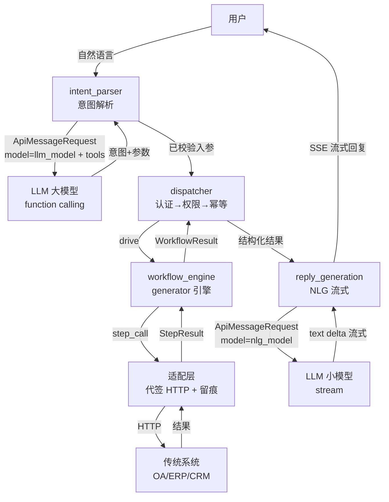
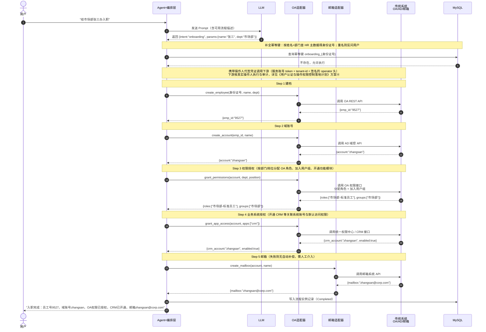
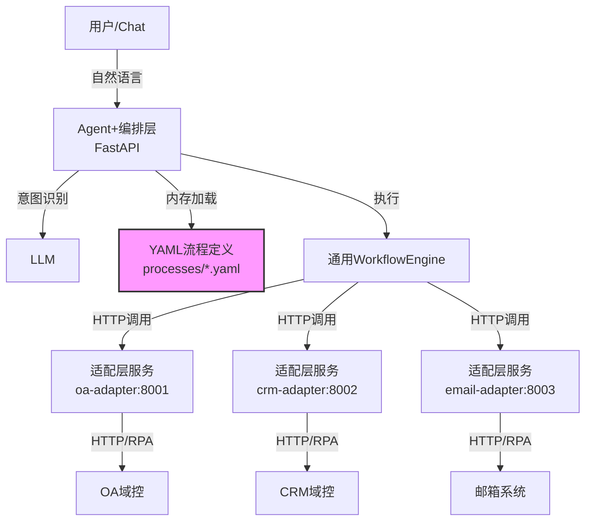
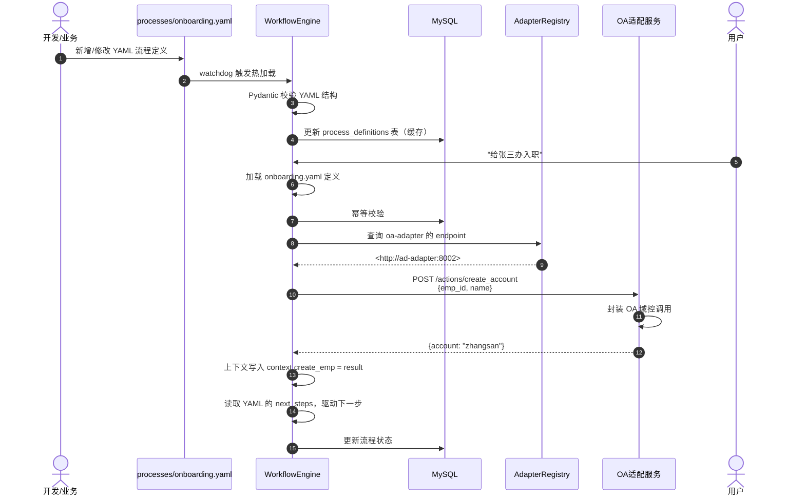
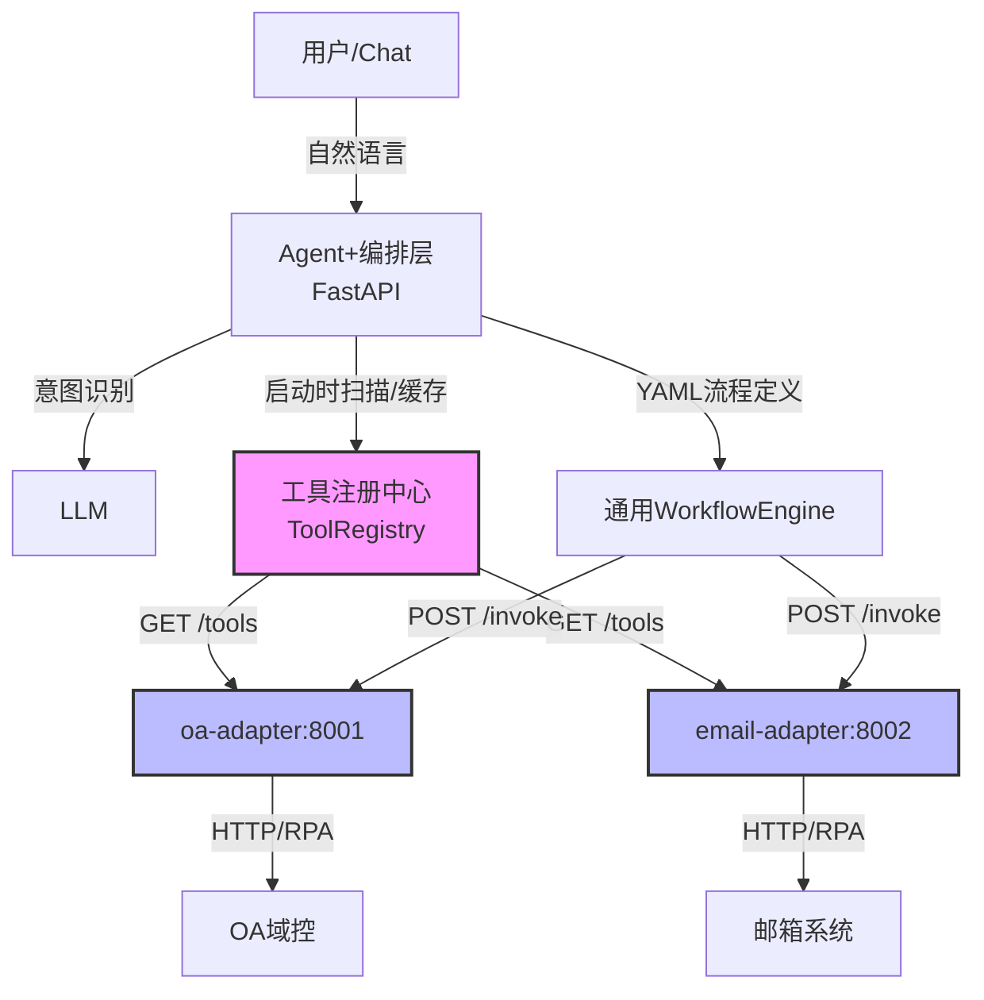
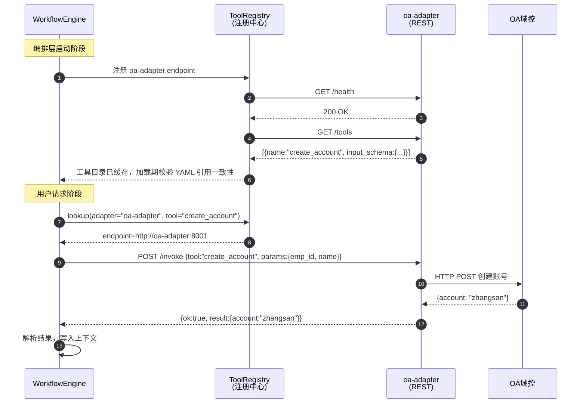
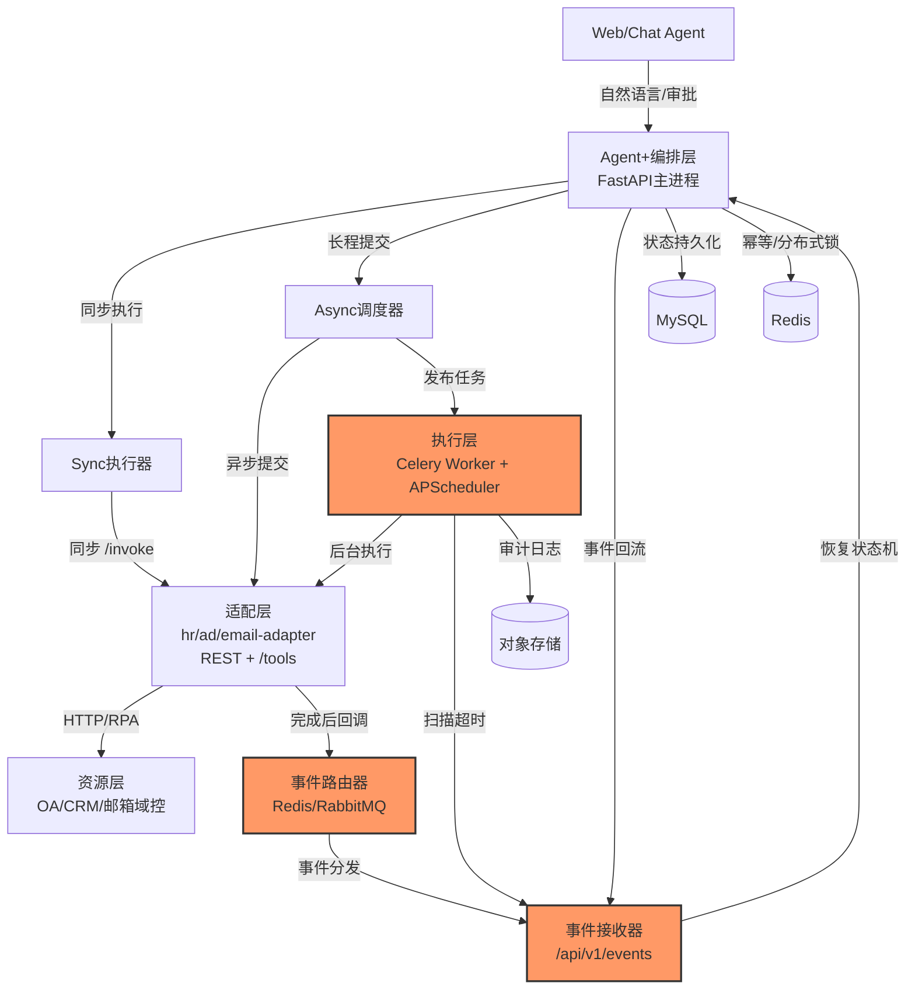
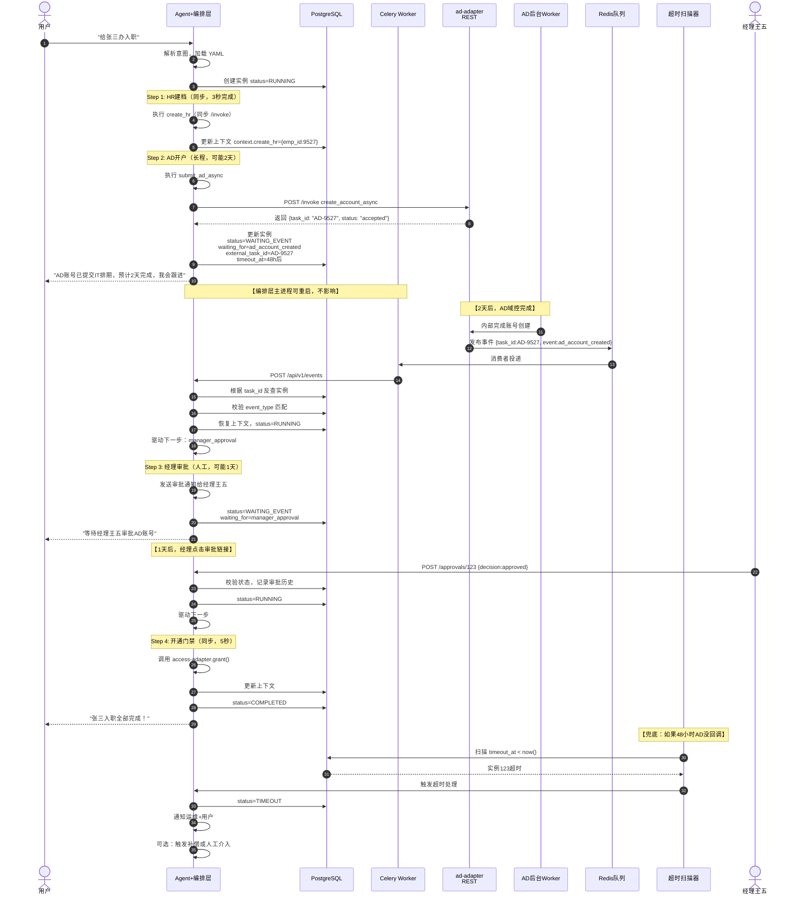

> ⚠️ **本文档已作废(2026-06)**,当前方案见 [`工作流引擎设计方案.md`](工作流引擎设计方案.md)(generator 引擎:drive/create/_exec_step/compensate/replay_steps)。
> 平台已放弃本文的「YAML 引擎 + 独立 adapter 服务 / MCP 独立注册中心 / Celery 长程」方案,也放弃了中间的「声明式 call/ref/yields」方案,改为 **generator-based 工作流引擎**(业务 `create()` 声明 `yield step(...)`,引擎 `drive` 驱动 + `gen.throw(Compensate)` 闭包补偿)。本文仅作历史决策记录保留,**不再作为落地依据**。

> **目标**：让成熟的传统 OA/ERP/CRM 系统具备自然语言驱动能力，从"同步单点"逐步演进为"长程可靠执行"的 Agent 化平台。
>
> **核心原则**：先跑通，再解耦；先同步，再异步；先人工，再自动。
>
> **技术栈**：Python 全栈

------

## 文档导航

- [1：最小可行产品（MVP）——同步单流程硬跑通](https://www.notion.so/Agent-37c0bfc33f8380ebb8c6c8bedf175b0e?pvs=21)
- [2：配置化与解耦——YAML 驱动 + 适配层独立](https://www.notion.so/Agent-37c0bfc33f8380ebb8c6c8bedf175b0e?pvs=21)
- [3：工具标准化——适配层 REST 工具化 + 注册中心](https://www.notion.so/Agent-37c0bfc33f8380ebb8c6c8bedf175b0e?pvs=21)
- [4：长程任务可靠性——异步、事件驱动与 Saga 补偿](https://www.notion.so/Agent-37c0bfc33f8380ebb8c6c8bedf175b0e?pvs=21)
- [身份认证与操作权限控制（横切，贯穿四阶段）](用户认证与操作权限控制落地计划.md)
- [全局支撑体系（监控、安全、团队）](https://www.notion.so/Agent-37c0bfc33f8380ebb8c6c8bedf175b0e?pvs=21)

------

## 最小可行产品（MVP）——同步单流程可执行

### 架构图（三段式 pipeline）



**三段式 pipeline 说明**：

1. **意图解析（大模型）**——`intent_parser.py` 构造 `ApiMessageRequest(model=settings.llm_model, tools=[...])` 调 `llm_client`，用 function calling 提取意图 + 参数；缺参反问。
2. **执行（generator 引擎）**——`dispatcher.execute` → `workflow_engine.drive` 驱动 generator（`yield step` → `_exec_step` → adapter `step_call` → 下游 HTTP）。成功/补偿/幂等全程留痕，产出 `WorkflowResult`。
3. **回复生成（小模型 NLG 流式）**——`reply_generation.py` 构造 `ApiMessageRequest(model=settings.nlg_model)` 调同一 `llm_client`，把结构化结果转自然语言，**流式**产出 text delta → SSE。

**关键设计**：
- **大/小模型分离**：意图解析用大模型（理解复杂），NLG 用小模型（生成简单、成本/延迟低）。差异在 `ApiMessageRequest.model` 动态指定，`llm_client` 是无状态协议适配器（不绑 model），两个业务逻辑**共用同一 `llm_client`**。
- **成功路径不走意图解析 LLM 做 NLG**：结果（`WorkflowResult.output`）交给独立的 NLG 小模型，不回意图解析节点（职责分离 + 成本可控）。
- **generator 引擎**：业务用 `create()` generator 声明 `yield step(...)`，引擎 `drive` 驱动 + `gen.throw(Compensate)` 闭包补偿。详见 `工作流引擎设计方案.md`。

### **技术选型**

| 层级       | 技术                   | 理由                                 |
| ---------- | ---------------------- | ------------------------------------ |
| API 框架   | FastAPI                | 异步原生、自动文档、Pydantic 集成    |
| 数据校验   | Pydantic v2            | LLM 输出强校验，防止幻觉参数污染下游 |
| ORM/数据库 | SQLAlchemy 2.0 + MySQL | 流程实例持久化、审计留痕             |
| 外部调用   | httpx (async)          | 异步 HTTP，替代 requests             |
| LLM 接入   | OpenAI / Anthropic     | 意图识别 + Function Calling          |

### **模块功能设计**

| 模块         | 职责                                            | 关键类/函数                                   | 代码位置                         |
| ------------ | ----------------------------------------------- | --------------------------------------------- | -------------------------------- |
| 意图解析     | 大模型 function calling 提取意图+参数,缺参反问 | IntentParser.run()（骨架,未实现）             | engine/intent_parser.py          |
| 回复生成     | 小模型 NLG 流式:结构化结果→自然语言 SSE        | ReplyGeneration.run()（骨架,未实现）          | engine/reply_generation.py       |
| LLM 抽象     | 无状态协议适配(OpenAI/Anthropic),按 ApiMessageRequest 动态调模型 | OpenAIClient / AnthropicClient + stream_message | engine/client/llm_client.py |
| 编排抽象     | generator 步骤编排:子类 create() yield step    | BaseWorkflow / WorkflowRegistry               | orchestrator/base.py             |
| 步骤引擎     | generator 引擎:drive + _exec_step + compensate + replay_steps | drive / Step / StepResult / Compensate | orchestrator/workflow_engine.py  |
| 调度入口     | 认证→权限→幂等→drive→finalize(状态)           | dispatcher.execute(workflow, inputs)          | orchestrator/dispatcher.py       |
| 适配器       | step_call:调下游 HTTP + 转 StepResult + 落 AdapterCallLog | BaseAdapter.step_call / _call_action  | adapters/base.py                 |
| 具体流程     | 会议室预订(submit→approve→update,except Compensate yield cancel) | MeetingRoomBookingWorkflow | orchestrator/workflow/meeting_room.py |
| 幂等控制器   | Status(StrEnum)+is_new;check/completed/failed  | IdempotencyChecker                            | orchestrator/idempotency.py      |
| 步骤留痕     | process_step 落库(每步 result_data 供 replay)   | create_step / finish_step / list_completed_steps | repository/step_tracker.py    |
| 失联降级     | replay+补偿(不重跑)+标 failed/completed        | handle_processes / replay_steps / compensate  | orchestrator/downgrade.py        |

### **数据流时序图**

> 以下以**入职为设计蓝本**演示(5 步:建档→开户→权限→业务授权→邮箱)。**阶段一实际落地的是会议室预订**(3 步:submit→approve→update,带 cancel 补偿),流程结构同构(意图→幂等→多步下游→落库)。



### **工程代码模块划分**

```
smart_talkflow/
├── src/                         # 运行时包根(代码内 import 无 src. 前缀,需 PYTHONPATH=src)
│   ├── main.py                  # FastAPI 入口 + lifespan(build_runtime 装配,停机释放 DB 引擎/redis)
│   ├── conf/config.py           # pydantic-settings 单例(必填项缺失启动即抛错)
│   ├── api/                     # /chat 路由(SSE 流式)+ 认证依赖
│   │   ├── deps.py              # get_current_operator(开发态信任 X-Operator-* 头 / 生产态 SSO 验签)
│   │   └── router.py
│   ├── engine/                  # LLM 引擎(厂商无关抽象;parser 仍为骨架)
│   │   ├── parser.py            # IntentParser.run() 骨架(意图解析+参数提取,未实现)
│   │   ├── client/              # messages / base_client / llm_client(OpenAI/Anthropic 归一为 ToolUseBlock)
│   │   ├── prompts/             # system_prompt(三级降级)/ envirement
│   │   └── stream_event.py      # 编排层流式事件(与 client 层 ApiStreamEvent 区分)
│   ├── security/                # SSO JWT(RS256)验签:jwks_client + redis 缓存
│   ├── orchestrator/            # 编排层
│   │   ├── base.py              # 抽象:BaseWorkflow(步骤式,execute 委托引擎)+ WorkflowRegistry
│   │   ├── workflow_engine.py   # 步骤执行引擎:run_steps / StepContext / WorkflowStep / StepMeta + 逆序补偿
│   │   ├── dispatcher.py        # 调度入口:认证→路由→权限→校验→幂等→执行→状态(_check_idempotency/_finalize 模块级)
│   │   ├── workflow/meeting_room.py  # 当前唯一注册流程(声明式 Saga:submit→approve→update,每步带 cancel 补偿)
│   │   └── resolver.py          # 空(身份补全,未实现)
│   ├── runtime/
│   │   ├── context.py           # OperatorContext / RequestContext(ContextVar:operator/trace_id/process_id/step_id)
│   │   └── runner.py            # build_runtime(启动装配)/ Runtime.run(每请求执行)
│   ├── adapters/                # 下游 HTTP 封装(错误码归一 + 每次 AdapterCallLog 留痕)
│   │   ├── base.py              # BaseAdapter / AdapterRequest / AdapterResult(data) / AdapterResponse
│   │   ├── oa_adapter/          # oa_client(单例)+ oa_meeting_room(submit/approve/update/cancel)
│   │   └── crm_adapter/ ecs_adapter/ erp_adapter/   # 骨架
│   ├── services/                # credential(代签凭证)/ email / memory(后两者骨架)
│   ├── permission/              # WorkflowRoleChecker(workflow_role 表 + redis + is_allowed,已从 BaseWorkflow 下沉)
│   ├── repository/               # 数据访问:models(5 张业务无关表 + workflow_role)/ process_tracker(process 表 CRUD/状态转换)/ step_tracker(process_step 落库)
│   ├── infra/                    # 纯技术设施:database / http / logger / exceptions / redis_client
│   └── utils/                   # trace_id_util / api_key_util
├── db/                          # smart_talkflow_init.sql(MySQL 建表,改需清卷重建)+ schema_diagram.md
├── tests/                       # unittest(IsolatedAsyncioTestCase);test_llm_client 为真实 LLM 冒烟
├── SSD/                         # 设计文档(本文件 + 用户认证与操作权限控制 + 流程崩溃自动恢复)
└── docker-compose.yml           # MySQL 8 + Redis 7
```

### **埋坑点**

1. **LLM 参数幻觉**：LLM 可能编造不存在的部门名称。必须在编排层用 Pydantic `validator` 或枚举值强校验，不合法参数绝不透传给下游 OA。
2. **幂等键**：不能用 `name` 做幂等键（重名），必须用身份证号等业务唯一键；但用户说「给市场部张三办入职」通常**不含身份证号**。因此执行前需先按 `姓名+部门` 查 HR 主数据补全身份证号（命中多条则反问用户选择），再以补全后的键做幂等校验。数据库加唯一索引 `UNIQUE(process_key, business_key)`。
3. **同步阻塞风险**：传统系统接口可能长时间不返回（如 30 秒），会阻塞 FastAPI 处理。本阶段用 `httpx.AsyncClient(timeout=10)` 严格限制，超时即报错，绝不无限等待。
4. **补偿已落地（更新）**：任一步失败,已成功步由 `workflow_engine` 逆序补偿（Saga,per-step 声明 `compensate`）——会议室场景用 yudao `PUT /cancel`（终态覆盖、幂等）整笔回滚。原计划「阶段4 才做补偿」已**提前到阶段一落地**。
5. **下游身份与鉴权（已落地）**：「服务账号 + operator 代签」已落地（`services/credential._build_agent_headers`:api-key SHA-256 哈希比对 + nonce Redis 防重放 + HMAC 恒定时间);`operator` 来自认证层（`api/deps.get_current_operator`,开发态请求头 / 生产态 SSO 验签）,不再从请求体取。详见 [《用户认证与操作权限控制落地计划》](用户认证与操作权限控制落地计划.md)。

### **挑战点**

- **Prompt 工程稳定性**：LLM 提取参数的准确率必须 > 90%，否则用户体验崩塌。需要设计多轮补全机制（缺参数时反问用户）。
- **传统系统接口文档缺失**：很多老 OA 没有标准 REST，需要抓包或读前端代码，时间不可控。

## 配置化与解耦——YAML 驱动 + 适配层独立

**目标**：新增业务不用改 Python 代码，改 YAML 配置即可；适配层独立部署，业务流程执行使用"通用引擎"。

### 架构图



**说明**：编排层热加载 YAML；适配层从"内联函数升级为独立 FastAPI 微服务，通过 HTTP 被编排层调用。

### **技术选型**

| 层级       | 技术                 | 理由                                        |
| ---------- | -------------------- | ------------------------------------------- |
| 流程定义   | YAML + Pydantic 校验 | 人工编写，结构化，可版本控制                |
| 热加载     | watchdog             | 文件系统监听，秒级热更新                    |
| 工作流引擎 | 自研轻量状态机       | 本阶段流程步骤固定，自研比引入 Camunda 更轻 |
| 适配层协议 | REST HTTP (FastAPI)  | 简单、可调试、团队熟悉                      |
| 服务发现   | 静态配置 / 环境变量  | 本阶段无服务网格，配置中心够用              |
| 异步任务   | Celery + Redis       | 适配层内部耗时操作（如 RPA）可异步化        |

### **模块功能设计**

| 模块              | 职责                              | 关键设计                                          |
| ----------------- | --------------------------------- | ------------------------------------------------- |
| YAML 流程定义中心 | 存储、校验、热加载流程定义        | ProcessStore类，监听 processes/*.yaml 变化        |
| 通用编排引擎      | 读取 YAML，按步骤驱动，管理上下文 | WorkflowEngine：支持串行、并行、参数映射          |
| 适配层注册表      | 维护 adapter_key -> endpoint_url  | 数据库表 adapter_registry，动态路由               |
| 规则引擎          | 权限、数据格式、前置条件校验      | 轻量自研，JSON 配置 + Python 函数                 |
| 上下文管理器      | 跨步骤数据传递                    | ContextResolver：支持 context.step_key.field 语法 |

### **数据流时序图**



### **工程代码模块划分**

```
smart_talkflow/
├── main.py
├── api/   
│   ├── __init__.py
│   ├── deps.py                      # 依赖注入：get_db（DB Session）、当前操作人等
│	  ├── router.py                    # /chat 和 /execute 路由
│   └── schema.py                    # http请求和返回实例
├── processes/                       # ⭐ 新增：YAML 流程定义目录
│   ├── employee_onboarding.yaml
│   └── employee_offboarding.yaml
├── engine/
│   ├── parser.py                    # LLM 意图解析 + 参数提取 + 缺参反问
│   ├── client/                      # llm_client / base_client / messages（OpenAI/Anthropic 归一为 ToolUseBlock）
│   ├── prompts/                     # system_prompt（三级降级）/ envirement
│   └── stream_event.py              # 编排层流式事件（与 client 层 ApiStreamEvent 区分）
├── orchestrator/
│   ├── __init__.py
│   ├── loader.py                    # ⭐ YAML 热加载器 (watchdog)
│   ├── models.py                    # MySQL 数据模型
│   ├── context.py                   # ⭐ 上下文解析器
│   ├── workflow_engine.py           # ⭐ 通用 WorkflowEngine
│   └── idempotency.py               # 幂等状态机(从 infra 移入)
├── adapters/                        # ⭐ 变为独立服务目录
│   ├── registry.py                  # ⭐ AdapterRegistry 服务发现                        
│   ├── oa_adapter/
│   │   ├── main.py                  # FastAPI 独立服务
│   │   ├── client.py                # OA 系统原始 HTTP 封装
│   │   └── requirements.txt
│   ├── email_adapter/
│   │   ├── main.py
│   │   └── client.py
│   └── shared/                      # 适配层公共库（日志、错误码）
│       └── schemas.py
├── repository/
│   ├── models.py                    # 5 张业务无关表(process / process_step / adapter_call_logs / request_logs / audit_logs) + workflow_role(RBAC)
│   ├── process_tracker.py           # process 表 CRUD + 状态转换(幂等逻辑下沉到此)
│   └── step_tracker.py              # process_step 落库
├── infra/
│   ├── database.py                  # SQLAlchemy 异步引擎 + 会话
│   ├── exceptions.py                # ApiException + 状态码子类
│   └── rules.py                     # ⭐ 轻量规则引擎（阶段二新增）
└── requirements.txt
```

### **埋坑点**

1. **YAML 校验必须严格**：如果 YAML 里的  adapter: oa-adapter  写错，或  input_mapping  引用了不存在的上下文字段，必须在加载时就报错，而不是执行时才发现。用 Pydantic 做  ProcessDef  模型校验。
2. **热加载线程安全**： watchdog  触发重载时，可能正在执行旧流程。使用版本号机制：新 YAML 加载为  v2 ，旧实例继续用  v1 ，新实例用  v2 。
3. **适配层网络隔离**：适配层独立部署后，可能出现"编排层能启动，但连不上适配层"的情况。启动时必须做健康检查（ GET /health ），不健康则标记为不可用。
4. **上下文污染**：并行步骤（如同时开邮箱和门禁）如果同时写同一个  context  字段，会互相覆盖。并行步骤的输出必须隔离在  context.{step_key}  命名空间下。
5. **适配层独立的委托语义红线**：适配层从内联升级为独立服务后，「编排层→适配层」的白名单 IP 只解决**网络层**鉴权，**不解决「下游以谁身份执行」**。委托语义（operator 代签 + 下游身份改写）必须内建，不能退化成裸服务账号，否则权限模型与审计在阶段二/三重新崩塌。详见《用户认证与操作权限控制落地计划》第 10 节。

### **挑战点**

- **YAML 编写门槛**：业务人员写 YAML 容易出错。需要提供JSON Schema 自动补全或一个极简的 Web 表单生成器。
- **调试链路变长**：问题可能在编排层、YAML 配置、适配层、传统系统四层中的任意一层。必须引入分布式 Trace ID，贯穿全链路日志。
- **并行步骤的聚合**：YAML 声明  parallel_next: true  后，引擎需要等待所有并行分支完成才能执行下一步。需要设计Join 节点或隐式聚合逻辑。

## 工具标准化——适配层 REST 工具化 + 注册中心

**目标**：适配层从"私有 HTTP 接口"升级为"标准化 REST 工具服务"，编排层通过**工具注册中心**统一发现与调用；LLM 只输出意图与参数，零感知底层工具。

### 架构图



**说明**：适配层保持独立 REST 服务，但每个适配层暴露两个标准端点——`GET /tools`与 `POST /invoke`（统一调用入口）。编排层启动时通过 `ToolRegistry` 扫描各适配层、缓存工具目录，运行时由 `WorkflowEngine` 按 YAML 中的 `adapter` + `tool` 定位并经 HTTP 调用。

### **技术选型**

| 层级       | 技术                      | 理由                                                |
| ---------- | ------------------------- | --------------------------------------------------- |
| 适配层框架 | FastAPI                   | 延续阶段2，标准 REST，团队熟悉、curl 可调试         |
| 工具元数据 | JSON Schema               | 统一参数命名/类型/描述规范                          |
| 工具发现   | GET /tools + 启动扫描缓存 | 编排层启动时拉取并缓存工具目录，支持定时/手动热刷新 |
| 统一调用   | POST /invoke              | 引擎按 adapter+tool 路由，参数透传，错误码归一      |

### 模块功能设计

| 模块           | 职责                                          | 关键设计                                                                                                                        |
| -------------- | --------------------------------------------- | ------------------------------------------------------------------------------------------------------------------------------- |
| 适配层标准端点 | 每个适配层暴露 `GET /tools` + `POST /invoke`  | `GET /tools` 返回 `{name,description,input_schema,output_schema}`；`POST /invoke` 按 tool_name 路由到 handler，参数透传          |
| 工具注册中心   | 编排层启动扫描适配层、缓存工具目录            | `ToolRegistry`：维护 adapter_key → endpoint + 工具清单，定时刷新，`GET /health` 探活标记可用                                     |
| 工具元数据校验 | 加载时校验工具 Schema 与 YAML 引用一致性      | YAML 中 `adapter` + `tool` 必须能在注册中心命中，缺失或参数不匹配在加载期即报错                                                  |
| 进度/推送      | 适配层长耗时操作的进度反馈                    | REST 天然支持异步回调：适配层完成或推进时 `POST /api/v1/events` 回调编排层（与阶段4衔接）                                        |

### **数据流时序图**



### 工程代码模块划分

```
smart_talkflow/
├── main.py
├── api/   
│   ├── __init__.py
│   ├── router.py                    # /chat 和 /execute 路由
│   └── schema.py                    # http请求和返回实例
├── processes/                       # YAML 流程定义目录
│   ├── employee_onboarding.yaml
│   └── employee_offboarding.yaml
├── agent/
│   ├── parser.py
│   └── models.py
├── orchestrator/
│   ├── __init__.py
│   ├── loader.py                    # YAML 热加载器 (watchdog)
│   ├── models.py                    # MySQL 数据模型
│   ├── context.py                   # 上下文解析器
│   └── tool_registry.py             # ⭐ 新增：ToolRegistry 工具发现与缓存
├── adapters/                        # ⭐ 每个适配层暴露 GET /tools + POST /invoke
│   ├── hr_adapter/
│   │   ├── main.py                  # FastAPI 入口（/tools、/invoke 路由）
│   │   ├── tools.py                 # 工具元数据声明（JSON Schema）
│   │   ├── hr_client.py             # 原始 HR 系统调用
│   │   └── pyproject.toml
│   ├── ad_adapter/
│   │   ├── main.py
│   │   ├── tools.py
│   │   └── ad_client.py
│   └── shared/                      # 适配层公共库（日志、错误码、统一响应）
│       └── schemas.py
├── core/
│   ├── models.py
│   ├── registry.py                  # AdapterRegistry 服务发现
│   ├── workflow_engine.py           # 通用 WorkflowEngine
│   └── rules.py                     # 轻量规则引擎
├── config.py
└── requirements.txt
```

### 埋坑点

1. **工具目录一致性**：适配层新增/重命名工具后，编排层缓存的工具目录可能滞后。`ToolRegistry` 需支持定时刷新与 `/refresh` 手动触发；`GET /tools` 响应应带版本号，便于编排层判断是否需要重新拉取。
2. **适配层健康检查**：适配层独立部署后可能出现"编排层已启动但适配层未就绪"。`ToolRegistry` 初始化时必须 `GET /health` 探活，不可用的适配层标记为 `disabled`，调用时直接返回明确错误而非超时。
3. **Tool Schema 决定健壮性**：`input_schema` 的字段描述、类型、枚举必须写得清晰，编排层据此对 YAML 透传的参数做预校验，避免脏参数打到下游。建议每个工具配 `examples`。
4. **错误信息归一**：适配层内部异常必须包装为统一的 `{ok:false, error:{code, message}}` 响应，而不是直接 500，否则编排层无从判断是业务错误还是网络错误。

### 挑战点

- **调试链路可控**：使用 REST 可直接用 curl/Postman 验证 `GET /tools` 与 `POST /invoke`，链路只有"编排层 → 适配层 → 传统系统"三层，Trace ID 全链路打通即可。
- **Schema 演进与向后兼容**：工具的 `input_schema` 变更（删字段、改类型）会破坏已上线的 YAML。建议 Schema 走版本号，破坏性变更通过新增工具或新增字段完成，而非原地修改。
- **第三方接入的安全边界**：适配层是标准 REST，更易被外部工具直连。`/invoke` 端点必须加鉴权网关，高危工具（如 `delete_account`）仅编排层白名单 IP 可调，或干脆不对外暴露。注意：白名单 IP 只是**网络层**鉴权，真正决定「下游以谁身份执行」的是**委托语义**（operator 代签），二者不可互相替代，详见《用户认证与操作权限控制落地计划》。

## 长程任务可靠性——异步、事件驱动与事物补偿

**目标**：支撑"提交即返回、数天后完成、失败可补偿、人工可介入"的企业级长程流程。

### 架构图



**说明**：新增"执行层"作为独立平面；编排层内部裂变为 Sync/Async/事件接收器三个子系统；状态机支持  WAITING_EVENT  和  HUMAN_APPROVAL  状态。

### 技术选型

| 层级     | 技术                      | 理由                                               |
| -------- | ------------------------- | -------------------------------------------------- |
| 任务队列 | Celery + Redis            | 成熟，Python 生态完善，支持延迟任务和重试          |
| 定时任务 | APScheduler               | 扫描超时实例、兜底轮询                             |
| 消息总线 | Redis Pub/Sub 或 RabbitMQ | 适配层完成事件后，通过消息队列通知编排层           |
| 状态存储 | MySQL                  | 主状态；Redis 做分布式锁和幂等缓存                 |
| 补偿引擎 | 自研事物协调器            | 逆序调用补偿 Tool，记录补偿日志                    |
| 审批网关 | FastAPI 独立路由          | /api/v1/approvals/{instance_id} 供外部审批系统对接 |

### 模块功能设计

| 模块         | 职责                                         | 关键设计                                                     |
| ------------ | -------------------------------------------- | ------------------------------------------------------------ |
| Async 调度器 | 调用适配层异步 Tool，拿到 task_id 后立即挂起 | `AsyncScheduler.submit()`：返回后设置 `status=WAITING`       |
| 事件接收器   | 接收外部回调或消息队列事件，恢复流程         | `EventController.receive()`：通过 `task_id` 反查实例，注入上下文 |
| 人工审批节点 | 流程挂起，通知审批人，等待决策               | `HumanApprovalNode`：支持 `approved/rejected/timeout` 三种出口 |
| 事物补偿引擎 | 流程失败时，逆序执行已成功的补偿 Tool        | `CompensationEngine`：从数据库读取历史步骤，按完成时间倒序补偿 |
| 超时扫描器   | 定时扫描 `WAITING` 且超时的实例              | `TimeoutScanner`：APScheduler 每 10 分钟执行一次             |
| 幂等控制     | 防重复回调、防重复审批                       | Redis `SETNX` + 业务唯一键                                   |

### 数据流时序图



### 工程代码模块划分

```
smart_talkflow/
├── main.py
├── api/   
│   │   ├── chat.py                  # 用户对话入口
│   │   ├── events.py                # ⭐ 外部事件回调入口
│   │   └── approvals.py             # ⭐ 人工审批提交入口
│   └── deps.py                      # 依赖注入（DB Session等）
├── processes/                       # YAML 流程定义目录
│   ├── employee_onboarding.yaml
│   └── employee_offboarding.yaml
├── agent/
│   ├── parser.py
│   └── models.py
├── orchestrator/
│   ├── __init__.py
│   ├── loader.py                    # YAML 热加载器 (watchdog)
│   ├── models.py                    # MySQL 数据模型
│   ├── context.py                   # 上下文解析器
│   ├── tool_registry.py             # ⭐ ToolRegistry 工具发现与缓存
│   ├── async_scheduler.py           # ⭐ Async 调度器
│   └── event_receiver.py            # ⭐ 事件接收与恢复逻辑
├── adapters/                        # 每个适配层暴露 GET /tools + POST /invoke
│   ├── hr_adapter/
│   │   ├── main.py                  # FastAPI 入口（/tools、/invoke 路由）
│   │   ├── tools.py                 # 工具元数据声明（JSON Schema）
│   │   ├── hr_client.py             # 原始 HR 系统调用
│   │   └── pyproject.toml
│   ├── ad_adapter/
│   │   ├── main.py
│   │   ├── tools.py
│   │   ├── ad_client.py
│   │   └── async_worker.py          # ⭐ 后台执行 + 完成后发事件
│   └── shared/                      # 适配层公共库（日志、错误码）
│       └── schemas.py
├── core/
│   ├── models.py
│   ├── registry.py                  # AdapterRegistry 服务发现
│   ├── workflow_engine.py           # 通用工作流引擎
│   ├── rules.py                     # 轻量规则引擎
│   ├── idempotency.py               # ⭐ 幂等控制（Redis SETNX）
│   ├── compensation.py              # ⭐ 事物补偿引擎
│   └── exceptions.py                # ⭐ 业务异常定义
├── workers/                         # ⭐ 新增：执行层 Worker
│   ├── celery_app.py                # Celery 应用实例
│   ├── event_consumer.py            # 消费 Redis 队列事件
│   ├── human_approval.py            # ⭐ 人工审批节点处理
│   └── timeout_scanner.py           # APScheduler 定时任务
├── config.py
└── requirements.txt
```

### 埋坑点

1. **回调幂等**：外部系统可能重复发送回调（网络重试）。事件接收器必须用  external_task_id  +  event_type  做幂等，处理过的回调直接返回  200 ，不重复驱动流程。
2. **脑裂恢复**：编排层多实例部署时，两个实例同时收到同一事件的回调，可能同时恢复流程导致并发执行。必须用数据库行锁（ SELECT FOR UPDATE ）或Redis 分布式锁保护恢复过程。
3. **补偿不是时光机**：有些操作无法撤销（如"已发送的邮件"、"已产生的审计日志"）。YAML 设计时必须区分可补偿步骤和不可补偿步骤，后者放在流程最后或加前置人工确认。
4. **超时与审批的竞态**：用户刚好在超时前 1 秒提交审批，扫描器和审批接口可能并发修改同一行。数据库更新必须用乐观锁（version 字段）或状态机校验（只允许  WAITING -> RUNNING ，不允许  TIMEOUT -> RUNNING ）。
5. **消息队列死信**：如果事件路由到 Celery 后，Worker 一直消费失败（如编排层接口 500），消息会进入死信队列。必须配置死信队列 + 告警，否则流程永远挂起。
6. **上下文膨胀**：长程任务执行数天，上下文（每一步的输入输出）可能变得很大。不要无限往  context  JSON 字段塞数据，大文件/日志应存对象存储，上下文只存引用 ID。

### 挑战点

- **分布式事务的最终一致性**：没有数据库 ACID 跨系统事务，全靠 Saga 补偿。补偿逻辑本身可能失败（如补偿时 AD 系统又挂了），需要补偿的补偿（人工兜底工单）。
- **长程调试的复杂性**：一个流程跑了 3 天，中间经历了重启、回调、审批，出问题时要像"查案"一样从  event_history  里还原现场。日志必须结构化 + Trace ID 全链路。
- **人工节点的 UX 设计**：审批人可能不用你的系统，而是在钉钉/企业微信/邮件里收到链接。审批网关必须支持免登/短链/移动端适配。
- **状态机的复杂度**：从 4 个状态（PENDING/RUNNING/COMPLETED/FAILED）扩展到 8+ 个状态，状态转换矩阵容易出错。建议用状态模式或状态机库（如  python-statemachine ）显式管理，不要写满地的  if-else 。
- **运维心智负担**：系统包含 FastAPI、Celery Worker、APScheduler、Redis、MySQL、多个 REST 适配层服务。需要Docker Compose 或 K8s 统一编排，否则本地开发环境都起不来。

## 全局支撑体系

### 里程碑与验收标准

| 阶段  | 验收标准（必须全部通过）                                     |
| ----- | ------------------------------------------------------------ |
| 阶段1 | 1. 用户说一句"帮我订明天 10 点第一会议室"(以会议室预订为交付场景;入职为结构同构的设计蓝本),30 秒内得到成功回复；<br />2. 数据库能查到完整的实例记录(process + process_step + adapter_call_logs)；<br />3. 同一请求重复发,不会重复建预订(幂等)；<br />4. 下游审计日志记的是**真实操作人**而非服务账号,篡改 operator 头会被下游拒绝；<br />5. 任一步失败,已成功步逆序 cancel(Saga 补偿已落地)。 |
| 阶段2 | 1. 新增一个"离职流程"只需新增 YAML 文件，不改 Python 代码；<br />2. 适配层独立部署，编排层通过配置发现它；<br />3. 热加载生效时间 < 5 秒。 |
| 阶段3 | 1. 适配层暴露标准 `GET /tools` 与 `POST /invoke`，可用 curl/Postman 直接调试；<br />2. 编排层通过 `ToolRegistry` 发现并缓存工具目录，按 `adapter`+`tool` 经 HTTP 调用；<br />3. 工具 Schema 完整清晰，编排层加载期即可校验 YAML 引用一致性。 |
| 阶段4 | 1. 长程任务（模拟 10 分钟）提交后，用户立即收到"已受理"回复；<br />2. 编排层重启后，流程能从 WAITING 状态正确恢复；<br />3. 超时后自动触发补偿或告警；<br />4. 人工审批拒绝后，已创建的账号被自动撤销。 |

### 监控告警设计

| 监控对象      | 指标                               | 告警阈值               |
| ------------- | ---------------------------------- | ---------------------- |
| 编排层 API    | 请求延迟 P99                       | 2s 告警                |
| 流程实例      | 处于 `WAITING` 超过 timeout 的数量 | 0 立即告警             |
| 适配层 REST   | 服务存活状态                       | 服务不可达立即告警     |
| Celery Worker | 任务积压数量                       | 100 告警               |
| 死信队列      | 未消费消息数                       | 0 告警                 |
| 补偿执行      | 补偿失败次数                       | 0 立即告警（人工介入） |
| 认证鉴权      | 401/403 异常率、签名校验失败次数   | 突增告警（疑似伪造或凭证失效） |

### 安全与权限

> 「Agent 以什么身份、代表谁去调下游」是贯穿四阶段却极易遗漏的横切问题，完整方案见 **[《用户认证与操作权限控制落地计划》](用户认证与操作权限控制落地计划.md)**。本节为摘要。

**一、下游身份与委托（认证）** —— 认证分两层，缺一不可：

- **层 1 · 调用可达性（M2M）**：平台用**服务账号 token** 完成与下游的技术握手（解决 401）。
- **层 2 · 操作人语义（委托）**：下游权限绑在**真实员工**身上。平台用「**服务账号 + operator 代签**」（方案④）——服务账号只负责「可调达」，真实操作人通过**签名的 `X-Operator-Userid` 头**传给下游，下游 Filter 把当前用户改写为真实员工，从而复用其既有权限与审计。

> ❌ **反模式**：用「超级服务账号代替所有人」——下游权限模型崩溃、审计归零、跨域越权。
> ⚠️ **`operator` 必须来自 SSO 登录态**，严禁来自请求体 / LLM 参数（可伪造）；平台**永不持有任何用户的下游 token**，只持有 IT 管理的服务账号。

**二、操作权限（授权）三层各司其职：**

| 层 | 谁判定 | 在哪 | 判定依据 |
|---|---|---|---|
| A · 流程级 | 平台（薄 RBAC） | dispatcher 入口 | `operator.roles` vs 流程 `allowed_roles` |
| B · 业务级 | 下游系统 | 业务接口 | 改写后真实 userId 的角色权限 |
| C · 数据级 | 下游系统 | 数据权限拦截器 | 真实用户部门 / 租户 |

平台只做层 A（粗粒度流程网关），**绝不复制下游的细粒度权限模型**（否则与下游不一致、违背「不复制业务数据」）。

**三、多租户**：下游多租户（如 `tenant-id` 头）。平台据 `operator` 注入正确 `tenant-id`，下游 Filter **交叉校验** operator↔tenant，防跨租户越界。

**四、各层既有要点（保留）：**

1. **Agent 层**：LLM 提取的参数必须经过 Pydantic Schema 校验，拒绝任何越界参数（如 `dept="管理员"` 但 Schema 里无此枚举值）。
2. **编排层**：操作前校验 `operator` 的 RBAC 权限（层 A，如只有 `hr_admin` 能触发入职）。
3. **适配层**：REST 适配层只暴露最小必要 Tool，高危操作（如 `delete_account`）不在 `/invoke` 路由中暴露，仅编排层白名单可调。
4. **审计**：所有 `process` / `process_step` 的 `input_params` 与 `result` / `output_result` 必须落库(process 表存 `result`,process_step 表存 `output_result`),保存 180 天。`operator` 与 `trace_id` **并列贯穿全链**,支持按 `operator` 和 `business_key` 追溯。

### 回滚策略

| 场景                   | 回滚方案                                                     |
| ---------------------- | ------------------------------------------------------------ |
| YAML 配置错误          | 流程定义表支持 `version` 字段，发现错误后立即回滚到上一版本 YAML |
| 适配层发版失败         | 独立部署，蓝绿发布。编排层的 `AdapterRegistry` 标记不健康后自动流量切换 |
| 编排层发版失败         | 数据库状态兼容旧代码。回滚 Pod 后，WAITING 中的流程由新实例继续处理（无状态设计） |
| LLM 模型升级后效果变差 | Prompt 版本化存储，切换模型或 Prompt 版本只需改环境变量，重启生效 |