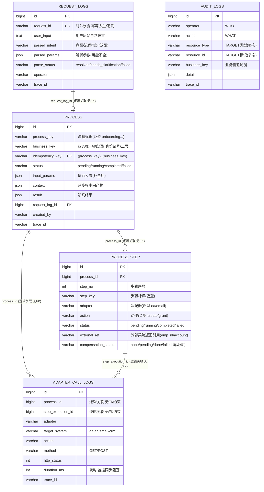

# smart_talkflow 数据库关系图(第一阶段 MVP)

> 本平台是业务无关的通用 Agent 编排平台。业务数据归各传统业务系统所有。
> 对应建表脚本:`smart_talkflow_init.sql`

## 一、ER 关系图



> 说明:mermaid 的 erDiagram 不区分实线/虚线,强弱关系已在**连线标签**中标注(`强外键` / `逻辑关联 无FK`)。
> `audit_logs` 通过多态字段关联任意表,故不画固定连线,详见第三节。

---

## 二、关系层次详解

### ① 强外键关系(字段存 ID,但**故意不加外键**)

| 父表 | 子表 | 基数 | 业务含义 |
|---|---|---|---|
| `request_logs` | `processs` | 1 : 0..1 | 一条请求最多产生一个实例;缺参反问请求不产生实例,删请求不影响已生成实例 |
| `processs` | `process_step` | 1 : 1..N | 一个实例包含多个步骤;清理测试实例时步骤连带删除 |

### ② 逻辑关联(字段存 ID,但**故意不加外键**)

| 来源字段 | 指向 | 基数 | 为何不加 FK |
|---|---|---|---|
| `adapter_call_logs.process_id` | `processs.id` | 1 : 0..N | 部分调用不在流程上下文内(如启动健康检查),需可空 |
| `adapter_call_logs.step_execution_id` | `process_step.id` | 1 : 0..N | 一步可触发多次外部调用(多接口 / 重试) |

> 日志类表刻意脱离外键约束,保证「业务记录删除不波及日志」,满足审计独立性与不可篡改要求。

### ③ 多态关联(`audit_logs` 独立)

`audit_logs` 通过 `resource_type` + `resource_id` 这对组合指向**平台内任意实体**,无需为每种资源加一列:

| `resource_type` | `resource_id` 取值 | 含义 |
|---|---|---|
| `request` | `request_logs.id` | 审计一次请求解析 |
| `process` | `processs.id` | 审计一次流程执行 |
| `step_execution` | `process_step.id` | 审计某个具体步骤 |
| `adapter_call` | `adapter_call_logs.id` | 审计一次外部系统调用 |
| `config` | 配置项名 | 审计配置变更(阶段2 起) |

同时 `audit_logs.business_key` 与 `processs.business_key` 在业务侧逻辑对应(同一身份证号),支撑「按 business_key 跨表追溯」。

---

## 三、一次请求的数据落库流(以入职场景为例)

```
用户输入 "给市场部张三办入职"
   │
   ▼
① request_logs          写入: user_input + parse_status=resolved + parsed_params
   │ (request_log_id)
   ▼
② processs     幂等校验 → 写入实例 status=running, business_key=身份证号(外部补全)
   │ (process_id)
   ├─▶ ③ process_step ×N   每步一条: create_employee / create_account / ... 
   │        │ (step_execution_id)
   │        └─▶ ④ adapter_call_logs ×N   每次外部 HTTP 调用一条(含耗时/状态码)
   │
   ▼
② processs     收尾: status=completed, result=..., finished_at=...
   │
   ▼
⑤ audit_logs            记录: operator=hr_admin, action=process_execute,
                             resource_type=process, resource_id=实例ID,
                             business_key=身份证号
```

**核心脉络**:`request_logs → processs → process_step → adapter_call_logs` 是一条由强到弱的关联链;`audit_logs` 作为横切关注点,旁路记录所有关键操作。
